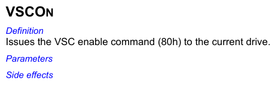
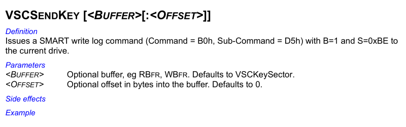
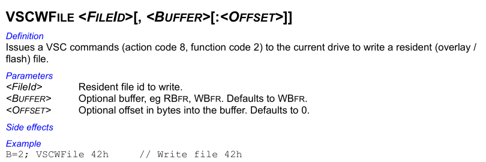
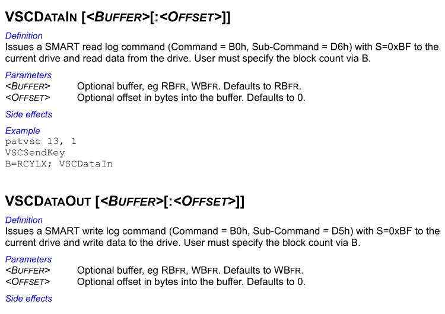
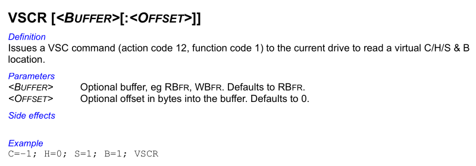

# Drive Firmware Security - In the Wild

## Introduction

Storage drives are special as one of the few types of computer components with firmware-level attacks discovered in the wild, alongside UEFI/BIOS (LoJax et al) and BMC (iLOBleed). Something not merely theoretical or a conference talk demo, but actually used in the real world. Despite this there's been little public research on the topic compared to those others, with technical details of how that discovered attack actually worked remaining esoteric and public information being vague.

This in-the-wild attack was, of course, published by Kaspersky in 2015 [^1]. Although the actual firmware implants were not documented, they detailed two separate versions of the installer used to remotely implant the firmware of a targeted drive. Beyond infecting firmware, these installers also had the ability to read and write arbitrary data to a drive's System Area (SA), as a form of covert storage. These installers were Windows dynamic libraries named nls_933w.dll, internal version number 3.0.1 with a PE timestamp of June 2010, and 4.2.0 with a timestamp of May 2013. Version 3.0.1 supports a range of hard drive vendors (Maxtor, Seagate, Western Digital, Samsung), while 4.2.0 supports additional hard drives (Hitachi, Toshiba) and also some SSDs (Micron, OCZ) [^2].

Of those versions detailed above, only the earlier version 3.0.1 has a sample publicly available [^3], so that version will be the subject of this analysis. The sample is a 32-bit DLL (nls_933w.dll) that also contains a kernel driver (win32m.sys) as a PE resource.

## Driver

The kernel driver win32m.sys is fairly minimal, only providing low-level interfaces to send ATA commands to drives, and containing not much else. Interestingly the PE timestamp of the driver (23/8/2001 17:03:19 UTC) appears to be forged, as the rich header shows it was compiled with Visual Studio 7.0 Rainier (released February 13 2002). The use of a custom driver at all is also interesting, as Windows versions from NT4 supported standard interfaces to send ATA commands from user-mode, although such capabilities were not publicly documented until the release of Server 2003 [^4]. This driver is unsigned, as was standard for 32-bit Windows before Driver Signature Enforcement was introduced, and provides its functionality through the following six IOCTLs:

### IOCTL 0x870021C0 - Get Version

Returns version string, *3.0.0.0*.

### IOCTL 0x870021C4 - Set Main Configuration

Parses received configuration data and initialises the driver; this configuration data contains the following values:

* Driver version
* CPU count
* Number of ATA controllers (8 maximum)
* The following configuration values for each ATA controller:
  * Device type (IDE, AHCI, NVIDIA nForce)
  * I/O type (port, memory-mapped)
  * PCI vendor ID
  * PCI device ID
  * Command base-address
  * Control base-address
  * MMIO region size

### IOCTL 0x870021C8 - Cleanup

Clears current configuration and un-initialises the driver.

### IOCTL 0x870021CC - Get Main Configuration

Reads the current configuration data set through [IOCTL set main configuration](#ioctl-0x870021c4---set-main-configuration).

### IOCTL 0x870021D0 - ATA Command

Executes an ATA command with the provided registers and data buffer, on a drive selected by controller number, port number, and drive number (master/slave). It supports flags to control transfer direction (read/write) and register size (LBA28/LBA48), however it does not support DMA transfer, only PIO ATA commands can be executed.

### IOCTL 0x870021D4 - ATA Command Configuration

Configures various parameters used when executing ATA commands with [IOCTL ATA command](#ioctl-0x870021d0---ata-command). This includes a timeout, retry count, and ATA controller poll interval.

## Dispatcher

The library nls_933w.dll provides the main functionality and logic of this installer, containing everything important up to dispatching low-level ATA commands through a generic interface provided by [the driver](#Driver). It has a PE timestamp of 15/6/2010 16:23:37 UTC, which seems appropriate matching other metadata and functionality of the library, so may be genuine unlike the kernel driver.

The library has strings encrypted with a XOR-based cipher, and makes heavy use of complex C++ class hierarchies, but is otherwise unobfuscated. It exports five separate ordinals, designed for the specific malware framework this library is deployed and used through, descriptions of each of these ordinals are provided below:

1. Returns a pointer to dispatch function that handles requests to module functionality.
2. Initialises callback function pointers from a structure provided as an argument, RC5-CFB decrypts a string table resource used internally by the library.
3. Just returns 1.
4. Initialises structure pointer passed as a parameter with the module version (3.0.1).
5. Initialises structure pointer passed as a parameter with module ID (`0x80AB`).

The main dispatcher function returned by ordinal 1 handles operation codes ranging from `0x51` to `0x64` inclusive:

```
unsigned int DispatchRequest(Request **request, size_t *request_size) {
  if (request_size != NULL) {
    if (request != NULL && *request != NULL) {
      if (ComputeChecksum(*request, *request_size) == 0) {
        switch((*request)->opcode) {
        case 0x51:
          return Handle_InstallService(request, request_size);
        case 0x52:
          return Handle_UninstallService(request, request_size);
        case 0x53:
          return Handle_GetVersion(request, request_size);
        case 0x54:
          return Handle_EnumerateDrives(request, request_size);
        case 0x55:
          return Handle_SADumpFile(request, request_size);
        case 0x56:
          return Handle_SALoadFile(request, request_size);
        case 0x57:
          return Handle_Get5a5a(request, request_size);
        case 0x58:
        case 0x59:
        case 0x5a:
        case 0x5b:
        case 0x5c:
        case 0x5d:
        case 0x5e:
        case 0x63:
          return Handle_Operations_0x58-0x5e_0x63(request, request_size);
        case 0x5f:
          return Handle_SelectDrive(request, request_size);
        case 0x60:
          return Handle_DeselectDrive(request, request_size);
        case 0x61:
          return Handle_SALoad(request, request_size);
        case 0x62:
          return Handle_SADump(request, request_size);
        case 0x64:
          return Handle_SupportedDriveTypes(request, request_size);
        default:
          return 0x302;
        }
      }
      *request_size = 0;
      return 0x306;
    }
    *request_size = 0;
  }
  return 0x303;
}
```

Rather than being a simple installer that just autonomously performs all operations to infect a drive, this module is instead a handler for performing singular low-level operations on a drive one at a time, with much of the actual logic done remotely on the command-and-control side. A drive is first selected with opcode `0x5F`, then other opcodes are used to perform various operations on that selected drive. Details of each operation are included below:

## Operation 0x51 - Install driver

Installs driver service (win32m.sys).

## Operation 0x52 - Uninstall driver

Uninstalls driver service (win32m.sys).

## Operation 0x53 - Get version

Returns string *3.4.1*, possible internal version number, though different from the main library version of 3.0.1.

## Operation 0x54 - Enumerate drives

Enumerates all available drives, returns various information from ATA command `0xEC` IDENTIFY DEVICE.

## Operation 0x55 - Dump SA to File

Dumps an array of various data from the system area of the selected drive to a file, in a custom RC5-encrypted format.

## Operation 0x56 - Load SA From File

Similar to [operation 0x55](#operation-0x55) above, parses a file of the same structure and writes it to the selected drive. However not a simple inverse of that operation, some file sections *Dump SA* can generate are rejected by this operation and cause it to fail, it also supports some additional section types *Dump SA* cannot produce.

## Operation 0x57 - Get 0x5a5a

Just returns integer `0x5a5a`, unknown purpose.

## Operations 0x58 to 0x5B - Unknown

Various low-level firmware read and write operations on the selected drive, of an unknown purpose.

## Operation 0x5C - Covert Storage Wipe

The module provides functionality to store arbitrary data in the system area of the selected drive. This operation wipes the hidden storage area, zeroing all bytes.

## Operation 0x5D - Covert Storage Read to File

Related to [operation 0x5C](#operation-0x5c). This operation reads all data from the covert storage area of the selected drive, RC5 encrypts it, and writes it to a file.

## Operation 0x5E - Covert Storage Write

Related to [operation 0x5C](#operation-0x5c) and [operation 0x5D](#operation-0x5d), writes provided data to covert storage in the system area of the selected drive.

## Operation 0x5F - Select drive

Selects the current drive based on serial number, required before other drive operations. The library sends various ATA commands to fingerprint and discover what type of drive it is, it creates classes of every supported drive type, then iterates through each calling a verification method on the drive until one returns a match.

```
class DriveManager {
    ...
    std::vector<DriveHandler*> handlers;

    DriveManager() {
        handlers.push_back(new MaxtorHandler());
        handlers.push_back(new Seagate1Handler());
        handlers.push_back(new WD2Handler());
        handlers.push_back(new SamsungHandler());
        handlers.push_back(new WD1Handler());
        handlers.push_back(new Seagate2Handler());
    }

    Drive* CreateDrive(DriveInfo* drive_info, DriveAddress* drive_address) {
        for (DriveHandler* handler : handlers) {
            if (handler != nullptr && handler->IsSupported(drive_info, drive_address) == 0) {
                Drive* drive = handler->CreateDrive(drive_info, drive_address);
                if (drive != nullptr) {
                    return drive;
                }
            }
        }
        return new Drive(drive_info, drive_address);
    }
    ...

};
```

As shown in the above code, this module supports six different major types of drives, though some of those perform additional checks internally to identify minor sub-types. The checks used to identify each drive type are detailed below:

### Maxtor

* WWN starts with 5001075

    **OR**

* Model name starts with *Maxtor* but does not start with *Maxtor STM*, and firmware version doesn't contain a "." character

### Samsung

* WWN starts with *50000F*

    **OR**

* Model name starts with *SAMSUNG*

### Seagate (Type 1)

* WWN starts with *5000C5* or is zero

    **AND**

* Model name starts with *ST* or *Maxtor STM*

    **AND**

* Identify byte 275 (vendor-specific) is not *P* (`0x50`)

### Seagate (Type 2)

* WWN starts with 5000C5

    **AND**

* Identify byte 275 (vendor-specific) is *P* (`0x50`)

### WD (Type 1)

* WWN starts with 50014EE, or model starts with *WDC WD*

    **AND**

* Identify word 142 (vendor-specific) is 0, 1, or 2

    **AND**

* WD Vendor Unique Command *VSC Unlock* succeeds

### WD (Type 2)

* WWN starts with 50014EE, or model starts with *WDC WD*

    **AND**

* Identify word 142 (vendor-specific) is 4

    **AND**

* WD Vendor Unique Command *VSC Unlock* succeeds

## Operation 0x60 - Deselect drive

Deselects the current drive if any, and resets state.

## Operation 0x61 - Load SA

The same as [operation 0x56](#operation-0x56), however data is loaded from memory instead of a file.

## Operation 0x62 - Dump SA

The same as [operation 0x55](#operation-0x55), however the output is sent in-memory instead of to a file.

## Operation 0x63 - Covert Storage Read

The same as [operation 0x5d](#operation-0x5d), except simply returns the read covert storage data instead of writing it to a file.

## Operation 0x64 - Supported Drive Types

Returns a list of 16-bit IDs of each major drive type this module supports, a list of those IDs is included below:

ID      | Description
--------|-------------
`0x132` | Seagate (Type 1)
`0x133` | Maxtor
`0x134` | WD (Type 1)
`0x135` | WD (Type 2)
`0x136` | Samsung
`0x13A` | Seagate (Type 2)

## Western Digital ROYL

ROYL is a generation of SATA hard drives introduced by WD in the mid-2000s, using controllers by Marvell. This library provides extensive functionality to target these drives.

Vendor Unique Commands (VUCs) for this drive are first unlocked with the following ATA command:

Features  | Sectors | LBA low | LBA mid | LBA high  | Device  | Command
----------|---------|---------|---------|-----------|---------|--------
`0x45`    | `0xB`   | `0x0`   | `0x44`  | `0x57`    | `0xA0`  | `0x80`

A 2006-dated manual for WD internal tool *TREX* [^5] refers to this command as *VSC enable*:



Once unlocked, commands are then sent using a vendor-specific variant of SMART Command Transport (SCT). Command parameters are written to SMART log `0xBE`, a log number defined in the specification as vendor-specific, using the following ATA command:

Features  | Sectors | LBA low | LBA mid | LBA high  | Device  | Command
----------|---------|---------|---------|-----------|---------|--------
`0xD6`    | `0x1`   | `0xBE`  | `0x4F`  | `0xC2`    | `0xA0`  | `0xB0`

That same WD TREX manual refers to this command as *VSC send key*:



Parameter data is in the following format, where *action-code* designates the type of data or functionality, *function-code* designates a specific operation on that *action-code*, and *function-specific parameters* can be any data specific to that action and function combination:

`2-byte action-code` `2-byte function-code` `function-specific parameters`

An example is action-code 8 for system area modules and function-code 2 for writing, as detailed in the TREX manual:



Command data is then either read or written with SMART log `0xBF`, a log number also defined as vendor-specific, accessing this log also triggers the command to execute. This is done using the following ATA command:

Features  | Sectors | LBA low | LBA mid | LBA high  | Device  | Command
----------|---------|---------|---------|-----------|---------|--------
`0xD5` read / `0xD6` write | *Sectors* | `0xBF`  | `0x4F`  | `0xC2`    | `0xA0`  | `0xB0`

The TREX manual refers to this command as *VSC data in* or *VSC data out*:



### WD ROYL - Operation 0x55 - Dump SA to File

For dumping the system area ([operation 0x55](#operation-0x55---dump-sa-to-file)), it first actually reads from the drive serial flash, not the system area on disk. This is done using vendor-specific SCT system detailed above with action-code 36 and function-code 1, with the following parameter data:

`24 00 01 00` `4-byte offset` `4-byte size` `01`

Although not documented in the TREX manual, this action-code is detailed elsewhere on the internet [^6]. It loops with the offset starting at 0 and incrementing by 65,536 each read up to a maximum of 262,144. After the first read, if it detects any subsequent read returns the same data as the first read, it exits the loop early as a wraparound protection.

It then reads a list of 29 different System Area modules with VUC action-code 8 function-code 1, using the following parameter data:

`08 00 01 00` `2-byte module ID`

<details>
<summary>SA Modules</summary>

ID    | Description
------|---------------------
`0x1`   | Modules directory
`0x2`   | Drive configuration
`0x11`  | Firmware - ATA overlay
`0x12`  | Firmware - CFG overlay
`0x13`  | Firmware - LBA overlay 1
`0x14`  | Firmware - Unknown overlay 1
`0x15`  | Firmware - Techno overlay 1
`0x17`  | Firmware - LLF overlay
`0x19`  | Firmware - Unknown 1
`0x1B`  | Firmware - Transient overlay
`0x1C`  | Firmware - Techno overlay 2
`0x1E`  | Firmware - Techno overlay 3
`0x1F`  | Firmware - Unknown 2
`0x4C`  | Firmware - LBA overlay 2
`0x61`  | Firmware - DRVPROT overlay
`0x80`  | Firmware - Unknown 3
`0x21`  | SMART log current 1
`0x22`  | SMART log current 2
`0x23`  | SMART log clear
`0x24`  | SMART log main
`0x2A`  | Firmware - Unknown 4
`0x2F`  | Firmware - Unknown overlay 2
`0x50`  | Acoustic profile - main
`0x51`  | Acoustic profile - alt 1
`0x52`  | Acoustic profile - alt 2
`0x53`  | Acoustic profile - alt 3
`0x6E`  | Firmware - Unknown 5
`0x108` | Firmware - IBI overlay
`0x109` | ROM image

Many of these modules and their purposes are further documented in a manual for data recovery tool PC3000 [^7], and other lists available online [^8].

</details>

The flash data and SA modules are then packed into a custom structured format, with the first 4 bytes being magic `21 93 35 01`. The structure is made up of a list of records, each with a 16-bit record type. This SA dump function produces records of the following two types:

ID  | Description
----|---------------------
1   | SA module
4   | Flash image

This packed data is then RC5-encrypted, prepended with two 32-bit checksums, and written to an output file.

### WD ROYL - Operation 0x56 - Load SA From File

For loading data to the system area ([operation 0x56](#operation-0x56---load-sa-from-file)), it decrypts and parses an input file of the same format detailed in [operation 0x55](#wd-royl---operation-0x55---dump-sa-to-file), however there are differences in the types of records it supports. If the file contains a record type 4 (flash data) the entire file is rejected and the load fails, this means the output produced by the SA dump operation is not actually compatible with this SA load operation, even though they use the same structure. This SA load feature is likely the functionality used to install a firmware implant in a drive.

This SA load operation also supports additional record types the SA dump operation does not produce, all supported record types are listed below:

ID  | Description
----|------------------------
1   | SA module
2   | Firmware Section 2
3   | Firmware Section 257
5   | Firmware header flag
6   | Remove SA module

#### Record Type 1 - SA Module

For type 1 records it parses each as a system area module ID and data, writing each to the drive with VUC action-code 8 function-code 2, using the following parameter data:

`08 00 02 00` `2-byte module ID`

#### Record Type 2 - Firmware Section 2

Type 2 records dynamically replace a section of firmware code in the disk system area, through a complex patching process using direct low-level disk reads and writes with Cylinder-Head-Sector (CHS) addressing. A single of these records is supported per input file, and this record replaces a single firmware section designated by the hardcoded 16-bit ID number 2. The new firmware section data has a maximum size of 16,896 bytes. 

It first reads 512 bytes of data from the drive using unknown VUC action-code 19 with function-code 1, this action-code is not documented in the WD TREX manual or anywhere online. It uses the following parameter data:

`13 00 01 00 00 00 00 00 00 02 00 00 01`

It then parses the resulting data as 32-bit little-endian ARM code, it performs 4 different types of checks for various instructions at two different positions, extracting a 32-bit value from another offset determined by which check matches:

Check at `+20`  | Check at `+28`      | Value offset
----------------|---------------------|---------------
`mov r0,r0`     | `ldr pc,[pc,#0x18]` | `0x34`
`mov r1,r1`     | N/A                 | `0x3C`
`mov r2,r2`     | N/A                 | `0xB4`
`mov r3,r3`     | N/A                 | `0x5C`

It then uses the extracted 32-bit value as a packed CHS address to read 512 bytes of data from the drive, using VUC action-code 12 function-code 1, using the following parameter data:

`0C 00 01 00` `4-byte cylinder` `2-byte head` `2-byte sector` `4-byte sector-count`

This is described in the WD TREX manual as reading a *virtual C/H/S & B location*:



This data read from disk is then parsed as the start of a firmware header. It verifies that the first 5 bytes are `D0 AC 68 24 01` and extracts a 16-bit value from offset +6 in this data, which it uses as a sector count. It re-reads from the same CHS location using the same VUC, but now with the size of that extracted sector count instead of just 512-bytes, which reads the full data of the firmware header.

It then enters a complex parsing routine extracting a table of firmware sections from the header, starting at offset +8 and terminated by marker `0xFFFFFFFF`, with each section entry being 12-bytes.

It then uses the parsed section table to look up the CHS location for target section ID number 2, then writes the new section data to that location using the same VUC action-code 12 but with function-code 2, using the following parameter data:

`0C 00 02 00` `4-byte cylinder` `2-byte head` `2-byte sector` `4-byte sector-count`

It then reads back the data using the same CHS read VUC detailed earlier, to verify the data was written successfully.

Finally a new firmware header is constructed, and written to the drive at the same CHS location it was read from, using the same CHS write VUC.

#### Record Type 3 - Firmware Section 257 (Covert Storage)

Type 3 records are processed similarly to [record type 2](#record-type-2---firmware-section-2) records, however instead of replacing section ID 2 it replaces section ID 257. Unlike type 2 records its size has no limit other than the maximum value of a 16-bit sector count, or 33,553,920 bytes, it also does not perform the read-verify step to check the section data was written successfully.

This same firmware section ID 257 is also used for covert storage operations, and is where that data is stored.

#### Record Type 5 - Firmware Header Flag

Record type 5 has a single byte of data. The firmware header is read and written back to the drive through the same process detailed in [record type 2](#record-type-2---firmware-section-2), however the data byte replaces the byte in the firmware header at offset +5.

#### Record Type 6 - Remove SA Module

For type 6 records it uses the data as a 16-bit module ID. It then reads and parses module ID 1, the module directory. If an entry in the directory matches that target module ID, it is removed and subsequent entries are shifted backwards. The modified module directory is then written back to the drive, effectively removing or unlinking the given module ID.

### WD ROYL - Operation 0x58 - Unknown

Operation code `0x58` (in [operations 0x58-0x5B](#operations-0x58-to-0x5b---unknown) range) first reads and parses the firmware header from the drive, as detailed in [load SA record type 2](#record-type-2---firmware-section-2). It then reads the first 512 bytes of firmware section ID 2, verifies the first 4 bytes are `0C CD 65 37`, and returns that 512-byte data.

### WD ROYL - Operation 0x59 - Unknown

Similar to [operation 0x58](#wd-royl---operation-0x58---unknown). Reads firmware section ID 2 by the same method, then validates the first 4 bytes are `0C CD 65 37` and validates a 16-bit checksum value at offset +6. It then sets byte at offset +10 in the read data to `0x01`, zeros all bytes from offset +11 onwards, and recomputes the checksum. It then writes the section back to the drive.

### WD ROYL - Operation 0x5A - Unknown

Related to [operation 0x59](#wd-royl---operation-0x59---unknown). Reads and validates the same firmware section ID 2, sets byte at offset +10 to `0x01` and recomputes the 16-bit checksum at offset +6, then writes it back to the drive. Basically the same as operation 0x59 without data from offset +11 being zeroed.

### WD ROYL - Operation 0x5B - Unknown

The same as [operation 0x5A](#wd-royl---operation-0x5a---unknown), except it sets the byte at offset +10 to `0x00`.

### WD ROYL - Operation 0x5C - Covert Storage Wipe

Reads and parses the firmware header from the drive, as detailed in [load SA record type 2](#record-type-2---firmware-section-2). It then iterates through each section ID parsed from the header, each section has all data on-disk overwritten with `0x00` bytes unless the section ID is within one of the following ranges:

* `0x8000` to `0x80FF`
* `0xFFFE` to `0xFFFF`

### WD ROYL - Operation 0x5D - Covert Storage Read to File

Reads and parses the firmware header from the drive, as detailed in [load SA record type 2](#record-type-2---firmware-section-2). It then verifies the size of firmware section ID 257 is under `0x10000` sectors (33,554,432 bytes), and reads the section data. It then encrypts the data with RC5-CFB and writes it to a file.

### WD ROYL - Operation 0x5E - Covert Storage Write

This operation accepts input data, and first validates its size is under `0x10000` sectors (33,554,432 bytes). It reads and parses the firmware header from disk, as detailed in [load SA record type 2](#record-type-2---firmware-section-2). It checks if firmware section ID 257 exists in the header, removes it if found, and writes the header back to disk. It then reads the firmware header from disk again, and inserts a new section with ID 257 and the size of the input data. It then writes the input data to disk, and finally writes the new firmware header to disk.

### WD ROYL - Operation 0x63 - Covert Storage Read

The same as [operation 0x5D](#wd-royl---operation-0x5d---covert-storage-read-to-file), except does not encrypt the data or write it to a file, it simply returns the read data.

## Conclusion

Overall this module appears to be very well designed and engineered, with a large amount of effort clearly expended into building it. The functionality appears to have been implemented favouring the lowest-level operations possible, such as direct CHS addressed disk access, even where simpler higher-level operations could accomplish the same thing. It uses a large amount of very esoteric vendor-specific functionality for each drive type that likely could not have been obtained purely through reverse engineering, and probably involved at least some internal documentation or resources from drive vendors. Despite dating all the way back to 2010 this version already seems fairly mature, with a large amount of functionality for several different types of drives, it is likely this tool had been in development for at least several years prior to this version.

[^1]: https://securelist.com/inside-the-equationdrug-espionage-platform/69203/
[^2]: https://media.kasperskycontenthub.com/wp-content/uploads/sites/43/2018/03/08064459/Equation_group_questions_and_answers.pdf
[^3]: https://www.virustotal.com/gui/file/83d14ce2dcfc852791d20cd78066ba5a2b39eb503e12e33f2ef0b1a46c68de73
[^4]: https://www.smartmontools.org/wiki/FAQ#OnWindowssmartctlprintsthemessage:...LogReadfailed:Functionnotimplemented
[^5]: https://trulycrisp.github.io/drivefirmware/inthewild/trex_manual.pdf
[^6]: https://web.archive.org/web/20230217034243/http://yura.puslapiai.lt/files/wd/mhdd/
[^7]: https://trulycrisp.github.io/drivefirmware/inthewild/pc3000_wd_marvell_manual.pdf
[^8]: https://www.hddoracle.com/viewtopic.php?f=7&t=1176