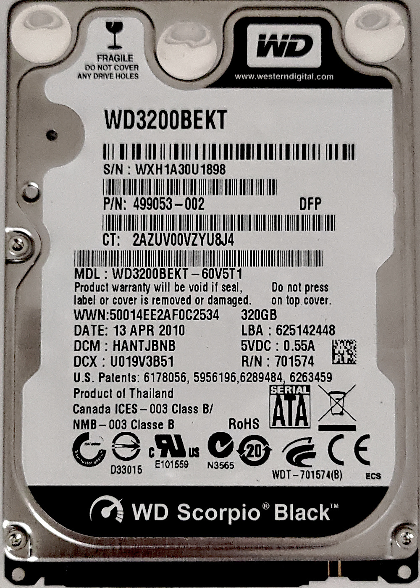
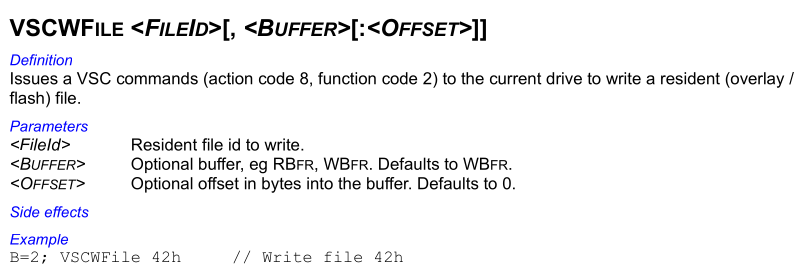
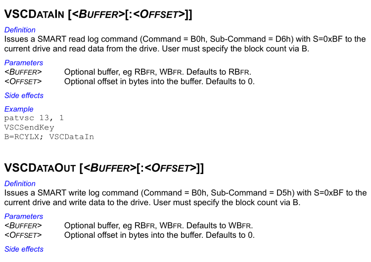
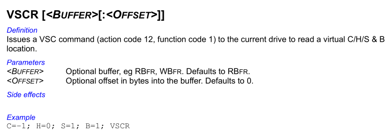
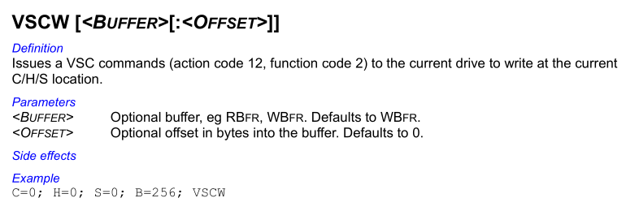

# Drive Firmware Security - In the Wild

*This page references many technical terms and concepts detailed in the [Overview](../overview) page, which should be read first.*

## Introduction

Storage drives are notable as one of the few types of computer components for which firmware-level persistence attacks have been discovered in-the-wild, alongside UEFI/BIOS (LoJax et al) and BMCs (iLOBleed), something not merely theoretical or a conference talk demo, but actually used in the real world. Despite this, there has been little public research on the topic compared to those other targets, with technical details of how the discovered attack actually worked remaining obscure and public information largely vague.

This in-the-wild attack being published by Kaspersky in 2015[^1]. Although the actual firmware implants were not documented, they detailed two separate versions of the installer used to remotely implant the firmware of a targeted drive. Beyond infecting the firmware, these installers also had the ability to read and write arbitrary data to a drive's System Area (SA), as a form of covert storage. These installers were Windows dynamic libraries named nls_933w.dll, internal version number *3.0.1* with a PE timestamp of June 2010, and *4.2.0* with a timestamp of May 2013. Version *3.0.1* supports a range of hard drive vendors (Maxtor, Seagate, Western Digital, Samsung), while *4.2.0* supports additional hard drives (Hitachi, Toshiba) and also some SSDs (Micron, OCZ)[^2].

Of those versions detailed above, only the earlier version *3.0.1* has a [sample publicly available](nls_933w.zip)[^3] (password: infected), so that version will be the subject of this analysis. The sample is a 32-bit DLL (*nls_933w.dll*) that also contains a kernel driver (*win32m.sys*) as a PE resource.

## Driver

The kernel driver *win32m.sys* is fairly minimal, only providing low-level interfaces to send ATA commands to drives, and containing not much else. Interestingly the PE timestamp of the driver (*23/8/2001 17:03:19 UTC*) appears to be forged, as the rich header shows it was compiled with Visual Studio 7.0 Rainier (released February 13 2002). The use of a custom driver at all is also interesting, as Windows versions dating back to NT4 supported standard interfaces to send ATA commands from user-mode, although such capabilities were not publicly documented until the release of Server 2003[^4]. This driver is unsigned, as was standard for 32-bit Windows before Driver Signature Enforcement was introduced, and provides its functionality through the following six IOCTLs:

### IOCTL 0x870021C0 - Get Version

Returns version string, *3.0.0.0*.

### IOCTL 0x870021C4 - Set Main Configuration

Parses received configuration data and initialises the driver; this configuration data contains the following values:

* Driver version
* CPU count
* Number of ATA controllers (8 maximum)
* The following configuration values for each ATA controller:
  * Device type (IDE, AHCI, NVIDIA nForce)
  * I/O type (port, memory-mapped)
  * PCI vendor ID
  * PCI device ID
  * Command base-address
  * Control base-address
  * MMIO region size

### IOCTL 0x870021C8 - Cleanup

Clears current configuration and uninitialises the driver.

### IOCTL 0x870021CC - Get Main Configuration

Reads the current configuration data set through [IOCTL set main configuration](#ioctl-0x870021c4---set-main-configuration).

### IOCTL 0x870021D0 - ATA Command

Executes an ATA command with the provided registers and data buffer, on a drive selected by controller number, port number, and drive number (master/slave). It supports flags to control transfer direction (read/write) and register size (LBA28/LBA48), however it does not support DMA transfer, only PIO ATA commands can be executed.

### IOCTL 0x870021D4 - ATA Command Configuration

Configures various parameters used when executing ATA commands with [IOCTL ATA command](#ioctl-0x870021d0---ata-command). This includes a timeout, retry count, and ATA controller poll interval.

## Dispatcher

The library *nls_933w.dll* provides the main functionality and logic of this installer, containing everything important up to dispatching low-level ATA commands through a generic interface provided by the [driver](#driver). It has a PE timestamp of *15/6/2010 16:23:37 UTC*, which seems appropriate matching other metadata and functionality of the library, so may be genuine unlike the kernel driver.

The library has strings encrypted with a XOR-based cipher, and makes heavy use of complex C++ class hierarchies, but is otherwise unobfuscated. It exports five separate ordinals, designed for the specific malware framework this library is deployed and used through, descriptions of each of these ordinals are provided below:

1. Returns a pointer to a dispatch function that handles requests to module functionality.
2. Initialises callback function pointers from a structure provided as an argument, RC5-CFB decrypts a string table resource used internally by the library.
3. Just returns 1.
4. Initialises structure pointer passed as a parameter with the module version (*3.0.1*).
5. Initialises structure pointer passed as a parameter with module ID (`0x80AB`).

The main dispatcher function returned by ordinal 1 handles operation codes ranging from `0x51` to `0x64` inclusive:

<details>
<summary>Dispatcher pseudocode</summary>

```
unsigned int DispatchRequest(Request **request, size_t *request_size) {
  if (request_size != NULL) {
    if (request != NULL && *request != NULL) {
      if (ComputeChecksum(*request, *request_size) == 0) {
        switch((*request)->opcode) {
        case 0x51:
          return Handle_InstallService(request, request_size);
        case 0x52:
          return Handle_UninstallService(request, request_size);
        case 0x53:
          return Handle_GetVersion(request, request_size);
        case 0x54:
          return Handle_EnumerateDrives(request, request_size);
        case 0x55:
          return Handle_SADumpFile(request, request_size);
        case 0x56:
          return Handle_SALoadFile(request, request_size);
        case 0x57:
          return Handle_Get5a5a(request, request_size);
        case 0x58:
        case 0x59:
        case 0x5a:
        case 0x5b:
        case 0x5c:
        case 0x5d:
        case 0x5e:
        case 0x63:
          return Handle_Operations_0x58_to_0x5e_and_0x63(request, request_size);
        case 0x5f:
          return Handle_SelectDrive(request, request_size);
        case 0x60:
          return Handle_DeselectDrive(request, request_size);
        case 0x61:
          return Handle_SALoad(request, request_size);
        case 0x62:
          return Handle_SADump(request, request_size);
        case 0x64:
          return Handle_SupportedDriveTypes(request, request_size);
        default:
          return 0x302;
        }
      }
      *request_size = 0;
      return 0x306;
    }
    *request_size = 0;
  }
  return 0x303;
}
```

</details>

Rather than being a simple installer that just autonomously performs all operations to infect a drive, this library is instead a handler for performing singular low-level operations on a drive one at a time, with much of the actual logic done remotely on the command-and-control side. A drive is first selected with opcode `0x5F`, then other opcodes are used to perform various operations on that selected drive. Each operation handled by this dispatcher is detailed in its own section.

## Implant Data Storage

The library implements a fascinating set of functionality related to managing a custom structure of data stored in the drive System Area (SA), data that also seems to be used internally by a firmware implant installed in the drive. The structure of that data, and the process of how it is accessed, are detailed below.

### Implant Data Storage - Structure

This structured data uses two levels of indirection. Firstly, a set of *extents* representing areas of CHS-addressed ranges of the SA is used to manage potentially multiple discontinuous SA areas as a single contiguous storage area. Over those *extents* a set of *allocations* is managed, representing logical areas allocated within the combined *extents*, each *allocation* being addressed by a 16-bit integer. Details of these *extents* and *allocations* are stored within a header, with that header itself being assigned *allocation* ID `0xFFFD`.

The header begins with the following structure:

`D0 AC 68 24` `01` `1-byte unknown` `2-byte sector count` `2-byte extent table offset` `2-byte allocation table offset` `2-byte checksum`.

Where *sector count* represents the size of the header in sectors, *extent table offset* is the offset in the header at which a table of *extent* entries begins, and similar *allocation table offset* is the offset to the table of *allocation entries*. The *checksum* is a value such that a 16-bit word sum of the header equals zero.

The *extent table* is a series of entries terminated by the bytes `FE FF FF FF`, where each entry has the following format:

`4-byte logical sector` `4-byte CHS` `4-byte sector count`

Where *logical sector* is a sector number representing a logical position within the combined area of all *extents*, *CHS* represents a packed CHS address where the *extent* is located, and *sector count* represents the *extent* size as a number of sectors.

The *allocation table* is a series of entries terminated by the bytes `00 00`, where each entry has the following format:

`2-byte ID` `4-byte sector` `4-byte sector count`

Where *ID* represents an integer uniquely identifying each allocation, *sector* is the start position within the combined *extents* area as a sector offset, and *sector count* is the allocation size as a number of sectors. Although the sector count is stored as a 32-bit value in the structure, the code constrains it as a non-zero 16-bit value, meaning allocations can be sized from 512 to 33,553,920 (512 aligned) bytes.

The following *allocation IDs* are used to store the described types of data:

Allocation ID         | Size                    | Description
----------------------|-------------------------|------------------------------------------------------------------------------------------------
`0x2`                 | 33 sectors              | State/configuration data, starts with a 1-sector header with various flags, related to `0x101`
`0x3`                 | 32 sectors              | Unknown, only written with 16,384 null bytes and never read
`0x100`               | 1 to 65,535 sectors     | Likely covert storage
`0x101`               | 1 to 65,535 sectors     | Likely payload of MBR substitution, related to `0x2`
`0x8000` to `0x80FF`  | Unknown                 | Reserved range, possibly used internally by firmware implant
`0xFFFD`              | >=1 sector              | Data storage header
`0xFFFE`              | N/A                     | Free space marker
`0xFFFF`              | 1 to ? sectors          | Likely internal scratch space, allocated before then freed after certain operations

The key allocation IDs are `0x100` and `0x101`, the only allocations used to store any data larger than a few sectors in size.

Allocation `0x101` appears closely tied to `0x2`, with many areas of the library allocating or accessing these together as part of a single high-level operation. Allocation `0x101` also appears closely related to some core functionality of the firmware implant, with drive-specific implementations of the [load SA](#operation-0x56---load-sa-from-file) operation likely used for implant installation having functionality specific to this allocation ID. As such the most likely hypothesis is this allocation is used to store the payload executed on the computer through MBR substitution.

In contrast allocation `0x100` appears more related to some extra optional functionality. The only use of this allocation ID in the library is simply implementing raw reads and write operations for the contained data, with no inbuilt parsing or other handling logic like other allocation IDs have. The most likely intent of this allocation ID is an area of covert storage, where external arbitrary data can be written to the drive SA for later reading.

### Implant Data Storage - Access

Each drive type provides different implementations of a set of low-level primitives used to manage this data in the System Area (SA), with each implementation using Vendor Unique Commands (VUCs) and related logic specific to the drive type. These primitives are reading data from a Cylinder-Head-Sector (CHS) address, writing data to a CHS address, and reading a CHS address value from the drive.

The read and write CHS data primitives are fairly intuitive, simply reading or writing data to the drive at a specific raw CHS address location, which can be used to access the drive System Area (SA).

The read CHS address value primitive however is more unusual, this implements drive-specific reading and parsing logic to extract a 32-bit value from the drive, which represents a packed CHS address that locates the header of the structured data stored in the SA. Rather than this packed CHS value being some parameter or value related to the drive's standard firmware or functionality, this value actually seems to originate from a custom firmware implant installed in the drive. For standard drives with factory-original firmware, the drive-specific implementations of this primitive do not actually appear capable of obtaining a valid CHS address, they appear intended for use only with some modified form of firmware that supports the specific logic implemented.

An example of how the vendor-specific primitives described above are implemented for a drive type is detailed in [WD ROYL - implant data storage](#wd-royl---implant-data-storage). The library uses these primitives to implement a generic interface to manage a common format of structured data in the SA, the same for every drive type.

It first uses the drive-specific *read CHS value* primitive to read a 32-bit packed CHS address from the drive, an address it then reads 512 bytes of data from using the *read CHS data* primitive. This 512-byte data is parsed at the start of the header detailed in [implant data storage - structure](#implant-data-storage---structure), validating it starts with bytes `D0 AC 68 24 01` and reading the sector count value from offset +6, this sector count is then used to re-read the full data of the header and parse it.

With the header parsed, including the contained tables of *extents* and *allocations*, the *CHS read* and *CHS write* primitives are then used to access and manage the various allocations, with a new header structure also written if necessary with the *CHS write* primitive.

## Operation 0x51 - Install Driver

Installs driver service (win32m.sys).

## Operation 0x52 - Uninstall Driver

Uninstalls driver service (win32m.sys).

## Operation 0x53 - Get Version

Returns string *3.4.1*, possible internal version number, though different from the main library version of 3.0.1.

## Operation 0x54 - Enumerate Drives

Enumerates all available drives, returns various information from ATA command `0xEC` IDENTIFY DEVICE.

## Operation 0x55 - Dump SA to File

Dumps a range of various data from the System Area (SA) of the current drive selected with [operation 0x5F](#operation-0x5f---select-drive) to a file in a custom format, this format is based on multiple layers of encapsulated containers.

### Operation 0x55 - Dump SA to File - Encrypted Container

The outermost container, referred to here as the *encrypted container*, starts with an unencrypted header of the following format:

`4-byte checksum` `4-byte checksum+1`

Where the checksum is a 16-bit word sum of the unencrypted container contents, and *checksum+1* is simply that checksum value incremented by 1. The 8-byte data of this header is later used as the Initialisation Vector (IV) for encryption. 

This header is then followed by RC5-CFB encrypted data, where the data encrypted is the magic string *22220000* followed by the container contents. This encryption uses the following hardcoded key:

`A0 1E D6 EA 83 89 A2 A0 AA 44 AA D3 EC 35 F5 F3`

### Operation 0x55 - Dump SA to File - Common Container

Inside the encrypted container another container is found, similar to the *encrypted container* this uses a single format common to all drive types, so it will be referred to here as the *common container*. This container has its contents prepended by a header of the following format:

`21 93` `2-byte drive type` `01 00` `2-byte checksum`

Where the drive type is as detailed in [operation 0x64](#operation-0x64---supported-drive-types), and the checksum is a value such that the 16-bit word sum of the entire container (including this header) equals zero.

### Operation 0x55 - Dump SA to File - Specific Container

Inside the common container there is yet another format of structured data, however this is completely specific to each different drive type, and has no common format. As such, it is referred to here as the *specific container*. For all drive types this will generally contain a list of records representing different types of SA or other internal data for the drive. An example of how this container is implemented for a drive type is detailed in [WD ROYL - dump SA to file](#wd-royl---operation-0x55---dump-sa-to-file).

## Operation 0x56 - Load SA From File

Related to [operation 0x55](#operation-0x55---dump-sa-to-file) above, this parses a file of the exact same structured format and writes it to the current drive selected with [operation 0x5F](#operation-0x5f---select-drive).

However this is not necessarily a simple inverse of operation 0x55. For some drive types certain *specific container* record types produced by *Dump SA* are rejected by this *Load SA* operation and cause it to fail, it can also support additional record types *Dump SA* cannot produce. This means even though they work with the same format of structured data, the actual output/input of these operations is not always compatible for all drive types.

## Operation 0x57 - Get 0x5A5A

Just returns integer `0x5A5A`, unknown purpose.

## Operations 0x58 to 0x5E and 0x63 - Implant Data Management

These operations collectively manage allocations within the [implant data storage](#implant-data-storage) structure, each designating a type of action to perform on these allocations, detailed below:

Operation | Description
----------|-------------
`0x58`    | Read metadata
`0x59`    | Reset
`0x5A`    | Set flag
`0x5B`    | Clear flag
`0x5C`    | Clear data
`0x5D`    | Read data to file
`0x5E`    | CRUD operations
`0x63`    | Read data inline

All of these operations share common sub-operation codes which designate which allocation to perform the action on and how, some operations do not support certain sub-operations, and some sub-operations only support a certain drive type. Details of each sub-operation are listed below:

Sub-operation | Supported operations                    | Supported drives      | Description
--------------|-----------------------------------------|-----------------------|--------------
`0x1`         | `0x58`, `0x59`, `0x5A`, `0x5B`, `0x5C`  | Seagate (Type 1)      | Unknown purpose, special case unique to drive type, uses single-sector transfers through VUC protocol
`0x2`         | All except `0x5E`                       | All                   | Likely for implant configuration/payload, uses allocation ID `0x2` for metadata and `0x101` for data
`0x4`         | `0x58`, `0x5C`, `0x5D`, `0x5E`, `0x63`  | All                   | Likely for covert storage of arbitrary data, uses allocation ID `0x100`

Interestingly for operation `0x5C` and sub-operation `0x2` it overwrites all allocation IDs with null bytes, not just `0x2` and `0x101`, except for those in the following ranges:

* `0x8000` to `0x80FF`
* `0xFFFE` to `0xFFFF`

## Operation 0x5F - Select Drive

Selects the current drive based on serial number, required before other drive operations. The library sends various ATA commands to fingerprint and discover what type of drive it is, it creates classes of every supported drive type, then iterates through each calling a verification method on the drive until one returns a match:

<details>
<summary>Select drive pseudocode</summary>

```
class DriveManager {
    ...
    std::vector<DriveHandler*> handlers;

    DriveManager() {
        handlers.push_back(new MaxtorHandler());
        handlers.push_back(new Seagate1Handler());
        handlers.push_back(new WD2Handler());
        handlers.push_back(new SamsungHandler());
        handlers.push_back(new WD1Handler());
        handlers.push_back(new Seagate2Handler());
    }

    Drive* CreateDrive(DriveInfo* drive_info, DriveAddress* drive_address) {
        for (DriveHandler* handler : handlers) {
            if (handler != nullptr && handler->IsSupported(drive_info, drive_address) == 0) {
                Drive* drive = handler->CreateDrive(drive_info, drive_address);
                if (drive != nullptr) {
                    return drive;
                }
            }
        }
        return new Drive(drive_info, drive_address);
    }
    ...

};
```

</details>

As shown in the above code, this library supports six different major types of drives, though some of those perform additional checks internally to identify minor sub-types. The checks used to identify each drive type are detailed below:

### Maxtor

* WWN starts with *5001075*

    **OR**

* Model name starts with *Maxtor* but does not start with *Maxtor STM*, and firmware version does not contain a "." character

### Samsung

* WWN starts with *50000F*

    **OR**

* Model name starts with *SAMSUNG*

### Seagate (Type 1)

* WWN starts with *5000C5* or is zero

    **AND**

* Model name starts with *ST* or *Maxtor STM*

    **AND**

* Identify byte 275 (vendor-specific) is not *P* (`0x50`)

### Seagate F3

* WWN starts with 5000C5

    **AND**

* Identify byte 275 (vendor-specific) is *P* (`0x50`)

### WD (Type 1)

* WWN starts with *50014EE*, or model starts with *WDC WD*

    **AND**

* Identify word 142 (vendor-specific) is 0, 1, or 2

    **AND**

* WD Vendor Unique Command (VUC) *VSC Enable* succeeds

### WD ROYL

* WWN starts with *50014EE*, or model starts with *WDC WD*

    **AND**

* Identify word 142 (vendor-specific) is 4

    **AND**

* WD Vendor Unique Command (VUC) *VSC Enable* succeeds

## Operation 0x60 - Deselect Drive

Deselects the current drive if any, and resets state.

## Operation 0x61 - Load SA

The same as [operation 0x56](#operation-0x56---load-sa-from-file), however data is loaded from memory instead of a file.

## Operation 0x62 - Dump SA

Similar to [operation 0x55](#operation-0x55---dump-sa-to-file), however the output is returned in-memory instead of written to a file. The output data also does not use the outer [encrypted container](#operation-0x55---dump-sa-to-file---encrypted-container), being unencrypted just in the format of the [common container](#operation-0x55---dump-sa-to-file---common-container) and contained [specific container](#operation-0x55---dump-sa-to-file---specific-container). This difference is interesting as [operation 0x61](#operation-0x61---load-sa) to similarly load SA data from memory does use the full encrypted format.

## Operation 0x64 - Supported Drive Types

Returns a list of 16-bit IDs of each major drive type this library supports, a list of those IDs is included below:

Drive type ID | Description
--------------|-------------
`0x132`       | Seagate (Type 1)
`0x133`       | Maxtor
`0x134`       | WD (Type 1)
`0x135`       | WD ROYL
`0x136`       | Samsung
`0x13A`       | Seagate F3

## Western Digital ROYL

ROYL is a generation of SATA hard drives first introduced by WD in the mid-2000s that remains in production today. In contrast to earlier generations of WD drives generally using in-house controllers, these drives use controllers designed and manufactured by Marvell. The library provides extensive functionality to target these drives.

The functionality of this library was tested on a drive of this type, a 2.5-inch model *WD3200BEKT-60V5T1* with a firmware version *12.01A12* and manufacture date of April 13th 2010, a few months before the compilation timestamp of the library. This drive will be referenced elsewhere in this section as the *test drive*, a photograph of it is included below:

<details>
<summary>Test drive photograph</summary>



</details>

The library first unlocks Vendor Unique Commands (VUCs) for this drive with the following ATA command:

Features  | Sectors | LBA low | LBA mid | LBA high  | Device  | Command
----------|---------|---------|---------|-----------|---------|--------
`0x45`    | `0xB`   | `0x0`   | `0x44`  | `0x57`    | `0xA0`  | `0x80`

A 2006-dated manual for WD internal tool *TREX*[^5] refers to this command as *VSC enable*:


Once unlocked, commands are then sent using a vendor-specific variant of SMART Command Transport (SCT). Command parameters are written to SMART log `0xBE`, a log number defined in the specification as vendor-specific, using the following ATA command:

Features  | Sectors | LBA low | LBA mid | LBA high  | Device  | Command
----------|---------|---------|---------|-----------|---------|--------
`0xD6`    | `0x1`   | `0xBE`  | `0x4F`  | `0xC2`    | `0xA0`  | `0xB0`

That same WD TREX manual refers to this command as *VSC send key*:


Parameter data is in the following format, where *action-code* designates the type of data or functionality, *function-code* designates a specific operation on that *action-code*, and *function-specific parameters* can be any data specific to that action and function combination:

`2-byte action-code` `2-byte function-code` `function-specific parameters`

An example is action-code 8 for System Area (SA) modules and function-code 2 for writing, as detailed in the TREX manual:



Command data is then either read or written with SMART log `0xBF`, a log number also defined as vendor-specific, accessing this log also triggers the command to execute. This is done using the following ATA command:

Features  | Sectors | LBA low | LBA mid | LBA high  | Device  | Command
----------|---------|---------|---------|-----------|---------|--------
`0xD5` read / `0xD6` write | *Sectors* | `0xBF`  | `0x4F`  | `0xC2`    | `0xA0`  | `0xB0`

The TREX manual refers to this command as *VSC data in* or *VSC data out*:



### WD ROYL - Implant Data Storage

To manage the structured data stored by the firmware implant in a reserved section of the System Area (SA), the WD ROYL class implements the primitives detailed in [implant data storage - access](#implant-data-storage---access), the same as all drive types do.

To read data from a Cylinder-Head-Sector (CHS) address it uses the vendor-specific SCT system detailed above with action-code 12 function-code 1, using the following parameter data:

`0C 00 01 00` `4-byte cylinder` `2-byte head` `2-byte sector` `4-byte sector-count`

This is described in the WD TREX manual as reading a *virtual C/H/S & B location*:



For writing to a CHS address it uses the same action code and parameter format, but with function code 2, meaning the parameter data:

`0C 00 02 00` `4-byte cylinder` `2-byte head` `2-byte sector` `4-byte sector-count`

The TREX manual similarly describes this command as performing a *write at the current C/H/S location*.



For the primitive to read the packed CHS address locating the header on disk, it first reads 512 bytes of data from the drive using unknown VUC action-code 19 with function-code 1, this action-code is not documented in the WD TREX manual or anywhere online. It uses the following parameter data:

`13 00 01 00 00 00 00 00 00 02 00 00 01 00`

Based on testing, this seems to be a type of memory read, taking parameters of the following format:

`13 00 01 00` `4-byte offset` `4-byte size` `2-byte unknown`

The offset parameter seems to wrap around at 131,072, meaning that offset `131072 + x` returns the same data as just offset `x`. The size parameter supports a maximum value of 122,880, and the unknown parameter seems to have no effect. The data returned starts with an ARM exception vector table followed by various firmware code and related data, some areas of data returned can be slightly different between reads at different times, indicating it likely reads from RAM of the drive controller.

For the test drive this returns the following data:

<details>
<summary>VUC action-code 19 read data</summary>

```
00000000: 58 f0 9f e5 58 f0 9f e5 58 f0 9f e5 58 f0 9f e5 58 f0 9f e5 00 00 a0 e1 70 f0 9f e5 68 f0 9f e5  X...X...X...X...X.......p...h...
00000020: 4c f0 9f e5 5c f0 9f e5 38 f0 9f e5 4c f0 9f e5 4c f0 9f e5 00 00 a0 e1 38 f0 9f e5 38 f0 9f e5  L...\...8...L...L.......8...8...
00000040: 2c f0 9f e5 3c f0 9f e5 18 f0 9f e5 2c f0 9f e5 2c f0 9f e5 00 00 a0 e1 18 f0 9f e5 18 f0 9f e5  ,...<.......,...,...............
00000060: 53 4c e2 ff 68 d4 f2 ff 64 03 e3 ff 04 d5 f2 ff 44 d5 f2 ff 28 03 e3 ff 24 03 01 00 60 f4 00 00  SL..h...d.......D...(...$...`...
00000080: 0c 74 e1 ff 14 74 e1 ff 00 74 e1 ff 7c 00 01 00 04 9e 00 00 0e 40 2d e9 00 10 4f e1 00 20 0f e1  .t...t...t..|........@-...O.. ..
000000a0: 02 f0 61 e1 04 e0 8f e2 10 ff 2f e1 01 f0 61 e1 0e 80 bd e8 c0 46 00 00 10 0f 6f e1 1e ff 2f e1  ..a......./...a......F....o.../.
000000c0: 01 c0 5e e5 0c 00 53 e1 03 30 de 37 0c 30 de 27 83 e0 8e e0 1e ff 2f e1 61 4a 01 01 50 58 89 18  ..^...S..0.7.0.'....../.aJ..PX..
000000e0: 09 89 81 29 08 d0 83 29 08 d1 80 88 d0 28 03 d0 d5 28 01 d0 d6 28 01 d1 01 20 70 47 00 20 70 47  ...)...).....(...(...(... pG. pG
00000100: f8 b5 27 f6 61 fa 1f 20 27 f6 fc f8 55 4e 56 4d 56 48 ae 60 00 68 56 49 57 4f 48 62 55 48 68 60  ..'.a.. '...UNVMVH.`.hVIWOHbUHh`
00000120: ff 20 28 70 a8 68 69 68 00 22 08 40 81 21 00 f0 df ff 52 49 04 1c 08 40 02 d0 ff 20 18 f0 f0 ef  . (p.hih.".@.!....RI...@... ....
00000140: 4f 48 20 40 07 d0 00 ab 19 78 20 1c 27 f6 4b f9 4b 48 c0 43 04 40 48 48 60 38 20 40 20 d0 02 f0  OH @.....x .'.K.KH.C.@HH`8 @ ...
00000160: 51 f9 48 4a 01 21 28 70 ff 28 51 60 18 d0 46 49 09 78 89 07 01 d5 19 f0 34 e8 28 78 02 f0 99 f8  Q.HJ.!(p.(Q`..FI.x......4.(x....
00000180: 28 78 ff f7 a9 ff 00 28 06 d0 38 1c 3c 40 c9 d0 01 21 01 f0 2d f8 c5 e7 3c 48 01 21 01 f0 28 f8  (x.....(..8.<@...!..-...<H.!..(.
000001a0: 35 48 80 30 20 40 0d d0 30 48 ae 60 00 68 30 49 48 62 28 78 ff 28 03 d1 35 48 30 f6 4e e8 01 e0  5H.0 @..0H.`.h0IHb(x.(..5H0.N...
000001c0: 02 f0 77 f8 33 48 04 40 20 1c 38 40 aa d0 02 20 69 46 02 f0 87 fc 30 48 80 7d 06 28 24 d0 bc 43  ..w.3H.@ .8@... iF....0H.}.($..C
000001e0: 2b d1 a8 68 b0 42 28 d1 2c 48 2d 49 80 78 89 7e 08 43 c0 07 21 d1 28 f6 82 f9 00 28 1d d0 29 48  +..h.B(.,H-I.x.~.C..!.(....(..)H
```

Full data returned from this command with offset 0 and size 122,880 is available at [vuc-action-19.bin](wdtest/vuc-action-19.bin).

</details>

It then parses that read data as a 32-bit little-endian ARM exception vector table, extracting the packed CHS address from an offset varying based on checks for specific instructions at two of the vectors. These checks are for the *Reserved* vector at offset +20, an unused vector normally containing a No-Operation (NOP) instruction variant, and the *Fast Interrupt Request (FIQ)* vector at offset +28, a vector for highest priority hardware interrupts normally used for critical low-latency tasks.

The checks and resulting CHS address offset it uses are the following:

Reserved vector             | FIQ vector                          | CHS address offset
----------------------------|-------------------------------------|---------------
`00 00 A0 E1` (`mov r0,r0`) | `18 F0 9F E5` (`ldr pc,[pc,#0x18]`) | `0x34`
`01 10 A0 E1` (`mov r1,r1`) | N/A                                 | `0x3C`
`02 20 A0 E1` (`mov r2,r2`) | N/A                                 | `0xB4`
`03 30 A0 E1` (`mov r3,r3`) | N/A                                 | `0x5C`


For the test drive, none of these sets of checks actually match. The first set is close, with the reserved vector check matching, however the FIQ vector instruction is `68 F0 9F E5` (`ldr pc,[pc,#0x68]`) which fails that check.

The incompatibility of the test drive with these checks is due to their actual purpose, a CHS address packed in a custom 32-bit format unique to this tool is never going to just be found next to the exception vector table in standard firmware. Rather than this CHS address originating from some standard drive functionality of factory firmware, it is actually from a custom firmware implant installed in the drive by this tool, basically a way for the firmware implant to tell the host computer *this is where my data header is*.

The exception vector table checks are verifying which of several possible firmware modifications the drive has, to identify where the CHS address should be located nearby. For the first possible option at offset `0x34` for example, the test drive has ARM NOP instruction `00 00 A0 E1` (`mov r0,r0`) at this position, seemingly for another unused exception vector. A packed CHS address value in an unused exception vector makes no sense for standard drive firmware; however, it makes perfect sense for a custom firmware implant, for which an unused vector is a convenient area of free space.

Kaspersky identified this functionality in their report on this malware; however, they seemed to misinterpret it as part of the firmware flashing process, possibly finding NOP instructions to patch with hooks for firmware modifications[^2]:

>The main function to reflash the HDD firmware receives an external payload, which can be compressed by LZMA. ...  For WD drives, there is a sub-routine
searching for ARM NOP opcodes in read data, and then used further in following writes.

In fact the purpose of this functionality is something perhaps even more interesting. When performed, the firmware of the drive has already been infected with a custom implant, with the reads, checks, and CHS address extraction being a form of communication channel with that implant.

### WD ROYL - Operation 0x55 - Dump SA to File

For dumping the System Area (SA) ([operation 0x55](#operation-0x55---dump-sa-to-file)), it first reads from the drive flash with Vendor Unique Command (VUC) action-code 36 and function-code 1, with the following parameter data:

`24 00 01 00` `4-byte offset` `4-byte size` `01`

Although not documented in the TREX manual, this action-code is detailed elsewhere on the internet[^6]. It iterates reading the flash in 65,536-byte chunks, incrementing the offset by the chunk size with each read, up to a maximum total size of 262,144 bytes (4 chunks). After the first read, if it detects that any subsequent chunk has the same data as the first chunk, it exits the loop early as a wraparound protection.

It then attempts to read a list of 29 different System Area (SA) modules from the drive. It first reads and parses module 1, the module directory, which details which modules are available, if a module is not in this directory it is skipped. The process used to read these modules is more complex than the standard *VSC set key* then *VSC data in/out* flow, with an extra step in-between.

Firstly, the *VSC set key* VUC is executed for action-code 8 function-code 1 using the following parameter data:

`08 00 01 00` `2-byte module ID`

Then the current *LBA mid* and *LBA high* ATA registers are read from the drive. These register values form the low and high bytes respectively of a sector count, representing the size of the SA module attempting to be read.

That read sector count is then used with the *VSC data out* VUC to read the data of the SA module. The following is a list of all 29 SA modules this operation can read from the drive:

<details>
<summary>Read SA modules</summary>

Module ID      | Description
---------------|---------------------
`0x1`          | Modules directory
`0x2`          | Drive configuration
`0x11`         | Firmware - ATA overlay
`0x12`         | Firmware - CFG overlay
`0x13`         | Firmware - LBA overlay 1
`0x14`         | Firmware - Unknown overlay 1
`0x15`         | Firmware - Techno overlay 1
`0x17`         | Firmware - LLF overlay
`0x19`         | Firmware - Unknown 1
`0x1B`         | Firmware - Transient overlay
`0x1C`         | Firmware - Techno overlay 2
`0x1E`         | Firmware - Techno overlay 3
`0x1F`         | Firmware - Unknown 2
`0x4C`         | Firmware - LBA overlay 2
`0x61`         | Firmware - DRVPROT overlay
`0x80`         | Firmware - Unknown 3
`0x21`         | SMART log current 1
`0x22`         | SMART log current 2
`0x23`         | SMART log clear
`0x24`         | SMART log main
`0x2A`         | Firmware - Unknown 4
`0x2F`         | Firmware - Unknown overlay 2
`0x50`         | Acoustic profile - main
`0x51`         | Acoustic profile - alt 1
`0x52`         | Acoustic profile - alt 2
`0x53`         | Acoustic profile - alt 3
`0x6E`         | Firmware - Unknown 5
`0x108`        | Firmware - IBI overlay
`0x109`        | ROM image

Many of these modules and their purposes are further documented in a manual for data recovery tool PC3000[^7], and other lists available online[^8].

</details>

For the test drive the skipped SA modules were `0x11`, `0x13`, `0x4C`, `0x80`, and `0x109`. All other SA modules in the list were read successfully. The resulting data read from the test drive by this *Dump SA* operation, including the flash image and SA modules, is available at [dumpsa.zip](wdtest/dumpsa.zip).

The flash image and SA modules are then packed into the structured format detailed in [operation 0x55](#operation-0x55---dump-sa-to-file), with a custom *specific container* for this drive type. This *specific container* starts with a header of the following structure:

`22 69` `01 00` `2-byte checksum` `4-byte size` `2-byte record count`

Where the *checksum* is a value such that a 16-bit word sum of the container equals zero, the *size* is the size in bytes of the container, and *record count* is the number of records that follow the header.

Following the header is a series of records of the following structure:

`2-byte record type` `2-byte checksum` `4-byte size` `contents`

Where the *checksum*, similarly to the header, is a value such that a 16-bit word sum equals zero, *size* is the size in bytes of the record, *contents* is simply the data of the record's contents, and *record type* is one of the following type values:

Record type  | Description
-------------|---------------------
1            | SA module
4            | Flash image

### WD ROYL - Operation 0x56 - Load SA from File

For loading data to the System Area (SA) ([operation 0x56](#operation-0x56---load-sa-from-file)), it decrypts and parses an input file of the same format detailed in [operation 0x55](#wd-royl---operation-0x55---dump-sa-to-file), however there are differences in the types of records it supports. If the file contains a record type 4 (flash image) the entire file is rejected and the load fails, this means the output produced by the SA dump operation is not actually compatible with this SA load operation, even though they use the same structure. This SA load feature is likely the functionality used to install a firmware implant in a drive.

This SA load operation also supports additional record types the SA dump operation does not produce, all supported record types are listed below:

Record type  | Description
-------------|------------------------
1            | SA module
2            | Implant data allocation ID `0x2`
3            | Implant data allocation ID `0x101`
5            | Implant data header flag
6            | Remove SA module

#### WD ROYL - Load SA - Record Type 1

For type 1 records it parses each as an SA module ID and data, writing each to the drive with VUC action-code 8 function-codes 2, with the following parameter data:

`08 00 02 00` `2-byte module ID`

This is likely how a firmware implant is remotely installed, as WD ROYL drives store many sections of firmware as SA modules.

#### WD ROYL - Load SA - Record Type 2

Used for the [implant data storage](#implant-data-storage) in the drive System Area (SA), this record is written to allocation ID `0x2`.

####  WD ROYL - Load SA - Record Type 3

The same as [record type 2](#wd-royl---load-sa---record-type-2), but writes to allocation ID `0x101`.

####  WD ROYL - Load SA - Record Type 5

Related to [implant data storage](#implant-data-storage) similar to record types 2 and 3, however this record has data of only a single byte, which is used to set a flag in the header. It reads allocation ID `0xFFFD` (header of the implant data), copies the single byte of the record data to offset +5 in the header, then writes the modified header back.

#### WD ROYL - Load SA - Record Type 6

For type 6 records it uses the data as a 16-bit module ID. It then reads and parses module ID 1, the module directory. If an entry in the directory matches that target module ID, it is removed and subsequent entries are shifted backwards. The modified module directory is then written back to the drive, effectively removing or unlinking the given module ID. Interestingly it does not actually wipe the data of the module on disk, or do anything beyond removing the associated entry from the module directory.

## Conclusion

Overall this library appears to be very well designed and engineered, with a large amount of effort clearly expended in building it. The functionality appears to have been implemented favouring the lowest-level operations possible, such as direct CHS-addressed disk access, even where simpler higher-level operations could accomplish the same thing. There seems to be a design philosophy of implementing low-level primitives specific to each drive type, on which generic functionality compatible with every drive type is built. It uses a large amount of very esoteric vendor-specific functionality for each drive type that likely could not have been obtained purely through reverse engineering, and probably involved at least some internal documentation or resources from drive vendors. Despite dating as far back as 2010 this version already seems fairly mature, with a large amount of functionality for several different types of drives, it is likely this tool had been in development for at least several years prior to this version.

[^1]: https://securelist.com/inside-the-equationdrug-espionage-platform/69203/
[^2]: https://media.kasperskycontenthub.com/wp-content/uploads/sites/43/2018/03/08064459/Equation_group_questions_and_answers.pdf
[^3]: https://www.virustotal.com/gui/file/83d14ce2dcfc852791d20cd78066ba5a2b39eb503e12e33f2ef0b1a46c68de73
[^4]: https://www.smartmontools.org/wiki/FAQ#OnWindowssmartctlprintsthemessage:...LogReadfailed:Functionnotimplemented
[^5]: https://trulycrisp.github.io/drivefirmware/inthewild/trex_manual.pdf
[^6]: https://web.archive.org/web/20230217034243/http://yura.puslapiai.lt/files/wd/mhdd/
[^7]: https://trulycrisp.github.io/drivefirmware/inthewild/pc3000_wd_marvell_manual.pdf
[^8]: https://www.hddoracle.com/viewtopic.php?f=7&t=1176