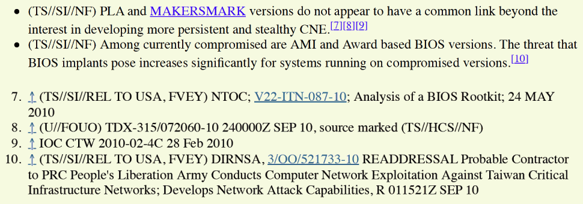
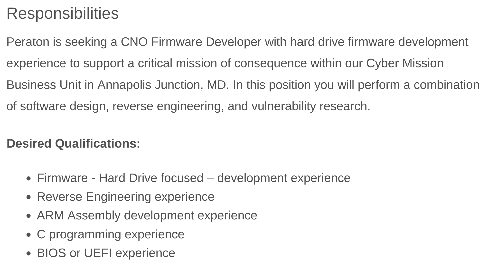

*This series references many technical terms and concepts detailed in the [drive firmware security overview](../overview) page, which should be read first.*

*IRATEMONK* is the cover name for an implant installed in the firmware of a personal computer's storage drive. This implant is designed for two purposes: the main one being indefinite, unremovable, persistent execution of an operating system payload, and the secondary being to provide an area of covert storage in the drive's System Area (SA).

A page from the infamous [ANT catalogue](https://en.wikipedia.org/wiki/ANT_catalog), dated 20 June 2008, gives an overview of its features and capabilities at that time[^ant_catalogue_iratemonk]:

<figure>
    
</figure>

The above page describes its general purpose: designed for personal computers, it persists a malware payload that executes in the operating system every time the system powers on, and it supports a variety of hard drive vendors (Western Digital, Seagate, Maxtor, Samsung). It's described as configurable, optionally able to execute the payload on a custom interval rather than on every boot.

The name *IRATEMONK* is used both for this overall capability and for the firmware implant within it. This capability is made up of multiple separate components, each with a specific role. These components are individually detailed in the pages below:

* [IRATEMONK](iratemonk): The firmware implant itself
* [WICKEDVICAR](wickedvicar): The tool to remotely install *IRATEMONK* to a drive
* [SLICKERVICAR](slickervicar): The driver used by *WICKEDVICAR*

Firmware persistence techniques such as *IRATEMONK* are very rare in real-world publicly documented attacks. In fact, such attacks have only ever targeted three different types of computer component:

* Motherboard BIOS/UEFI
* Server Baseboard Management Controller (BMC)[^ilobleed]
* Storage drive

The first of the above categories is by far the most numerous, with several such in-the-wild attacks documented. The first such attack, according to sources, was *LoJax* in 2018[^lojax], a persistent UEFI firmware implant attributed to Russian military intelligence. After *LoJax* was widely publicised, many in the security industry began to perceive such UEFI attacks as a real threat worthy of investigation rather than just a theoretical conference topic, even adding UEFI firmware scanning to commercial antivirus products. This rise in attention given to UEFI threats also coincided with a rise in such attacks being discovered, with multiple others, such as *MosaicRegressor*[^mosaicregressor], found and published in the few years following *LoJax*.

Was this emergence and wave of BIOS/UEFI persistence attacks being discovered caused by threat actors only adopting the technique in the late 2010s? A classified 2012-dated page from *Intellipedia*, the internal wiki of the US intelligence community, implies otherwise[^intellipedia], claiming not only that by then the technique was in active use by both Russian and Chinese intelligence, but that in 2010 such an attack had been found in Taiwanese critical infrastructure:

The more likely explanation for this late 2010s explosion in UEFI discoveries seems to be not that the technique suddenly entered use, but that before *LoJax* no-one considered it a serious threat, so no-one was looking for it.

As detailed in the pages for each component, *IRATEMONK* appears to have an origin dating to the early 2000s, likely between 2001 and 2004, developed for hard drives dating as far back as the late 1990s. This would make *IRATEMONK* the earliest publicly known firmware persistence attack, beating *LoJax* by nearly two decades.

Despite its age, if job advertisements by American defence contractors are to be trusted, *IRATEMONK* or a capability like it may still be in use today[^job_ad]:

Why hasn't such a capability been documented more recently, or been seen in use by other threat actors? As with the pre-*LoJax* UEFI era, maybe sometimes these discoveries have to wait for the right people to look for them.

[^ant_catalogue_iratemonk]: https://en.wikipedia.org/wiki/ANT_catalog#/media/File:NSA_IRATEMONK.jpg
[^ilobleed]: https://threats.amnpardaz.com/en/wp-content/uploads/sites/5/2021/12/Implant.ARM_.iLOBleed.a-en.pdf
[^lojax]: https://www.welivesecurity.com/2018/09/27/lojax-first-uefi-rootkit-found-wild-courtesy-sednit-group
[^mosaicregressor]: https://securelist.com/mosaicregressor/98849
[^intellipedia]: https://theintercept.com/document/2019/01/23/intellipedia-bios-threats
[^job_ad]: https://web.archive.org/web/20260819141024/https://www.bing.com/search?q=%22peraton%22%20%22CNO%20Firmware%20Developer%22