# Introduction

*IRATEMONK* is the cover name of the implant installed inside the firmware of a targeted drive. Although in-the-wild infections of the host-side components ([WICKEDVICAR](../wickedvicar) and [SLICKERVICAR](../slickervicar)) were documented by Kaspersky[^kaspersky_equationdrug], the company apparently did not recover any samples of the firmware implant itself, and no real-world infection or sample of it has been publicly documented by anyone since.

Despite the lack of any sample, many technical details of this firmware implant can be reconstructed from internal NSA documents. The [ANT catalogue page](../ant_catalogue.jpg)[^ant_catalogue_iratemonk] gives a high-level overview of the capability, seemingly written for an external audience such as other offices or agencies within the Five Eyes intelligence community. However, even more insightful is the internally focused documentation, written for the people who research and develop this capability. A single internal developer document relating to this firmware implant is publicly available: a wiki-style page from the NSA's *S3285 Persistence Division* titled [intern projects](../nsa_intern_projects.pdf)[^nsa_intern_projects].

<figure>
    <a href="intern_projects_header.png" class="image-popup">
        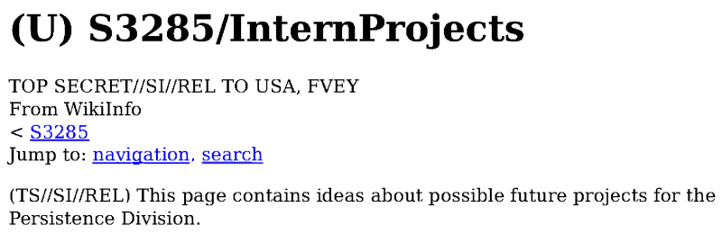
    </a>
</figure>

This wiki page details potential projects for *interns*, a term which seemingly refers to the NSA's *Computer Network Operations Development Program*[^nsa_cnodp], where military and intelligence-community personnel from outside the agency do a temporary tour working within the NSA.

The wiki page itself is undated. However, the content gives enough detail to roughly infer the time period it was written in. The mention of Windows 7 as a supported operating system gives a floor of late 2009[^windows_7_release], while the complete absence of any Windows 8 mention gives a likely ceiling of late 2012[^windows_8_release]. The mention of *newest Seagate drives including their hybrid drive products* likely raises the floor to mid-2010, when Seagate released their flagship *Momentus XT* hybrid drive model[^seagate_momentus_xt_release]. The most revealing detail may be a mention of BTRFS as *slated to become the default in Fedora Core 17 or 18*: Fedora 16 reached feature freeze in July 2011[^fedora_16_schedule], with default BTRFS still under consideration mere weeks earlier[^fedora_16_btrfs], while Fedora 17 reached feature freeze in February 2012 and final release in May 2012[^fedora_17_schedule]. The naming of Fedora 17 or 18 rather than 16 raises the floor to mid-2011, when 16 dropped BTRFS as its default, while the change still being only *slated* gives a ceiling of Fedora 17's release. These various details together allow dating this wiki page to a plausible period of roughly mid-2011 to mid-2012, showing the current state of *IRATEMONK* development at that time.

# Why

The [intern projects](#introduction) document describes an additional purpose for this drive firmware implant not mentioned in the [ANT catalogue page](../ant_catalogue.jpg). In addition to persistent execution of a payload, it provides a capability of *covert storage* in the drive System Area (SA), storing arbitrary external data in an internal reserved area of the drive that's otherwise inaccessible:

<figure>
    <a href="intern_projects_covert_storage.png" class="image-popup">
        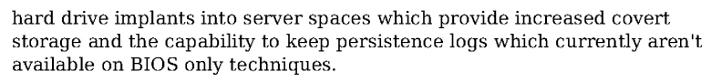
    </a>
</figure>

The paragraph above also mentions an important advantage of drive firmware implants over other comparable firmware persistence techniques such as BIOS attacks: the capability of *storage* available to the implant, usable for features such as *persistence logs*.

The NOR flash that stored a computer BIOS was generally around 1 to 8 megabytes during this period, with unused free space sometimes being mere kilobytes in size[^bios_size]. By contrast, a hard drive of the period may have had a reserved SA with hundreds of megabytes of free space[^hdd_sa_size], far more than enough to store any practical payload and ancillary data.

This storage limitation is demonstrated by other firmware capabilities developed by the same organisation, such as *SWAP*, which targets a personal computer's BIOS[^ant_catalogue_swap]:

ANT catalogue SWAP page

<figure>
    <a href="ant_catalogue_swap.jpg" class="image-popup">
        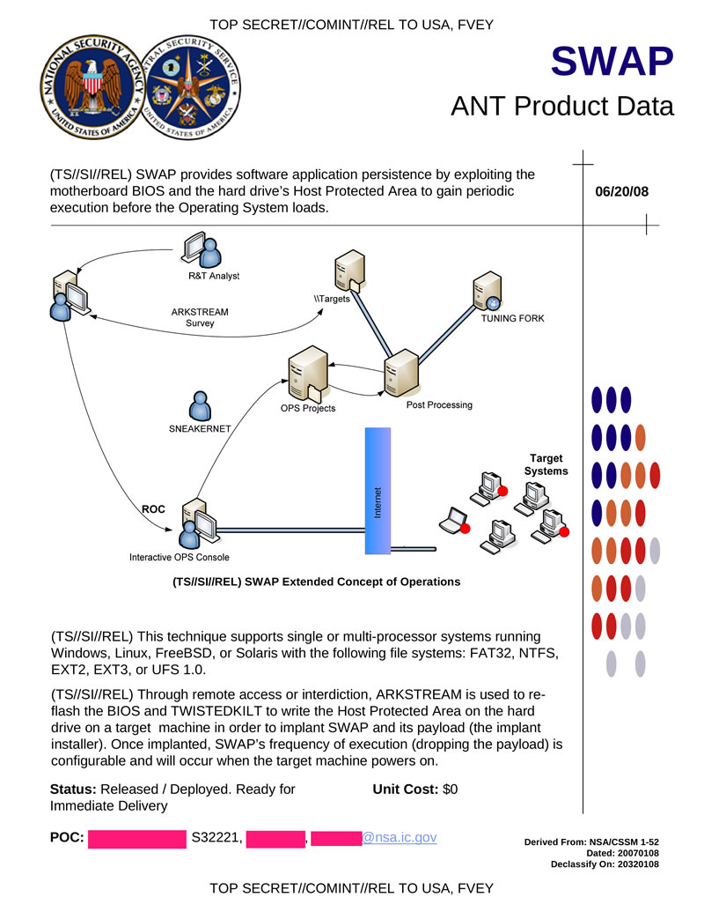
    </a>
</figure>

As detailed in the above catalogue page, even when targeting the BIOS, the drive had to be targeted as well. Due to storage limitations, a Host Protected Area (HPA) was required on the computer's drive for the BIOS implant to use as storage space. If the drive had to be targeted regardless, there was little reason not to develop a drive-only technique, without the complexity of having to target multiple separate components. These practical realities make drive firmware persistence a natural choice.

By all indications, developing the capability to persist entirely within a drive's firmware may have made other firmware persistence techniques for personal computers obsolete within the NSA, not supplementing but outright replacing them as a superior option. Within the previously detailed *intern projects* document, dating to at least mid-2011, it's mentioned that their BIOS persistence capability *SWAP* only supported IDE hardware that had by then been obsolescent for half a decade, suggesting it was no longer a significant focus of active development:

<figure>
    <a href="intern_projects_stylishchamp.png" class="image-popup">
        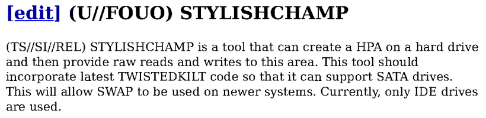
    </a>
</figure>

# How

In addition to expanding on the *why* of this capability as detailed above, the [intern projects](#introduction) document gives significant insight into the *how*. It first answers one of the most common questions and points of speculation about this technique: whether it was enabled purely through black-box reverse engineering, through internal drive vendor resources (possibly even through wilful collusion or cooperation of those vendors), or some combination of the two.

A perspective leaning towards one end of that spectrum was stated by Reuters, which not only asked drive vendors for comment on whether they had knowledge of or involvement in the discovered attacks, but also claimed that access to private firmware source code was a necessity[^reuters_raiu]:

>Raiu said the authors of the spying programs must have had access to the proprietary source code that directs the actions of the hard drives.

The cited source, Costin Raiu, a Kaspersky researcher involved in the discovery and investigation of the relevant samples, did not, however, explicitly make this *source code* claim in the included quote. He only implied the use of some non-public information:

>There is zero chance that someone could rewrite the [hard drive] operating system using public information,

Raiu elaborated further on this perspective in another interview[^pcworld_raiu]:

>Equation knows sets of unique ATA commands used by hard drive vendors to format their products. Most ATA commands are public, as they comprise a standard that ensures a hard drive is compatible with just about any kind of computer.

>But there are undocumented ATA commands used by vendors for functions such as internal storage and error correction, Raiu said. “In essence, they are a closed operating system,” he said.

>Obtaining such specific ATA codes would likely require access to that documentation, which could cost a lot of money, Raiu said.

One key piece of information often unmentioned in speculation such as that quoted above is that technical details of drive firmware internals have proliferated outside the vendors themselves for decades, and in fact an entire commercial industry is built on the foundation of this information: data recovery. When attempting to recover data from a broken or malfunctioning drive, detailed knowledge of how the drive works is essential, as is often low-level access to the firmware internals that control the drive's functionality. Companies located in jurisdictions with loose intellectual property enforcement, such as ACE Lab[^ace_lab] and MRT Lab[^mrt_lab] in Russia and China respectively, build their businesses on selling commercial products and training that give the data recovery industry access to these proprietary drive internals.

This connection between proprietary drive vendor knowledge and data recovery is explicitly made in the following section of the page:

<figure>
    <a href="intern_projects_data_recovery.png" class="image-popup">
        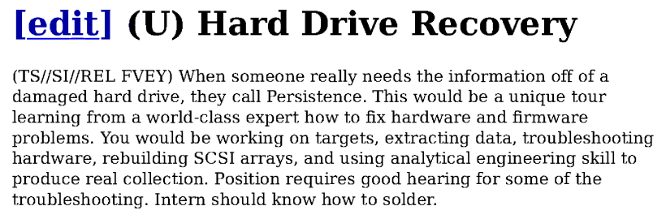
    </a>
</figure>

The section above is extremely revealing. Not only did the NSA have the knowledge of low-level drive internals necessary for complex data recovery tasks, but that knowledge was also institutionally organised within the same division tasked with developing drive firmware implants for offensive use.

As the world's premier signals intelligence organisation, the NSA would inevitably encounter challenges requiring the extraction of intelligence from storage media in a massive range of conditions, including, no doubt, drives that had been intentionally or inadvertently damaged, or whose data was otherwise not immediately accessible. It's therefore unsurprising that they would invest in the same expertise and capabilities as the commercial data recovery industry, but in-house, for use within their security and classification requirements.

Even without any initial objective of firmware implant development, any organisation like the NSA would inevitably obtain the very same deep technical expertise required to develop such a capability, purely as a side effect of their data recovery requirements.

The project for implementing SSD support also gives significant insight into how these firmware implants are developed and the type of resources used:

<figure>
    <a href="intern_projects_ssd.png" class="image-popup">
        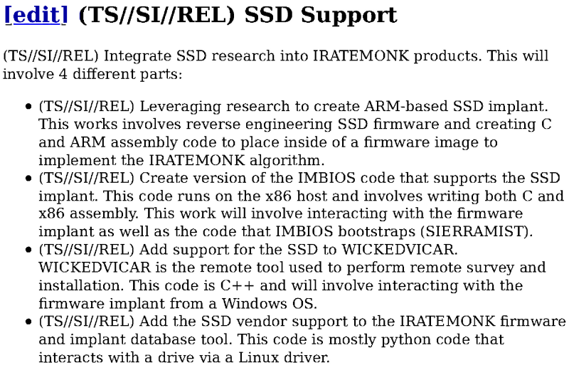
    </a>
</figure>

The above project states this explicitly: implant support for a new drive type is developed through prior *SSD research* combined with *reverse engineering SSD firmware*, not by modifying and building firmware source code as some speculation suggested. The implant is described as comprising both low-level assembly and high-level C code, compiled and inserted *inside of a firmware image*. It is characterised as an *IRATEMONK algorithm*, a single common core design that's simply implemented for each drive type.

The section introducing a series of Computer Network Attack (CNA) project ideas gives an estimate of how much work these *intern projects* are expected to require. From this we can infer that developing a functional *IRATEMONK* firmware implant for a drive type should be possible for a single individual in approximately 4 to 6 months of full-time work:

<figure>
    <a href="intern_projects_time.png" class="image-popup">
        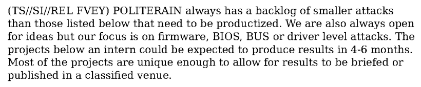
    </a>
</figure>

# Implant

The design of the firmware implant is detailed in the [intern projects](#introduction) document. It's described as a single *algorithm* implemented for each drive type in assembly and C code, with that assembled and compiled code inserted into an existing firmware image:

<figure>
    <a href="intern_projects_ssd_part_1.png" class="image-popup">
        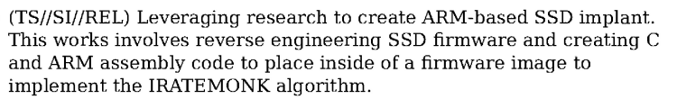
    </a>
</figure>

Implants are *productized* and deployed as an entire *firmware image*: an original firmware package that has been modified with the implant code inserted within. A *firmware and implant database tool* with cover name *SPITEFULANGEL* maintains a catalogue of these modified firmware images for supported drive models and firmware versions:

<figure>
    <a href="intern_projects_ssd_part_4.png" class="image-popup">
        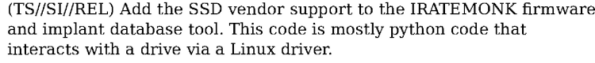
    </a>
</figure>

# IMBIOS

The [ANT catalogue page](../ant_catalogue.jpg) describes the main functionality of these firmware implants as executing a payload in the host operating system by substituting an alternate Master Boot Record (MBR) boot sector. This boot-sector payload is referred to in the [intern projects](#introduction) document as *IMBIOS* (**I**rate **M**onk BIOS?), described as specific to each individual drive type and implemented in a combination of assembly and C code:

<figure>
    <a href="intern_projects_ssd_part_2.png" class="image-popup">
        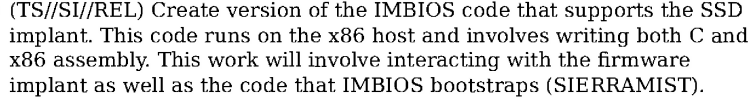
    </a>
</figure>

The *IMBIOS* first-stage payload is given two roles: *interacting with the firmware implant*, and bootstrapping the second-stage payload *SIERRAMIST*. The mention of *IMBIOS* implementations being drive-type specific implies this involves Vendor Unique Commands (VUCs). The task of *bootstrapping* likely refers to loading *SIERRAMIST* from the drive SA into memory, then initialising and executing it, while *interacting with the firmware implant* likely refers to notifying *IRATEMONK* of execution so that boot-sector substitution can be paused for the real OS bootloader to be loaded, as well as logging the execution to *persistence logs* in the SA:

<figure>
    
</figure>

The use of these *persistence logs* allows tracking of attempted and successful deployments of the payload, which also enables deployment at variable frequencies. This matches the detail in the [ANT catalogue page](../ant_catalogue.jpg) that *frequency of execution (dropping the payload) is configurable*.

# SIERRAMIST

The second-stage payload executed by [IMBIOS](#imbios) is a component with cover name *SIERRAMIST*, which appears to be a generic platform used with multiple firmware persistence techniques. The [intern projects](#introduction) document describes its various features, and seems to imply that it was in the process of being superseded by the next-generation *JUMPDOLLAR*, with various *JUMPDOLLAR* features requested to be backported:

<figure>
    <a href="intern_projects_sierramist_backport.png" class="image-popup">
        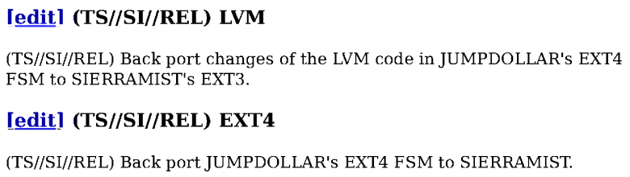
    </a>
</figure>

*SIERRAMIST* appears to be designed like a miniature operating system executed before the computer's main OS: modular, with various separate *applications* that can be executed inside it. It's stored in a *partition* implemented specifically for each persistence method, a partition that can be updated separately from the firmware implant itself:

<figure>
    <a href="intern_projects_sierramist_partition.png" class="image-popup">
        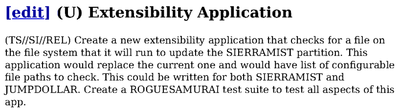
    </a>
</figure>

For *IRATEMONK* it's likely this partition is stored in the drive SA, the area of drive storage intended for internal firmware use.

The vectors *SIERRAMIST* uses to execute a payload on the host OS involve writing to the filesystem, with support for various filesystems being the target of several projects such as the two above. This echoes the [ANT catalogue page](../ant_catalogue.jpg), which ties *IRATEMONK* support to a set of specific filesystems. Based on the filesystems listed in both the ANT catalogue and *intern projects* documents, we can infer the following set of supported OSs:

OS | Filesystems
---|---
Windows | NTFS, FAT
Linux | EXT3
Solaris and/or BSD | UFS

The specific methods used to gain code execution through filesystem writes for the above operating systems are not specified. However, at least for Windows NTFS, they can be partially inferred from techniques used by other similar products at the time. *CompuTrace* (a.k.a. *LoJack* or *Absolute Home & Office*) was a security product active in the early 2010s, designed to execute a payload in the host Windows OS from a computer's BIOS by writing to the filesystem. At that time, third-party NTFS implementations had limited functionality due to the filesystem's complexity and largely undocumented nature. Minimal implementations were not able to include full-featured write support such as creating and allocating new files.

This difficulty is also acknowledged in the *intern projects* document, which requests development of a *reliable, robust, and portable* NTFS implementation, something they apparently did not have:

<figure>
    <a href="intern_projects_ntfs.png" class="image-popup">
        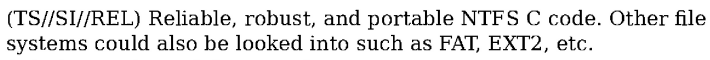
    </a>
</figure>

As such, *CompuTrace* worked by inserting itself into space within the pre-existing file *autochk.exe*, which Windows automatically executes during boot, backing up the original *code parts* of the file to the alternate data stream `autochk.exe:BAK` without changing the file's overall size allocation[^securelist_computrace]. Having been developed in approximately the same period with the same functional goals, the NTFS code execution vector of *SIERRAMIST* likely worked similarly.

For Windows targets, the method used to deploy the final payload from that initial code execution foothold is detailed in the *intern projects* document under the cover name *CASTLECRASHER*, a method they were apparently looking to develop an alternative to:

<figure>
    <a href="intern_projects_castlecrasher.png" class="image-popup">
        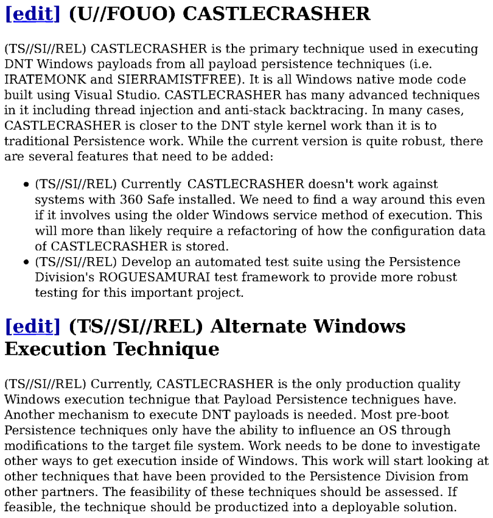
    </a>
</figure>

From the description above it can be inferred that *CASTLECRASHER* executes in *native mode*, an early stage in the Windows boot process before full OS functionality is available. From there it executes the final payload reflectively in another process using *thread injection*, combined with *anti-stack backtracing* (a.k.a. call stack spoofing) to obscure the injected thread's origin from security products.

# Conclusion

From the details covered above, the likely process by which *IRATEMONK* executes a payload in a Windows operating system can be reconstructed:

* *IRATEMONK* presents the *IMBIOS* MBR boot sector to the host BIOS.
* *IMBIOS* executes and uses VUCs to log deployment to *IRATEMONK* and load *SIERRAMIST* from the drive SA.
* *SIERRAMIST* executes and writes *CASTLECRASHER* into an existing native-mode executable in the Windows NTFS partition.
* Notified of deployment, *IRATEMONK* pauses substitution to present the real Windows boot sector.
* The Windows boot sector executes (invoked by *IMBIOS* or *SIERRAMIST*, directly or through reboot), and Windows starts.
* *CASTLECRASHER* executes in Windows native mode, reflectively executing the final payload in another process.

It's a complex but robust execution chain, dependent only on the filesystem format and location of a single key executable file, and likely stable even between major Windows versions. A design intended for reliable long-term persistence on a high-value individual's personal computer.

[^kaspersky_equationdrug]: https://securelist.com/inside-the-equationdrug-espionage-platform/69203/
[^ant_catalogue_iratemonk]: https://en.wikipedia.org/wiki/ANT_catalog#/media/File:NSA_IRATEMONK.jpg
[^nsa_intern_projects]: https://www.spiegel.de/international/world/new-snowden-docs-indicate-scope-of-nsa-preparations-for-cyber-battle-a-1013409.html
[^nsa_cnodp]: https://www.nsa.gov/Careers/Career-Fields/Development-Programs/
[^windows_7_release]: https://en.wikipedia.org/wiki/Windows_7
[^windows_8_release]: https://en.wikipedia.org/wiki/Windows_8
[^seagate_momentus_xt_release]: https://en.wikipedia.org/wiki/Hybrid_drive
[^fedora_16_schedule]: https://fedoraproject.org/wiki/Releases/16/Schedule
[^fedora_16_btrfs]: https://www.phoronix.com/news/OTU0Nw
[^fedora_17_schedule]: https://fedoraproject.org/wiki/Releases/17/Schedule
[^reuters_raiu]: https://www.reuters.com/article/2015/02/16/us-usa-cyberspying-idUSKBN0LK1QV20150216/
[^pcworld_raiu]: https://www.pcworld.com/article/431905/equation-cyberspies-use-unrivaled-nsastyle-techniques-to-hit-iran-russia.html
[^ant_catalogue_swap]: https://en.wikipedia.org/wiki/File:NSA_SWAP.jpg
[^ace_lab]: https://www.acelab.eu.com/
[^mrt_lab]: https://us.mrtlab.com/
[^bios_size]: https://eternallybored.org/logo/bios/
[^hdd_sa_size]: https://dl.packetstormsecurity.net/papers/general/SA-cover.pdf
[^securelist_computrace]: https://securelist.com/absolute-computrace-revisited/58278/
