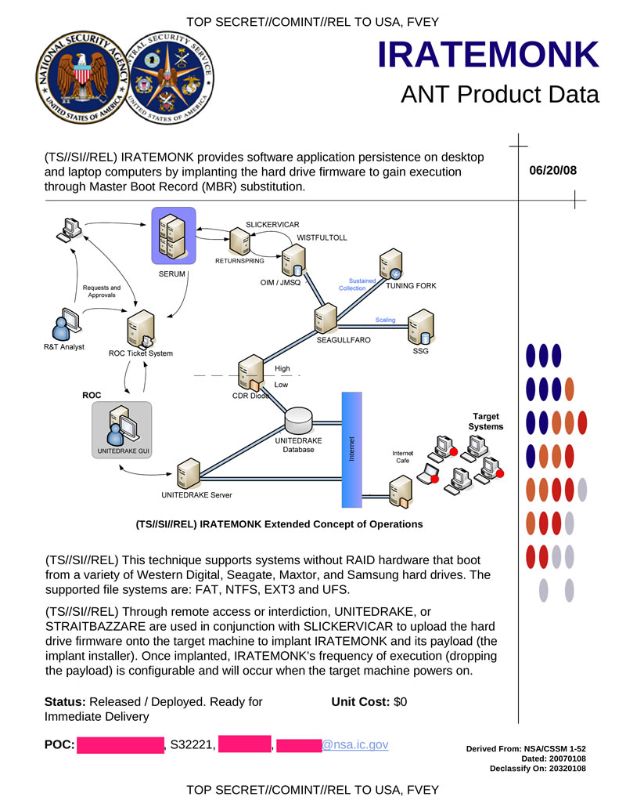

# Introduction

*SLICKERVICAR* is the cover name for a Windows kernel driver used by [WICKEDVICAR](../wickedvicar) to execute ATA commands on a target drive. The earliest source referencing it is an [ANT catalogue page](../ant_catalogue.jpg)[^ant_catalogue_iratemonk], dated 20 June 2008:

<figure>
    
</figure>

There *SLICKERVICAR* is named as a component related to *IRATEMONK*, and is used by *UNITEDRAKE* (a.k.a. *EquationDrug* and *GrayFish*[^vb_unitedrake]) and *STRAITBIZARRE* (a.k.a. *SBZ*[^kaspersky_sbz], misspelled in the page as *STRAITBAZZARE*) to *upload the hard drive firmware onto the target machine to implant IRATEMONK and its payload*.

The other internal NSA source referencing *SLICKERVICAR* is from the [Shadow Brokers](https://en.wikipedia.org/wiki/The_Shadow_Brokers) dumps, specifically a driver signature database of the *TERRITORIALDISPUTE* component[^tedi_driverdb]. That database has a row naming *SLICKERVICAR* with an associated file name, version, and hash[^netadr]:

> win32m.sys|*** SLICKERVICAR 3.1.4.1 ***|TOOL_HASH|ea647581401947b90768ecb68e1dfa3e606f9a71||

That file name *win32m.sys* can then be connected to two samples mentioned in a Kaspersky threat intelligence report[^kaspersky_equationdrug]: a 32-bit version with compile timestamp *23 August 2001 17:03:19 UTC*, and a 64-bit version with compile timestamp *14 May 2013 15:58:36 UTC*. Of these, only the 32-bit sample is publicly available, stored as a PE resource inside the sample detailed in [WICKEDVICAR](../wickedvicar).

That compile timestamp of the 32-bit sample also matches the toolchain used to build the driver. The PE rich header indicates the driver was built with Visual C++ compiler version *13.00.9178* (build 9178) and linker version *13.00.9210* (build 9210). These build numbers correspond to a pre-release version of Visual C++ 7.0 (*Rainier*) between Beta 1 (build 9037) released 13 November 2000[^betawiki_9037] and Beta 2 (build 9254) released 19 June 2001[^betawiki_9254].

The driver's code is standard C, with string encryption as the only obfuscation. The specific algorithm used to scramble strings is named *MixText* within a script in the *Shadow Brokers* dumps[^mixtext].

The driver creates a device with path `\Device\WIN32M` and symlink `\DosDevices\WIN32M`, accessible from user-mode at path `\\.\WIN32M`. Functionality of the driver is provided as a set of IOCTLs for that device. Each supported IOCTL is detailed below.

IOCTL | Description
---|---
`0x870021C0` | [Get Version](#ioctl-get-version)
`0x870021C4` | [Initialise](#ioctl-initialise)
`0x870021C8` | [Uninitialise](#ioctl-uninitialise)
`0x870021CC` | [Get Device Configuration](#ioctl-get-device-configuration)
`0x870021D0` | [Execute](#ioctl-execute)
`0x870021D4` | [ATA Command Configuration](#ioctl-ata-command-configuration)

# IOCTL Get Version

IOCTL `0x870021C0` simply returns the *SLICKERVICAR* version as a string: *3.0.0.0*.

# IOCTL Initialise

IOCTL `0x870021C4` initialises the driver by parsing an 854-byte block of configuration data, beginning with a 12-byte header of the following structure:

Offset | Size | Value | Description
---|---|---|---
`0x0` | 4 | `0x356` | Total data size
`0x4` | 4 | `0x03000000` | Driver version
`0x8` | 4 | Maximum 8 | Device count

That header is then followed by a *device count* (header offset `0x8`) number of contiguous device entries, each describing an ATA device. Each device entry is 100 bytes in size, with the following structure:

Offset | Size | Value | Description
---|---|---|---
`0x0` | 2 | | PCI vendor ID
`0x2` | 2 | | PCI device ID
`0x4` | 4 | 0 (PMIO), 1 (MMIO) | I/O range 0 type
`0x8` | 4 | 0 (PMIO), 1 (MMIO) | I/O range 1 type
`0xC` | 4 | 0 (PMIO), 1 (MMIO) | I/O range 2 type
`0x10` | 4 | 0 (PMIO), 1 (MMIO) | I/O range 3 type
`0x1C` | 4 | | I/O range 0 address
`0x20` | 4 | | I/O range 1 address
`0x24` | 4 | | I/O range 2 address
`0x28` | 4 | | I/O range 3 address
`0x34` | 4 | | I/O range 0 size
`0x38` | 4 | | I/O range 1 size
`0x3C` | 4 | | I/O range 2 size
`0x40` | 4 | | I/O range 3 size
`0x50` | 4 | | Bus interrupt level
`0x54` | 4 | | SATA channel index
`0x58` | 4 | 0 (IDE), 1 (AHCI), 3 (Nvidia) | Device type
`0x5C` | 4 | | Port/channel count
`0x60` | 4 | | Port multiplier / secondary port index

The configuration data then ends with a 42-byte footer at offset `0x32C`, with the following structure:

Offset | Size | Value | Description
---|---|---|---
`0x0` | 4 | Must match `KeNumberProcessors` | CPU count
`0x4` | 4 | | Nvidia busy check threshold
`0xE` | 4 | | [IOCTL Execute](#ioctl-execute) request queue poll interval (milliseconds)
`0x12` | 4 | | [IOCTL Execute](#ioctl-execute) request retry limit
`0x16` | 4 | | Command dispatch retry limit
`0x1A` | 4 | | Poll interval (microseconds)
`0x1E` | 4 | | Pre-command timeout (poll iterations)
`0x22` | 4 | | PIO DRQ poll retry limit
`0x26` | 4 | | Post-command timeout (poll iterations)

Depending on the type, a single PCI device may be shared by multiple device configuration entries. For IDE and Nvidia, an entry is one channel, a single command/data path within a controller. For AHCI, an entry is the entire host bus adapter (HBA), and the port used is selected per command.

The specific device types supported are interesting as they allow dating the driver's development. Support for SATA AHCI controllers disproves the 2001 compile timestamp, as the first draft AHCI specification was only released years later in May 2003[^ahci_release]. For the Nvidia type, the driver includes a hardcoded list of PCI device IDs it uses for validation, which correspond to the following controllers:

Vendor:Device | Name
---|---
`10DE:008E` | nForce2 Serial ATA Controller
`10DE:00E3` | nForce3 Serial ATA Controller
`10DE:00EE` | nForce3 Serial ATA Controller 2
`10DE:0036` | MCP04 Serial ATA Controller
`10DE:003E` | MCP04 Serial ATA Controller
`10DE:0054` | CK804 Serial ATA Controller
`10DE:0055` | CK804 Serial ATA Controller
`10DE:0266` | MCP51 Serial ATA Controller
`10DE:0267` | MCP51 Serial ATA Controller
`10DE:037E` | MCP55 SATA Controller
`10DE:037F` | MCP55 SATA Controller
`10DE:03E7` | MCP61 SATA Controller
`10DE:03F6` | MCP61 SATA Controller
`10DE:03F7` | MCP61 SATA Controller

This is a comprehensive list of Nvidia's SATA controllers from the very first nForce2 up to the MCP61, but conspicuously misses everything after it, such as the MCP65 that immediately followed. As the MCP61 was released August 2006[^nvidia_mcp61_1][^nvidia_mcp61_2] while the MCP65 was in public driver device lists by November 2006[^nvidia_mcp65], it's likely this Nvidia component of the driver was last updated in approximately late 2006.

# IOCTL Uninitialise

IOCTL `0x870021C8` clears any configuration set through [IOCTL Initialise](#ioctl-initialise) and uninitialises the driver.

# IOCTL Get Device Configuration

IOCTL `0x870021CC` returns the device configuration data set through [IOCTL Initialise](#ioctl-initialise). This data is 804 bytes in size, starting with the *device count* field in the header, followed by all device entries.

# IOCTL Execute

IOCTL `0x870021D0` executes a list of ATA command-related operations. Multiple operations can be executed in a single IOCTL call. This IOCTL uses the same data buffer bidirectionally for both input and output. The data is variable-length and begins with the following 20-byte header:

Offset | Size | Value | Direction | Description
---|---|---|---|---
`0x0` | 4 | | In | Device, index in device list of [IOCTL Initialise](#ioctl-initialise)
`0x4` | 4 | | In | Port/channel index (AHCI only)
`0x8` | 4 | 0 (slave), non-zero (master) | In | Device select (IDE or Nvidia only)
`0xC` | 4 | 0 (success), non-zero (error code) | Out | Overall status, either success or the error code of the failed operation
`0x10` | 4 | | In | Operation count

That header is then followed by an *operation count* (header offset `0x10`) number of contiguous operation entries. Each entry is variable-sized and begins with the following 44-byte operation header:

Offset | Size | Value | Direction | Description
---|---|---|---|---
`0x0` | 4 | 0 (success), non-zero (error code) | Out | Status, an error code if non-zero
`0x4` | 4 | | In | Total operation entry size in bytes
`0x8` | 4 | 0 (none), non-zero (use value) | In | Timeout in milliseconds
`0xC` | 4 | 0 (abort), 1 (next), 2 (next forced) | In | Error handling. Abort all operations, skip to the next, or skip to the next that's *forced* (field `0x18`)
`0x10` | 4 | | Out | ATA Error register
`0x14` | 4 | | Out | ATA Status register
`0x18` | 4 | 0 (skip), non-zero (force) | In | Force, can execute if a preceding operation failed
`0x1C` | 4 | 0 (data), non-zero (non-data) | In | Non-data operation, no transfer
`0x20` | 4 | 0 (to device), non-zero (from device) | In | Data transfer direction
`0x24` | 4 | 512-byte aligned | In | Data transfer size in 16-bit words
`0x28` | 4 | | In | Register count

That header is then followed by a *register count* (operation header offset `0x28`) number of contiguous register entries, each representing a read or write operation on an ATA register. Each entry is 6 bytes in size, with the following structure:

Offset | Size | Value | Direction | Description
---|---|---|---|---
`0x0` | 4 | 0 (write), non-zero (read) | In | Direction, write or read register
`0x4` | 1 | 1 to 7 (command), `0xFF` (*alternate status*/*device control*) | In | Register ID
`0x5` | 1 | | | Register value

This IOCTL can execute both LBA-28 and LBA-48 ATA commands, with 16-bit registers usable by accessing the same register twice. However, only PIO commands can be reliably executed. DMA transfer is implicit for AHCI but unimplemented in this driver for IDE and Nvidia.

The following are all possible error codes that can be returned in the *status* field (`+0x0`) of the *operation header*:

Code | Description
---|---
`0xE0040003` | Device busy before command
`0xE0040004` | Device not ready after drive select
`0xE0040005` | Drive select failed
`0xE0040006` | Device state restore failed after command
`0xE0040007` | Register write or soft reset failed
`0xE0040008` | PIO data transfer failed (DRQ timeout)
`0xE0040009` | Command completed with ATA error
`0xE004000A` | Failed to acquire exclusive hardware access
`0xE004000B` | Device busy during command setup
`0xE004000D` | Device busy before PIO transfer (timeout)
`0xE004000E` | AHCI command FIS build failed
`0xE004000F` | AHCI scatter-gather list build failed
`0xE0040010` | AHCI port command issue failed
`0xE0040012` | AHCI command completion timeout
`0xE0040013` | AHCI port invalid or not implemented
`0xE0040016` | Transfer size not 512-byte aligned
`0xE0040017` | Operation failed with error handling set to *skip to forced*, but no *forced* operation found
`0xE0040019` | Device not detected
`0xE004001A` | Pre-command validation failed
`0xE004001C` | AHCI port error status clear failed

# IOCTL ATA Command Configuration

IOCTL `0x870021D4` gets or sets configuration parameters that correspond to fields `0xE` onwards in the footer of the [IOCTL Initialise](#ioctl-initialise) data. This IOCTL uses the same data buffer bidirectionally for both input and output. The data is 32 bytes in size, with the following structure:

Offset | Size | Value | Direction | Description
---|---|---|---|---
`0x0` | 4 | 0 (get), non-zero (set) | In | Either get all fields, or a bitmask (bits 0:6) of field indices to set
`0x4` | 4 | | | [IOCTL Execute](#ioctl-execute) request queue poll interval (milliseconds)
`0x8` | 4 | | | [IOCTL Execute](#ioctl-execute) request retry limit
`0xC` | 4 | | | Command dispatch retry limit
`0x10` | 4 | | | Poll interval (microseconds)
`0x14` | 4 | | | Pre-command timeout (poll iterations)
`0x18` | 4 | | | PIO DRQ poll retry limit
`0x1C` | 4 | | | Post-command timeout (poll iterations)

# Conclusion

This driver seems uniquely connected to *IRATEMONK*, with a cover name matching the convention of an adjective and a religious title. Even other capabilities by the same organisation that also execute ATA commands do not seem to use it, instead using different drivers such as *STYLISHCHAMP* for *SWAP*[^nsa_intern_projects]. The spurious compile timestamp of *23 August 2001 17:03:19 UTC* is contradicted by the driver's features specific to hardware first introduced years later, with that date likely chosen as one day before Windows XP's release to manufacturing on *24 August 2001*[^windows_xp_release]. This version of *SLICKERVICAR* cannot possibly date from earlier than August 2006, and the absence of newer Nvidia SATA controllers gives a tentative date estimate of approximately late 2006.

[^ant_catalogue_iratemonk]: https://en.wikipedia.org/wiki/ANT_catalog#/media/File:NSA_IRATEMONK.jpg
[^vb_unitedrake]: https://www.virusbulletin.com/virusbulletin/2019/01/vb2018-paper-draw-me-one-your-french-apts-expanding-our-descriptive-palette-cyber-threat-actors/
[^tedi_driverdb]: https://github.com/DonnchaC/shadowbrokers-exploits/blob/master/windows/Resources/Ops/Databases/DriverList.db
[^netadr]: Credit to https://github.com/netadr for identifying and telling me this.
[^kaspersky_sbz]: https://apt.securelist.com/apt/sbz
[^kaspersky_equationdrug]: https://securelist.com/inside-the-equationdrug-espionage-platform/69203/
[^betawiki_9037]: https://betawiki.net/wiki/Visual_Studio_.NET_build_9037
[^betawiki_9254]: https://betawiki.net/wiki/Visual_Studio_.NET_build_9254
[^mixtext]: https://github.com/webpentest/EquationGroupLeak/blob/master/Firewall/BUZZDIRECTION/BUZZ_1210/SeconddateCnC/noarch/MixText.py
[^nsa_intern_projects]: https://www.spiegel.de/international/world/new-snowden-docs-indicate-scope-of-nsa-preparations-for-cyber-battle-a-1013409.html
[^ahci_release]: https://www.intel.com/pressroom/archive/releases/2003/20030507corp.htm
[^nvidia_mcp61_1]: https://www.theregister.com/on-prem/2006/07/05/next-gen-nvidia-one-chip-chipset-gets-pci-e-thumbs-up/1539436
[^nvidia_mcp61_2]: https://forums.anandtech.com/threads/core-2-am2-motherboards-recommendations.57668/page-6
[^nvidia_mcp65]: https://lkml.iu.edu/hypermail/linux/kernel/0611.0/0116.html
[^windows_xp_release]: https://en.wikipedia.org/wiki/Windows_XP