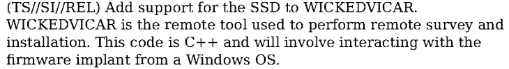

# Introduction

*WICKEDVICAR* is the cover name of a component for remote installation and management of an *IRATEMONK* firmware implant from a Windows host operating system (OS). Although, as detailed in [IRATEMONK](../iratemonk), other OSs are supported by the firmware implant itself, only Windows is known to have a component for installing and managing the implant remotely. The earliest source implying the existence of *WICKEDVICAR* is a page from the [ANT catalogue](https://en.wikipedia.org/wiki/ANT_catalog), dated 20 June 2008[^ant_catalogue_iratemonk]:

<figure>
    
</figure>

Although the name *WICKEDVICAR* is not used here (only its driver [SLICKERVICAR](../slickervicar)), details relevant to it are included. It's described as a module for *UNITEDRAKE* (a.k.a. *EquationDrug* and *GrayFish*[^vb_unitedrake]) and *STRAITBIZARRE* (a.k.a. *SBZ*[^kaspersky_sbz], misspelled on the page as *STRAITBAZZARE*). Its stated purpose is to *upload the hard drive firmware onto the target machine to implant IRATEMONK and its payload*.

The other internal NSA document relevant to *WICKEDVICAR*, and the only one explicitly referring to it by name, is a wiki page of project ideas for the *Persistence Division*. This document is introduced further in [IRATEMONK](../iratemonk#introduction), including heuristics dating it from roughly mid-2011 to mid-2012. Here *WICKEDVICAR* is described as *used to perform remote survey and installation* and *interacting with the firmware implant from a Windows OS*:

The above documents may be the only internal NSA resources related to this tool. However, there's an additional external source from antivirus vendor Kaspersky dated 2015, a [threat intelligence report](https://media.kasperskycontenthub.com/wp-content/uploads/sites/43/2018/03/08064459/Equation_group_questions_and_answers.pdf). In this report, Kaspersky described two versions of a malware component used to reprogram the firmware of HDDs and SSDs, with the filename *nls_933w.dll*.

Version *3.0.1* is a 32-bit DLL module for *UNITEDRAKE* version 3 (a.k.a. *EquationDrug*[^vb_unitedrake]) with compile date *Jun 15 2010*, and supports drives of the following types:

| Strings | World Wide Name OUIs | Architecture | Type |
|---|---|---|---|
| *ST*, *Maxtor STM* | Seagate Technology | Seagate (ST10) | HDD |
| *Maxtor* | | Maxtor | HDD |
| *WDC WD* | Western Digital Technologies | Western Digital (WDC MCU) | HDD |
| *WDC WD* | Western Digital Technologies | Western Digital (Marvell) | HDD |
| *SAMSUNG* | Samsung Electronics | Samsung (pre-Trinity) | HDD |
| | Seagate Technology | Seagate (F3) | HDD |

Version *4.2.0* is a 64-bit DLL module for *UNITEDRAKE* version 4 (a.k.a. *GrayFish*[^vb_unitedrake]) with compile date *May 14 2013*[^kaspersky_equationdrug]. It supports all the drive types of *3.0.1* as well as several additional types:

| Strings | World Wide Name OUIs | Architecture | Type |
|---|---|---|---|
| *IC*, *IBM*, *Hitachi*, *HTS*, *HTE*, *HDS*, *HDT*, *ExcelStor* | HGST | IBM | HDD |
| | HGST, Toshiba Corporation | Hitachi (ARM) | HDD |
| | Samsung Electronics, Seagate Technology | Samsung (Trinity) | HDD |
| *Toshiba M* | Toshiba Corporation | Toshiba | HDD |
| *C300*, *M4* | Micron Technology | Marvell (Van Gogh) | SSD |
| *OCZ*, *OWC*, *Corsair*, *Mushkin* | | SandForce | SSD |

Of the two versions detailed above, only the earlier *3.0.1* has a [sample publicly available](nls_933w.zip)[^sample_vt] (password *infected*), so that version will be the subject of reverse engineering. This module contains all high-level logic for installing and managing a firmware implant, executing ATA commands through an interface provided by [SLICKERVICAR](../slickervicar), a driver contained within the module as a PE resource.

The sample makes heavy use of complex C++ class hierarchies and has strings encrypted with a custom cipher, but is otherwise unobfuscated. The specific algorithm used for string encryption is named *MixText* within a script in the [Shadow Brokers](https://en.wikipedia.org/wiki/The_Shadow_Brokers) dumps[^mixtext].

The module exports five separate ordinals for use by the *UNITEDRAKE* version 3 platform it targets. Descriptions of each are provided below:

1. Returns a pointer to the [operations request handler](#operations) function.
2. Receives function pointers for *malloc* and *realloc* implementations used to allocate response data, and RC5-CFB-decrypts a string table resource used internally.
3. Returns 1.
4. Initialises the structure pointer passed as a parameter with the module version *3.0.1*.
5. Initialises the structure pointer passed as a parameter with the value `0x80AB`, one greater than the module ID `0x80AA`.

Of these, ordinal *1* is the most important, returning the [operations request handler](#operations) function used for all module functionality.

# Drive Types

The following are the drive types supported by this module and their associated ID numbers. A link to a page with details on how the drive type is implemented is included where available.

ID | Description
---|---
`0x132` | Seagate (ST10)
`0x133` | Maxtor
`0x134` | Western Digital (WDC MCU)
`0x135` | [Western Digital (Marvell)](wd_marvell)
`0x136` | Samsung (pre-Trinity)
`0x13A` | Seagate (F3)

In addition to the above values, the ID `0x131` is used as a default case for a drive not supported by any drive type.

## Drive Types - Drive Type Class

Each of the above drive types implements a *drive type* class with the following methods:

Signature | Description
---|---
`unsigned int MatchDrive(DriveInfo* info, DriveAddress* address)` | Returns 0 if the drive is supported, otherwise an error code
`Drive* CreateDrive(DriveInfo* info, DriveAddress* address)` | Creates an instance of the associated *drive* class

Each of the above methods takes a `DriveInfo` object with ATA `0xEC` *IDENTIFY DEVICE* data, and a `DriveAddress` object with a storage controller index and channel.

## Drive Types - Drive Class

Each drive type also has a corresponding *drive* class with implementations of the following methods, several of which operate on the drive's System Area (SA):

Signature | Description
---|---
`unsigned int ReadInfo(void)` | Read and store vendor-specific drive information
`unsigned int ReadSA(unsigned int address, unsigned int sector, unsigned int sectorCount, void* data)` | Read data at sector offset of type-specific address in the drive SA
`unsigned int WriteSA(unsigned int address, unsigned int sector, unsigned int sectorCount, void* data)` | Write data at sector offset of type-specific address in the drive SA
`unsigned int WriteResources(void* data, size_t size)` | Parse type-specific container to write various firmware/system resources to the drive
`unsigned int ReadResources(void** data, size_t* size)` | Read various firmware/system resources from the drive to a type-specific container
`unsigned int SAStorageLocation(SAStorageLocation* info)` | Get location (address, sector, sector count) of the [SA storage metadata](#sa-storage---metadata) header in the SA
`unsigned short TypeID(void)` | Return 16-bit drive type ID number
`size_t InfoSize(void)` | Return size of data read by `ReadInfo`
`void* Info(void)` | Return data read by `ReadInfo`

# SA Storage

*WICKEDVICAR* implements a fascinating system to store arbitrary data in a drive's SA, data that also seems to be accessed and used internally by the firmware implant installed in the drive. This structured data is based on two layers of indirection: at the lowest level a set of *extents* representing reserved areas of space in the SA, on top of which logical *allocations* are managed.

For an analogy to conventional storage, the *extents* layer is similar to a volume manager like LVM, mapping a single logical volume to multiple separate lower-level storage areas, while an *allocation* is similar to a partition, representing a contiguous assigned area within that volume, allocated on a first-fit basis.

This data storage area is bootstrapped and initialised within the [drive class](#drive-types---drive-class) method *WriteResources*, where the *extents* of the storage area are reserved with a method specific to each drive type. For Western Digital Marvell, the directory of the SA is dynamically parsed to locate unused areas, with every contiguous free area of at least 16 sectors used as an *extent*. For Seagate F3, the *extents* used are pre-determined within the *WriteResources* container, and presumably assigned based on areas known to be unused by the firmware.

## SA Storage - Metadata

The core of this data storage is a *metadata* structure stored within the SA with details of all *extents* and *allocations*. It is variable in size and begins with a header of the following structure:

Offset | Size | Type | Value | Description
---|---|---|---|---
 `0x0` | 4 | `uint32_t` | `0x2468ACD0` | Magic
 `0x4` | 1 | `uint8_t` | 1 | Unknown, possible version
 `0x5` | 1 | `uint8_t` | | Unknown, set from external input but never read
 `0x6` | 2 | `uint16_t` | | Sector count, total metadata size in 512-byte sectors
 `0x8` | 2 | `uint16_t` | `0xE` | Extents list offset
 `0xA` | 2 | `uint16_t` | | Allocations list offset
 `0xC` | 2 | `uint16_t` | | Checksum, value such that a 16-bit word sum of the entire metadata is zero

The field *extents list offset*, always set to `0xE` in this module, gives an offset from the header start to a list of *extents*, positioning that list immediately after the header. The *extents list* is made up of concatenated entries, each describing an area of storage within the SA and having the following structure:

Offset | Size | Type | Description
---|---|---|---
 `0x0` | 4 | `uint32_t` | Logical sector, position within all combined extents in units of 512-byte sectors
 `0x4` | 4 | `uint32_t` | SA address, drive-type specific value representing location within the SA
 `0x8` | 4 | `uint32_t` | Sector count, size in 512-byte sectors

The above list is terminated by the value `0xFFFFFFFE` in the *logical sector* field.

The field *allocations list offset* gives an offset from the header start to a list of concatenated *allocation* entries, each describing an area of storage within all combined *extents*:

Offset | Size | Type | Description
---|---|---|---
 `0x0` | 2 | `uint16_t` | Allocation ID, unique identifying value for the allocation's type or purpose
 `0x2` | 4 | `uint32_t` | Logical sector, position within all combined extents in units of 512-byte sectors
 `0x6` | 4 | `uint32_t` | Sector count, size in 512-byte sectors

The above list is terminated by the value 0 in the *allocation ID* field.

This metadata structure is always located within the *extents* space that it itself manages. It's self-referential and assigned [allocation ID](#sa-storage---allocations) `0xFFFD`.

## SA Storage - Allocations

As detailed in [metadata](#sa-storage---metadata), each *allocation* has a 16-bit identifying value used to describe its type. These values are hardcoded, each assigned to a specific purpose. For some allocation types, such as markers for free or reserved space, multiple allocations with the same type ID can exist at once.

The Samsung and Maxtor implementations of [drive class](#drive-types---drive-class) method *WriteResources* support writing any arbitrary allocation ID, validated against a specific set of ranges. No ID outside these ranges is referenced anywhere in the module, so they may represent the ranges of all possible valid allocation types for all drive types:

* `0x1` - `0x3`
* `0x100` - `0x101`
* `0x8000` - `0x80FF`
* `0xFFFD` - `0xFFFF`

The following are all specific allocation IDs this module manages or references:

ID | Size (512-byte sectors) | Contiguous | Multiple | Implant | Description
---|---|:-:|:-:|:-:|---
`0x2` | 33 (16.5 KiB) | ✅ | | ✅ | [Implant data](#sa-storage---allocations---implant-data)
`0x3` | 32 (16 KiB) | ✅ | | ✅ | [ID 0x3](#sa-storage---allocations---id-0x3)
`0x100` | Up to `0xFFFFFFFF` (2 TiB) | | | | [Covert storage](#sa-storage---allocations---covert-storage)
`0x101` | Up to `0xFFFF` (32 MiB) | | | | [SIERRAMIST](#sa-storage---allocations---sierramist)
`0xFFFD` | Up to `0xFFFF` (32 MiB) | ✅ | | | [Metadata](#sa-storage---metadata)
`0xFFFE` | | ✅ | ✅ | | Free space marker, used when allocating or deallocating space
`0xFFFF` | | ✅ | ✅ | | Reserved space marker, never used for allocation

An allocation marked *multiple* in the above table means multiple separate allocations with that same type ID can exist simultaneously.

An allocation marked *contiguous* in the above table means that the allocation logic requires it to be within a single *extent*, so it can be fully accessed with a single SA address and can't span multiple SA regions (based on the [WD Marvell implementation](wd_marvell#drive-class---writeresources---create-sa-storage)).

An allocation marked *implant* in the above table means the allocation appears to be directly accessed by the firmware implant itself (based on the [WD Marvell implementation](wd_marvell#drive-class---writeresources---implant-data)).

### SA Storage - Allocations - Implant Data

Allocation ID `0x2` appears to store some type of configuration or state for the firmware implant. The Western Digital Marvell implementation of [drive class](#drive-types---drive-class) method *WriteResources* allocates it with 33 sectors of 512 bytes, though only the first sector is directly used in this module. This first sector is a header with the following structure:

Offset | Size | Type | Value | Description
---|---|---|---|---
`0x0` | 4 | `uint32_t` | `0x3765CD0C` | Magic
`0x4` | 2 | | | Unknown, preserved by operation [SA storage reset](#operations---sa-storage---reset)
`0x6` | 2 | `uint16_t` | | Checksum, value such that a 16-bit word sum of the entire 512-byte header is zero
`0x8` | 2 | | | Unknown, preserved by operation [SA storage reset](#operations---sa-storage---reset)
`0xA` | 2 | `uint16_t` | 0 or 1 | Unknown, set by operations [SA storage reset](#operations---sa-storage---reset), [SA storage enable](#operations---sa-storage---enable) and [SA storage disable](#operations---sa-storage---disable)

Alongside type ID `0x3`, it is one of only two allocations that appear to be directly accessed by the *IRATEMONK* firmware implant itself, as detailed in the [WD Marvell implementation](wd_marvell#drive-class---writeresources---implant-data). However, unlike allocation `0x3`, `0x2` actually contains externally sourced data.

Although only the first sector of this allocation is directly used by *WICKEDVICAR*, it's clear that additional data of up to 32 sectors is intended to follow. It's possible this extra data contains the [IMBIOS](../iratemonk#imbios) payload the implant presents to the host through data reads.

### SA Storage - Allocations - ID 0x3

This allocation type ID is only directly referenced in the [Western Digital Marvell implementation](wd_marvell#drive-class---writeresources---implant-data) of [drive class](#drive-types---drive-class) method *WriteResources*, where it is written with 32 sectors of null bytes and never read. That same referenced WD Marvell implementation also indicates it's one of only two allocation types directly accessed by the *IRATEMONK* firmware implant itself. It could be used by the implant for some internal purpose such as logging, but that remains speculation.

### SA Storage - Allocations - Covert Storage

Allocation ID `0x100` appears to be an SA storage allocation completely separate from firmware-implant-related functionality. It is the only allocation that can possibly be created outside [drive class](#drive-types---drive-class) method *WriteResources*, and in fact the only allocation that no *WriteResources* implementation references. It is also the only allocation for which granular external access is provided, through [operation SA storage CRUD](#operations---sa-storage---crud).

It has the largest possible size of any SA storage allocation, with no limit directly enforced and the size only bounded by the 32-bit *sector count* field of a [metadata](#sa-storage---metadata) allocation entry. This gives it a maximum theoretical size of 2 TiB, though no hard drive actually has an SA that large.

This allocation appears intended as an external interface for read and write access to an area of arbitrary data storage in the drive SA, offering sector-addressed access within that storage for a purpose such as a virtual filesystem. That interface is exposed through [operation SA storage CRUD](#operations---sa-storage---crud), likely for use by other *UNITEDRAKE* modules to store their data.

### SA Storage - Allocations - SIERRAMIST

Allocation type ID `0x101` is one of only two (the other being [covert storage](#sa-storage---allocations---covert-storage)) designed to contain any significant amount of data, larger than a few sectors in size. Unlike the *covert storage* allocation, however, it is closely tied to core functionality of the firmware implant, with [drive class](#drive-types---drive-class) *WriteResources* implementations (such as [WD Marvell's](wd_marvell#drive-class---writeresources)) designed to write this allocation as part of the same operation that installs a firmware implant on a target drive. Despite that, this allocation does not appear intended to be directly accessed by the firmware implant itself, based on the earlier-referenced WD Marvell *WriteResources* implementation.

Details identified about the [IRATEMONK](../iratemonk) firmware implant leave only a single known candidate that matches all of the above attributes, the [SIERRAMIST](../iratemonk#sierramist) payload loaded and executed by [IMBIOS](../iratemonk#imbios).

Despite allocation sizes being stored as a 32-bit sector count in the [metadata](#sa-storage---metadata), a size limit of `0xFFFF` sectors is enforced for this specific allocation within methods that write to it. This gives a maximum possible *SIERRAMIST* size of 32 MiB.

## SA Storage - Access

To access this storage area, the [metadata header](#sa-storage---metadata) is first read from the drive and parsed. To locate it, the [drive class](#drive-types---drive-class) method *SAStorageLocation* is executed, retrieving the location of the header from the firmware implant inside the drive and returning the following structure:

Offset | Size | Type | Description
---|---|---|---
`0x0` | 4 | `unsigned int` | Address, drive-type specific SA address of header
`0x4` | 4 | `unsigned int` | Sector, header's relative sector offset from the above address
`0x8` | 4 | `unsigned int` | Sector count, header's size in sectors

In all drive type implementations, the above *sector* and *sector count* fields are hardcoded to 0 and 1 respectively. They are then used with drive class method *ReadSA* to read and parse the [metadata](#sa-storage---metadata) header. That parsed header's *sector count* is then used to re-read at the same location and parse the full *metadata*.

With the complete *metadata* read and parsed, the lists of *extents* and *allocations* are available, and can be used to translate any position within an *allocation* to a direct SA address and sector offset from that address, usable with [drive class](#drive-types---drive-class) methods *ReadSA* and *WriteSA* for reading and writing respectively.

# Operations

The function pointer returned by ordinal *1* is the entry point to all module functionality. This function parses input request data, executes the relevant operation, then returns result data as output. It uses *request* and *response* structures as specified below:

**Request Structure**

Offset | Size | Type | Description
---|---|---|---
`0x0` | 4 | `size_t` | Data size
`0x4` | 4 | `void*` | Data pointer

**Response Structure**

Offset | Size | Type | Description
---|---|---|---
`0x0` | 4 | `unsigned int` | Error code type
`0x4` | 4 | `unsigned int` | Error code
`0x8` | 4 | `size_t` | Data size
`0xC` | 4 | `void*` | Data pointer

The *error code type* in the response represents the namespace of the value in *error code*. It can have the following error type values:

Value | Description
---|---
0 | No error (success)
`0x80AA` | Internal module error code
`0xE0000004` | Windows error code from `GetLastError`

The data at *data pointer* in both the request and response begins with the following 4-byte header, with the data that follows being specific to each *operation code*:

Offset | Size | Type | Description
---|---|---|---
`0x0` | 2 | `uint16_t` | Operation code, response incremented by `0x100` (request `0x53` gives response `0x153`)
`0x2` | 2 | `uint16_t` | Checksum, value such that a 16-bit word sum of the data is zero

Before the handler executes a request, it first loads and initialises the [SLICKERVICAR](../slickervicar) driver through the following steps:

* Extracts the driver from PE resource ID *101* to file `C:\Windows\System32\drivers\win32m.sys`
* Registers the driver service directly in the registry with name *WIN32M* and description *Multimedia Driver Support*
* Loads the driver service with `NtLoadDriver`
* Enumerates storage controllers in `hdc` or `SCSIAdapter` classes through the Windows Setup API
* Initialises the driver with IOCTL `0x870021C4` on device `\\.\Global\WIN32M` with parameters and controller information

All available drives are then enumerated and identified. For each channel in each storage controller, the handler attempts to execute ATA command `0xEC` *IDENTIFY DEVICE* to determine if a drive is present. For every present drive it then executes the *MatchDrive* method of each [drive type class](#drive-types---drive-type-class). The first class to indicate support has its *CreateDrive* method executed to create a drive of that type. If no drive type supports the drive, a generic drive base class is used.

The request is then executed by calling a handler function for the given operation code. Afterwards, the *SLICKERVICAR* driver is unloaded with `NtUnloadDriver`, and the driver service deleted from the registry.

Some *operation code* values appear obsolete and do not function correctly, such as operations to manually install and uninstall the *SLICKERVICAR* driver, which is instead handled automatically on every operation. Each functional *operation* ID *WICKEDVICAR* supports is detailed below:

ID | Description
---|---
`0x53` | [Get version](#operations---get-version)
`0x54` | [List drives](#operations---list-drives)
`0x55` | [Read resources to file](#operations---read-resources-to-file)
`0x56` | [Write resources from file](#operations---write-resources-from-file)
`0x57` | [Get 0x5A5A](#operations---get-0x5a5a)
`0x58` | [SA storage query](#operations---sa-storage---query)
`0x59` | [SA storage reset](#operations---sa-storage---reset)
`0x5A` | [SA storage enable](#operations---sa-storage---enable)
`0x5B` | [SA storage disable](#operations---sa-storage---disable)
`0x5C` | [SA storage wipe](#operations---sa-storage---wipe)
`0x5D` | [SA storage read to file](#operations---sa-storage---read-to-file)
`0x5E` | [SA storage CRUD](#operations---sa-storage---crud)
`0x61` | [Write resources inline](#operations---write-resources-inline)
`0x62` | [Read resources inline](#operations---read-resources-inline)
`0x63` | [SA storage read inline](#operations---sa-storage---read-inline)
`0x64` | [Supported drive types](#operations---supported-drive-types)

## Operations - Get Version

Operation ID `0x53` takes no request data and returns variable-size response data beginning with the following structure:

Offset | Size | Type | Value | Description
---|---|---|---|---
`0x0` | 4 | `uint32_t` | 6 | String size

The above structure is then followed by the null-terminated string *3.4.1*, likely an internal version number of some kind, though different from the main module version of *3.0.1*.

## Operations - List Drives

Operation ID `0x54` takes no request data and returns a response with information on all drives enumerated in the [operations request handler](#operations). The response data begins with the following header:

Offset | Size | Type | Description
---|---|---|---
`0x0` | 2 | `uint16_t` | Entry count

That header is then followed by *entry count* drive entries, each of variable size. Each entry begins with the following header:

Offset | Size | Type | Value | Description
---|---|---|---|---
`0x0` | 2 | `uint16_t` | `0x7222` | Magic
`0x2` | 4 | `uint32_t` | | Controller index
`0x6` | 4 | `uint32_t` | | Channel index
`0xA` | 2 | `uint16_t` | | ATA device register
`0xC` | 41 | `char[41]` | | Model, null-terminated
`0x35` | 21 | `char[21]` | | Serial, null-terminated
`0x4A` | 9 | `char[9]` | | Firmware revision
`0x53` | 2 | `uint16_t` | | ATA major version (*IDENTIFY DEVICE* word 80)
`0x55` | 8 | `uint64_t` | | Sector count
`0x5D` | 12 | `uint16_t[6]` | | Command set words (*IDENTIFY DEVICE* words 82-87)
`0x69` | 2 | `uint16_t` | | PCI vendor ID
`0x6B` | 2 | `uint16_t` | | PCI device ID
`0x6D` | 4 | `uint32_t` | 0 (success), non-zero (error code) | [Drive class](#drive-types---drive-class) *ReadInfo* return value
`0x71` | 2 | `uint16_t` | | Drive type ID
`0x73` | 2 | `uint16_t` | | [Drive class](#drive-types---drive-class) info data size (*InfoSize* return value)

The above header is then followed by drive-type specific data returned from [drive class](#drive-types---drive-class) method *Info*, with a size given by entry field *info data size* (`+0x73`). The total size of each drive entry is `0x75` plus the value in field *info data size* (`+0x73`).

## Operations - Read Resources to File

Operation ID `0x55` reads a drive-type specific container of internal drive resources into a file. It takes variable-size request data beginning with a header of the following structure:

Offset | Size | Type | Value | Description
---|---|---|---|---
`0x0` | 20 | `char[20]` | | Drive serial
`0x15` | 4 | `uint32_t` | | File path size

That header is then followed by the output file path, with a size given by header field *file path size* (`+0x15`).

It then iterates the list of available drives previously obtained in the [operations request handler](#operations), finding the first with an *IDENTIFY DEVICE* serial matching the *drive serial* field in the request. It then calls [drive class](#drive-types---drive-class) method *ReadResources* on this drive.

The result of *ReadResources* is data in a container format specific to each drive type. That data is then encapsulated inside a container structure common to all drive types, detailed in [common container](#operations---read-resources-to-file---common-container), which itself is then encapsulated inside an RC5-encrypted container, detailed in [encrypted container](#operations---read-resources-to-file---encrypted-container). This results in three layers of encapsulated containers:

* [Encrypted container](#operations---read-resources-to-file---encrypted-container)
    * [Common container](#operations---read-resources-to-file---common-container)
        * Drive-type specific container

The resulting data is then written to the output file path given in the request data.

### Operations - Read Resources to File - Common Container

The common container format begins with the following header structure:

Offset | Size | Type | Value | Description
---|---|---|---|---
`0x0` | 2 | `uint16_t` | `0x9321` | Magic
`0x2` | 2 | `uint16_t` | | Drive type ID value (see [drive types](#drive-types))
`0x4` | 2 | `uint16_t` | 1 | Unknown, likely container version
`0x6` | 2 | `uint16_t` | | Checksum, value such that a 16-bit word sum of this entire container is zero

### Operations - Read Resources to File - Encrypted Container

The encrypted container format begins with the following header structure:

Offset | Size | Type | Value | Description
---|---|---|---|---
`0x0` | 4 | `uint32_t` | | Checksum value
`0x4` | 4 | `uint32_t` | | Checksum value incremented by 1

The checksum referenced above is a 16-bit unsigned value, zero-extended to 32 bits, such that adding it to a 16-bit word sum of this container's contents gives 0.

The above header is then followed by RC5-CFB encrypted data, where the data encrypted is the magic string *22220000* followed by the data of a [common container](#operations---read-resources-to-file---common-container). This encryption uses the header data detailed above as the Initialisation Vector (IV), and the following hardcoded key:

>`A0 1E D6 EA 83 89 A2 A0 AA 44 AA D3 EC 35 F5 F3`

## Operations - Write Resources from File

Operation ID `0x56` is the inverse of operation [read resources to file](#operations---read-resources-to-file), loading and writing internal resources to a drive from a drive-type specific container. This operation takes variable-size request data beginning with a header of the following structure:

Offset | Size | Type | Value | Description
---|---|---|---|---
`0x0` | 20 | `char[20]` | | Drive serial
`0x15` | 4 | | | Unknown, parsed but unused
`0x19` | 4 | `uint32_t` | | File path size

That header is then followed by the input file path, with a size given by header field *file path size* (`+0x19`).

The file at the input path given in the request is read, then parsed and decrypted according to the structure detailed in operation [read resources to file](#operations---read-resources-to-file), to obtain the drive-type specific container data.

It then iterates the list of available drives previously obtained in the [operations request handler](#operations), finding the first with an *IDENTIFY DEVICE* serial matching the *drive serial* field in the request. It then calls [drive class](#drive-types---drive-class) method *WriteResources* on this drive with the aforementioned drive-type specific container data.

## Operations - Get 0x5A5A

Operation ID `0x57` just returns the hardcoded value `0x5A5A` for an unknown purpose. It takes no request data and returns the following response structure:

Offset | Size | Type | Value
---|---|---|---
`0x0` | 4 | `uint32_t` | `0x5A5A`

## Operations - SA Storage

Operation IDs `0x58` to `0x5E` inclusive, in addition to `0x63`, all perform various operations on [SA storage allocations](#sa-storage---allocations). Each of these operations uses common variable-size request and response formats, which begin with the following structures:

**Request**

Offset | Size | Type | Value | Description
---|---|---|---|---
`0x0` | 20 | `char[20]` | | Drive serial
`0x15` | 2 | `uint16_t` | 1, 2, 4 | Target ID
`0x17` | 2 | `uint16_t` | | Data size, size of following data in bytes

**Response**

Offset | Size | Type | Value | Description
---|---|---|---|---
`0x0` | 2 | `uint16_t` | 1, 2, 4 | Target ID
`0x2` | 4 | `uint32_t` | | Data size, size of following data in bytes

Both the above request and response structures are then followed by data specific to the operation ID, with the size given by field *data size*.

Each request takes a *target ID* parameter that selects the target of the operation: one or more allocation IDs. Some targets are only supported by some drive types. The following details each of these targets:

ID | Allocations | Drive types | Description
---|---|---|---
 1 | *N/A* | Seagate (ST10) | Bypasses standard [SA storage](#sa-storage), directly using an unknown Vendor Unique Command (VUC) protocol
 2 | [Implant data](#sa-storage---allocations---implant-data), [SIERRAMIST](#sa-storage---allocations---sierramist) | All | Implant data and payload
 4 | [Covert storage](#sa-storage---allocations---covert-storage) | All | Covert storage

Each of the above targets only supports a subset of all operations, and each operation and target combination is implemented differently. However, based on common themes, the operations can be classified as follows:

ID | Targets | Description
---|---|---
 `0x58` | 1, 2, 4 | [Query](#operations---sa-storage---query)
 `0x59` | 1, 2 | [Reset](#operations---sa-storage---reset)
 `0x5A` | 1, 2 | [Enable](#operations---sa-storage---enable)
 `0x5B` | 1, 2 | [Disable](#operations---sa-storage---disable)
 `0x5C` | 1, 2, 4 | [Wipe](#operations---sa-storage---wipe)
 `0x5D` | 2, 4 | [Read to file](#operations---sa-storage---read-to-file)
 `0x5E` | 4 | [CRUD](#operations---sa-storage---crud)
 `0x63` | 2, 4 | [Read inline](#operations---sa-storage---read-inline)

### Operations - SA Storage - Query

Operation ID `0x58` appears intended as a generic query for the state of the target, returning information about it. It takes no additional input data other than the common headers detailed in [SA storage](#operations---sa-storage), and returns output data that varies by target.

For target *implant data and payload* (ID 2) it reads the single-sector [implant data header](#sa-storage---allocations---implant-data) and returns that data as the result.

For target *covert storage* (ID 4) it returns the size of the [covert storage](#sa-storage---allocations---covert-storage) allocation in sectors as a 32-bit integer.

### Operations - SA Storage - Reset

Operation ID `0x59` seems to perform a type of reset on the target. Other than the common headers detailed in [SA storage](#operations---sa-storage), it takes no input data and returns no output data.

For target *implant data and payload* (ID 2) it reads the single-sector [implant data header](#sa-storage---allocations---implant-data). It then zeros every byte in the header outside fields *magic* and the two unknown fields at `+0x4` and `+0x8`, while setting the value of the unknown field at offset `+0xA` to 1. It then recalculates the header checksum and writes the new header back to the drive.

### Operations - SA Storage - Enable

Operation ID `0x5A` appears to enable some unknown boolean flag value in the target. It takes no additional input or output data other than the common headers detailed in [SA storage](#operations---sa-storage).

For target *implant data and payload* (ID 2) it reads the single-sector [implant data header](#sa-storage---allocations---implant-data), sets the value of the unknown field at offset `+0xA` to 1, then recalculates the header checksum and writes the new header back to the drive.

### Operations - SA Storage - Disable

Operation ID `0x5B` is implemented as an inverse of the [enable operation](#operations---sa-storage---enable), disabling some unknown boolean flag value in the target. It takes no additional input or output data other than the common headers detailed in [SA storage](#operations---sa-storage).

For target *implant data and payload* (ID 2) it reads the single-sector [implant data header](#sa-storage---allocations---implant-data), sets the value of the unknown field at offset `+0xA` to 0, then recalculates the header checksum and writes the new header back to the drive.

### Operations - SA Storage - Wipe

Operation ID `0x5C` seems intended to wipe or purge the data of target SA storage allocations. It takes no additional input or output data other than the common headers detailed in [SA storage](#operations---sa-storage).

For target *implant data and payload* (ID 2) it overwrites the data of every present allocation with null bytes, except those whose IDs fall within the following inclusive ranges:

* `0xFFFE` to `0xFFFF` (*free* and *reserved*)
* `0x8000` to `0x80FF` (*unknown*)

In effect, this wipes the entire SA storage system, including erasing the [metadata](#sa-storage---metadata) allocation used to manage all SA storage extents and allocations.

For target *covert storage* (ID 4) it similarly overwrites allocation data with null bytes, but only the allocation [covert storage](#sa-storage---allocations---covert-storage) (ID `0x100`). It does not remove the actual allocation itself, which remains present with the same size and location. It just overwrites any data contained within.

### Operations - SA Storage - Read to File

Operation ID `0x5D` reads the entire contents of a target allocation and writes it encrypted to an external file. For target *implant data and payload* (ID 2) it reads allocation [SIERRAMIST](#sa-storage---allocations---sierramist) (ID `0x101`). For target *covert storage* (ID 4) it reads allocation [covert storage](#sa-storage---allocations---covert-storage) (ID `0x100`). A size limit of `0xFFFF` sectors is enforced for this operation, returning an error if the allocation is larger, which in practice is only possible for *covert storage*.

For input data this operation takes a null-terminated file path and returns no output data. The read data of the allocation is directly encapsulated in the same [encrypted container](#operations---read-resources-to-file---encrypted-container) format used by the [read resources to file](#operations---read-resources-to-file) and [write resources from file](#operations---write-resources-from-file) operations, and then written to the file path provided in the input data.

### Operations - SA Storage - CRUD

Operation ID `0x5E` handles complete Create, Read, Update, and Delete (CRUD) functionality for the [covert storage allocation](#sa-storage---allocations---covert-storage), and supports only target *covert storage* (ID 4).

Unlike other allocations, which can only have their entire contents read or written at once, this provides the ability to read or write any given area within the *covert storage* allocation. As noted under [covert storage](#sa-storage---allocations---covert-storage), this appears intended as an external interface for arbitrary data storage in the drive SA, with granular sector-level access suited to a purpose such as a virtual filesystem.

This operation takes variable-size input data that begins with the following structure:

Offset | Size | Type | Value | Description
---|---|---|---|---
`0x0` | 4 | `uint32_t` | `0x40001` (create), `0x40002` (delete), `0x40003` (read), `0x40004` (update) | Command ID, CRUD sub-operation

The above structure is then followed by data specific to each CRUD command, with the output data also command-specific.

For command *create* (ID `0x40001`) the command-specific data is a 32-bit integer sector count. That sector count is used as the size to create a new *covert storage* allocation, returning an error if the allocation already exists.

For command *delete* (ID `0x40002`) it removes the *covert storage* allocation from the [SA storage metadata](#sa-storage---metadata), converting it to a *free space* (ID `0xFFFE`) allocation, then writes the new metadata back to the drive. An error is returned if the *covert storage* allocation doesn't exist.

For command *read* (ID `0x40003`) the input command data has the following structure:

Offset | Size | Type | Description
---|---|---|---
`0x0` | 4 | `uint32_t` | Sector, read start offset in sectors
`0x4` | 4 | `uint32_t` | Sector count, read size in sectors

It clamps the *sector count* input parameter to a maximum of 127 sectors (63.5 KiB), then reads that many sectors from the *covert storage* allocation starting at the given *sector* offset. The read data is then directly returned as the output.

For command *update* (ID `0x40004`) the input command data starts with the following structure:

Offset | Size | Type | Description
---|---|---|---
`0x0` | 4 | `uint32_t` | Sector, write start offset in sectors
`0x4` | 4 | `uint32_t` | Sector count, following data size in sectors

The above structure is then followed by data with the size in sectors given by field *sector count*, with a maximum size of 127 sectors (63.5 KiB). The data is then written to the *covert storage* allocation starting at the given *sector* offset. No output data is returned.

### Operations - SA Storage - Read Inline

Operation ID `0x63` is the inline counterpart of operation [read to file](#operations---sa-storage---read-to-file), reading the entire contents of a target allocation and returning it as the output data. It takes no additional input data other than the common headers detailed in [SA storage](#operations---sa-storage).

For target *implant data and payload* (ID 2) it reads allocation [SIERRAMIST](#sa-storage---allocations---sierramist) (ID `0x101`). For target *covert storage* (ID 4) it reads allocation [covert storage](#sa-storage---allocations---covert-storage) (ID `0x100`). As with operation *read to file*, a size limit of `0xFFFF` sectors is enforced, returning an error if the allocation is larger. The data read from the allocation is then returned directly as the output data.

## Operations - Write Resources Inline

Operation ID `0x61` is the inline counterpart of operation [write resources from file](#operations---write-resources-from-file), with the container data inline in the request instead of loaded from an external file. This operation takes variable-size request data beginning with a header of the following structure:

Offset | Size | Type | Value | Description
---|---|---|---|---
`0x0` | 20 | `char[20]` | | Drive serial
`0x15` | 4 | | | Unknown, parsed but unused
`0x19` | 4 | `uint32_t` | | Encrypted container size

That header is then followed by the [encrypted container](#operations---read-resources-to-file---encrypted-container) data, with a size given by header field *encrypted container size* (`+0x19`).

The encrypted container is then written to the drive specified by header field *drive serial*, identically to operation [write resources from file](#operations---write-resources-from-file).

## Operations - Read Resources Inline

Operation ID `0x62` is the inline counterpart of operation [read resources to file](#operations---read-resources-to-file). It reads a drive-type specific container of internal drive resources and returns it inline in the response.

This operation takes 21-byte request data with the following structure:

Offset | Size | Type | Value | Description
---|---|---|---|---
`0x0` | 20 | `char[20]` | | Drive serial

It returns variable-size response data, beginning with a header of the following structure:

Offset | Size | Type | Value | Description
---|---|---|---|---
`0x0` | 4 | `uint32_t` | | Common container size

That response header is then followed by data of the [common container](#operations---read-resources-to-file---common-container).

The common container data is read from the drive specified by header field *drive serial*, identically to operation [read resources to file](#operations---read-resources-to-file), with the only difference being that the [encrypted container](#operations---read-resources-to-file---encrypted-container) is not used. The common container is not encrypted or otherwise encapsulated. It's simply returned directly in the response.

## Operations - Supported Drive Types

Operation ID `0x64` returns all supported drive type ID values concatenated sequentially, in order of an internal drive type registry vector. These are all the type IDs listed in [drive types](#drive-types). The default ID `0x131` is not included.

This operation returns the following response data:

Offset | Size | Type | Value | Description
---|---|---|---|---
`0x0` | 2 | `uint16_t` | `0x133` | Maxtor
`0x2` | 2 | `uint16_t` | `0x132` | Seagate (ST10)
`0x4` | 2 | `uint16_t` | `0x135` | Western Digital (Marvell)
`0x6` | 2 | `uint16_t` | `0x136` | Samsung (pre-Trinity)
`0x8` | 2 | `uint16_t` | `0x134` | Western Digital (WDC MCU)
`0xA` | 2 | `uint16_t` | `0x13A` | Seagate (F3)

# Conclusion

The compile timestamp of *15 June 2010 16:23:37 UTC* seems appropriate, matching other metadata and code functionality, and is likely the legitimate compilation time of this specific version.

The lower [supported drive type IDs](#drive-types) appear to have been originally implemented to target some exceptionally old drive models. The *Seagate (ST10)* drive type uses some VUCs only supported by the *U series* firmware architecture used in drives dating from 1999 to 2002. Meanwhile, the *Western Digital (WDC MCU)* drive type appears to have originally been developed for WD's older *native mode* VUC system used in drives from approximately 1999 to 2004, with WD's later SMART Command Transport (SCT)-based VUCs for newer WDC MCU models apparently refactored into the drive type only later.

The order of drive type implementation also gives some temporal clues, with each of the first three drive types appearing to have been implemented around the same period in numeric order of their IDs. The order of *Seagate (ST10)*, then *Maxtor*, then *Western Digital (WDC MCU)* makes perfect sense if they were developed in a period when that was the order of market share. Seagate held first place throughout this period[^market_2001], with only second place changing hands. From the late 1990s to 2000, Quantum was second instead of Maxtor[^market_1997][^market_2000], with Maxtor only gaining that position by 2001[^market_2001] after Quantum was acquired. Western Digital then rapidly gained prominence during 2002 and 2003 while Maxtor declined[^market_2002_2003][^market_2003_2004], with Western Digital overtaking Maxtor for second place by the end of 2004[^market_2003_2004]. As such, a specific time period exists that matches the implemented order exactly: roughly 2001 to 2004. After 2004, Maxtor's third-place and rapidly dropping market share would have made it a poor choice as the primary development target for a forward-looking persistence capability.

*WICKEDVICAR* appears to be the product of many years of development by multiple individuals, each with a different level of domain-specific knowledge and a different programming style. In particular, the implementation of a [specific Western Digital Marvell sub-variant](wd_marvell#conclusion) appears to be the work of a developer with shallow general knowledge of hard drive design but extensive knowledge of the proprietary SA structures used in WD drives. That combination is what would be expected of a generalist given detailed vendor documentation to work from.

The extensive implementation of undocumented vendor-specific drive internals is more than technically impressive: it makes *WICKEDVICAR* one of the most unusual and interesting malware samples in the public domain.

[^ant_catalogue_iratemonk]: https://en.wikipedia.org/wiki/ANT_catalog#/media/File:NSA_IRATEMONK.jpg
[^vb_unitedrake]: https://www.virusbulletin.com/virusbulletin/2019/01/vb2018-paper-draw-me-one-your-french-apts-expanding-our-descriptive-palette-cyber-threat-actors/
[^kaspersky_sbz]: https://apt.securelist.com/apt/sbz
[^kaspersky_equationdrug]: https://securelist.com/inside-the-equationdrug-espionage-platform/69203/
[^sample_vt]: https://www.virustotal.com/gui/file/83d14ce2dcfc852791d20cd78066ba5a2b39eb503e12e33f2ef0b1a46c68de73
[^mixtext]: https://github.com/webpentest/EquationGroupLeak/blob/master/Firewall/BUZZDIRECTION/BUZZ_1210/SeconddateCnC/noarch/MixText.py
[^market_1997]: https://www.storagenewsletter.com/2021/12/23/history-1998-over-130-million-hdds-shipped-in-1997/
[^market_2000]: https://idema.org/wp-content/downloads/1099.pdf
[^market_2001]: https://www.storagenewsletter.com/2023/06/02/2001-ww-storage-industry-ranking/
[^market_2002_2003]: https://www.storagenewsletter.com/2024/03/20/history-2003-12-hdds-shipped-y-y-in-2003/
[^market_2003_2004]: http://www.mcilvainecompany.com/industryforecast/disk%20drive/overview/industry%20analysis.htm