# Introduction

Western Digital Marvell is a SATA and IDE hard drive firmware architecture first introduced in 2003 with the *Mammoth* family, and it remains in use in WD hard drives produced today. As the name states, these drives use controllers designed and manufactured by Marvell, in contrast to WD's earlier hard drives, which used WD's own *WD70Cxx* controllers.

The Marvell architecture can be further separated into two generations based on how the System Area (SA) is structured: *pre-ROYL* and *ROYL*. Pre-ROYL drives are the earliest and structure the SA similarly to the older WDC MCU architecture, using an SA module header and directory with the same general format. The *ROYL* generation, introduced around 2006, uses a new module header and directory structure with modules beginning with the magic string *ROYL*, hence the name. The ROYL generation can itself be divided into two sub-generations based on how SA locations are primarily addressed: *ROYL-CHS* using Cylinder-Head-Sector (CHS) addressing and *ROYL-ABA* using linear block addressing (ABA and its logical form, RLBA).

These architecture variants were used in the following time periods and drive types:

Name | Period | Interface | Form
---|---|---|---
pre-ROYL | late 2003 to late 2007 | IDE, SATA | 2.5", 3.5"
ROYL-CHS | early 2006 to late 2006 | IDE, SATA | 2.5"
ROYL-ABA | late 2006 to present | IDE, SATA | 2.5", 3.5"

This drive type appears to be the most developed and well-engineered of any drive type [WICKEDVICAR](..) supports, with extensive, complex functionality (such as complete parsing of SA structure and allocations) that is absent from most other drive types.

# TREX

*Taskfile Register EXerciser* (*TREX*) is an internal WD tool for technicians and engineers to test drives and access low-level functionality. It's a DOS application that implements its own scripting language (`.trx`) for extensibility, adaptable to any task requiring access to drive internals.

A 2006-dated [manual](trex_manual.pdf) for TREX and a 2008-dated [copy](trex.zip) of the application itself both contain various Vendor Unique Command (VUC) definitions and other technical details such as internal SA data structures. Both are referenced throughout this document as sources.

# System Area

In WD Marvell architecture, positive cylinders are used to address the user area, while negative cylinders address the System Area used for internal firmware resources. A negative cylinder number may be counterintuitive, but the CHS coordinates used are not actually physical positions on the platters. They're a form of *virtual* CHS that goes through a layer of translation similar to a Logical Block Address (LBA).

The firmware designates a certain number of cylinders on all heads as reserved for the SA. Despite these cylinders being reserved on all heads, only the first two heads are actually used, each storing a redundant SA copy. If the drive has only a single head, both copies are stored in different areas within that same head.

This is detailed further in a manual for the data recovery tool PC3000[^pc3000_manual]:

<figure>
    <a href="pc3000_manual_sa_cylinders.png" class="image-popup">
        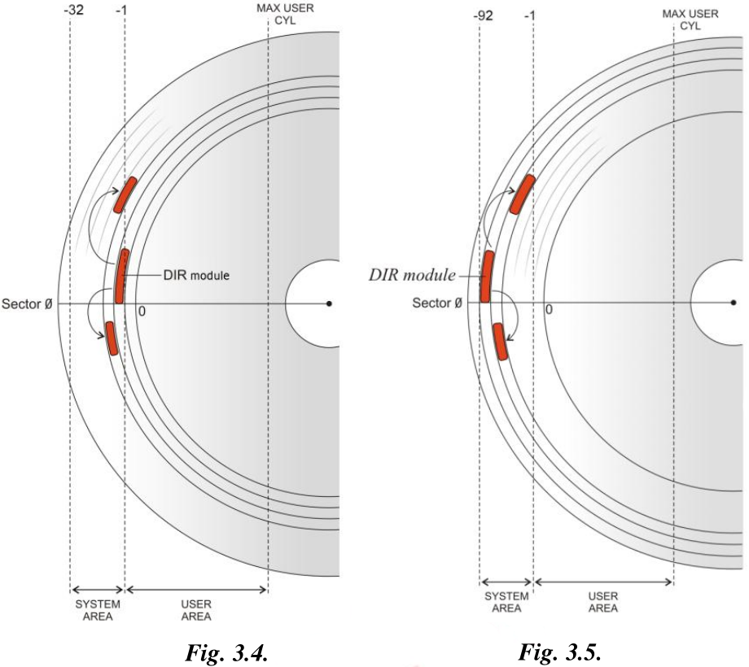
    </a>
</figure>

>Service area in MWD-CHS and MWD-ROYL-CHS drive families consists of tracks that are assigned negative numbers. They are marked in the range from -1 to -32 in the figure to the left. Only first -20 tracks are used out of that range, others are not formatted. Service area has two identical copies recorded for logical heads 0 and 1.

>Fig.3.5 demonstrates a different situation. Tracks with negative numbers are marked from -1 to -92. In the MWD-ROYL-ABA group of families the SA tracks are combined into a long sequence of sectors from cylinder -92 to -1 called a region and addressed by ABA sectors.

The WD Marvell architecture manages the space within the SA similarly to a filesystem, storing an array of modules referred to as *files* in WD terminology. Each file is designated an ID number (8-bit pre-ROYL, 16-bit ROYL) used to address it, with files located and managed through a *directory*, which is itself a file assigned ID 1. In addition to the centralised directory, each file is partially self-describing, beginning with a structured header containing various details.

The structure of these SA files differs significantly between Marvell ROYL and pre-ROYL variants. Pre-ROYL uses the same general structure of the files and directory as the older WDC MCU architecture, while ROYL-CHS introduced a completely new general format only partially revised with ROYL-ABA.

*WICKEDVICAR* supports all Marvell architecture variants: pre-ROYL, ROYL-CHS, and ROYL-ABA. The differences in SA file and directory structure mentioned above are how it distinguishes between these variants. It parses the SA directory and checks for a ROYL magic signature before branching to ROYL-CHS and ROYL-ABA implementations based on a version field in the directory, falling back to a pre-ROYL implementation if no ROYL signature is found.

## System Area - Addressing

Areas in the SA can be addressed using two systems: CHS coordinates or a linear block address, both of which can then be further divided into logical and physical addressing. A physical address includes all physical sectors on the platters, including defective sectors that are unusable. A logical address includes only usable sectors in the address space, with defective sectors excluded through [sector slipping](https://en.wikipedia.org/wiki/Sector_slipping). WD uses specific internal names for these physical and logical variants of the addressing systems, which are summarised in the following table:

| | **Physical** | **Logical**
---|---|---
**CHS** | Physical CHS | Virtual CHS
**Block** | Absolute Block Address (ABA) | Reserved Logical Block Address (RLBA)

All types of addressing listed above can be used on all three architecture variants: pre-ROYL, ROYL-CHS, and ROYL-ABA. The difference is which one each variant uses internally as its *primary* system, such as for locating SA files.

## System Area - Pre-ROYL

The pre-ROYL variant structures the SA very similarly to the WDC MCU architecture that preceded it, with the format being nearly identical. SA files are primarily addressed using *virtual CHS*, with the SA stored as two redundant copies on the first two logical heads, identical down to every *cylinder* and *sector* field locating each file. If the drive has only one head, the firmware transparently remaps the second SA copy to another range of cylinders, storing both copies within that same head.

In the pre-ROYL variant, files begin with a 24-byte header, called *file header 1* or *old file header* in WD internal terminology. This header has the following format defined in [TREX](#trex) script *eng.trx*:

<details markdown="1">
<summary>Pre-ROYL file header format</summary>

```
//-------------------------------------------------
//   Byte Map definition for the 24 Byte fileheader.
//-------------------------------------------------

ByteMap BmFileHeader24Byte
    month                  1     // [Byte 0]2 digit month
    day                    1     // [Byte 1]2 digit day
    year                   1     // [Byte 2]2 Digit Year
    checksum               1     // [Byte 3] checksum is calculated over all buffer (byte[0]...+byte[n]=0)byte[n]=0)
    file_id                1     // [Byte 4]See file.h  for numbers 1 byte
    version                4     // [Bytes 5:8] The version number
    compat                 1     // [Byte 9] This byte is checked against the ROM to ensure compatiblity
    FM_file_specific       4     // [Bytes 10:21] Reserved
    PAD                    8
    file_size              2     // [Bytes 22:23] File size in sectors
                                  // [Byte 24]
EByteMap
```

</details>

From the above script, the following structure can be determined:

Offset | Size | Type | Value | Description
---|---|---|---|---
`0x0` | 1 | `uint8_t` | 0 (none), 1 to 12 (month) | Month, zero if absent
`0x1` | 1 | `uint8_t` | 0 (none), 1 to 31 (day) | Day, zero if absent
`0x2` | 1 | `uint8_t` | 0 (none), non-zero (year) | Year, offset from 2000, zero if absent
`0x3` | 1 | `uint8_t` | | Checksum, value such that a byte sum of the entire file equals 0
`0x4` | 1 | `uint8_t` | | File ID
`0x5` | 4 | `char[4]` | | Version, revision of the file's contents
`0x9` | 1 | `char` | *?* (wildcard), anything else (revision) | Compatible ROM firmware revision, usually `0x3F` (*?*) to accept any
`0xA` | 12 | | | Type-specific, contains additional fields specific to each type of file
`0x16` | 2 | `uint16_t` | | Sector count, total file size in sectors

The same TREX script also gives the format of the SA directory:

<details markdown="1">
<summary>Pre-ROYL directory format</summary>

```
//---------------------------------------------------------
//   Byte Map definition for the 24 Byte Dirsect fileheader.
//---------------------------------------------------------

ByteMap BmDirSec24Byte
    month                  1       // [Byte 0]2 digit month
    day                    1       // [Byte 1]2 digit day
    year                   1       // [Byte 2]2 Digit Year
    checksum               1       // [Byte 3] checksum is calculated over all buffer (byte[0]...+byte[n]=0)byte[n]=0)
    file_id                1       // [Byte 4]See file.h  for numbers 1 byte
    version                4       // [Bytes 5:8] The version number
    compat                 1       // [Byte 9] This byte is checked against the ROM to ensure compatiblity
    NumEntries             2       // [Bytes 10:11] Number of directory entries
    startOfEntries         2       // [Bytes 12:13] Offset to start of the entries
    SPT                    2       // [Bytes 14:15] # of sectors allowed to be used on a track
                                   //            (zone 0 SPT - spares)
    PAD                    6       // [Bytes 16:21] Reserved
    file_size              2       // [Bytes 22:23] File size in sectors
                                    // [Byte 24]
EByteMap

//--------------------------------------------------
//   Bytemap definition for the 24byte header Dirsector Entry.
//--------------------------------------------------

ByteMap BmCHSDirEntry
    File_ID             1       // [Byte 00] See file_e above for numbers 1 byte
    cyl                 1       // [Byte 01] minus cylinder implied. 0 indicates Flash
    reserved            2       // [Bytes 02:03] Reserved for future use.
    sect                2       // [Bytes 04:05] Starting sector number.
    filesize            2       // [Bytes 06:07] File Size in Sectors.
                                 // [Byte 08]
EByteMap
```

</details>

The above script gives the following structure of the directory's *type-specific* header data mentioned earlier:

Offset | Size | Type | Value | Description
---|---|---|---|---
`0x0` | 2 | `uint16_t` | | Entry count, number of entries in directory
`0x2` | 2 | `uint16_t` | 24 | Entries offset, byte offset from file start to directory entries
`0x4` | 2 | `uint16_t` | | Sectors per track, number of 512-byte sectors in an SA track

The script also gives the format of the directory entries. At the offset given by header field *entries offset*, a list of sequential directory *entries* starts, the number of which is given in header field *entry count*. Each entry gives the *virtual CHS* location of an SA file. An entry is 8 bytes in size and has the following structure:

Offset | Size | Type | Description
---|---|---|---
`0x0` | 1 | `uint8_t` | File ID
`0x1` | 1 | `uint8_t` | SA cylinder, SA-relative one-indexed cylinder (e.g. 1 here means absolute cylinder -1)
`0x4` | 2 | `uint16_t` | Sector, one-indexed start sector position within track (e.g. 1 here means the first sector)
`0x6` | 2 | `uint16_t` | Sector count, file size in 512-byte sectors

## System Area - ROYL

In ROYL architecture (both CHS and ABA variants), files begin with a 28-byte header, called *file header 2* or *new file header* in WD internal terminology. This header has the following format defined in [TREX](#trex) script *eng.trx*:

<details markdown="1">
<summary>ROYL file header format</summary>

```
//-------------------------------------------------
//   Byte Map definition for the 28 Byte fileheader.
//-------------------------------------------------

ByteMap BmFileHeader28Byte
    file_header_version    4     // [Bytes 00:03] Hardcoded to 0x4c594f52 for FM_HEADER_II
    file_header_type       1     // [Byte 04] 1 for generic, 2 for PST, 3 for Overlay, 4 for flash
    reserved1              1     // [Byte 05] Padding
    file_header_size       2     // [Bytes 06:07] Offset to data in File, skip over the file header.
    file_id                2     // [Bytes 08:09] 16 bit file id.
    file_size              2     // [Bytes 10:11] Size in sectors (rounded up).
    checksum               4     // [Bytes 12:15] 32 bit checksum.
    version                4     // [Bytes 16:23] version 8 chars including NULL
    PAD                    4
    month                  1     // [Byte 24] month in hex.
    day                    1     // [Byte 25] day in hex
    year                   1     // [Byte 26] 2 digit year in hex.
    reserved2              1     // [Byte 27] pad
EByteMap
```

</details>

From the above script the following file header structure can be determined:

Offset | Size | Type | Value | Description
---|---|---|---|---
`0x0` | 4 | `char[4]` | *ROYL* | Magic
`0x4` | 1 | `uint8_t` | 1 (*generic*), 2 (*PST*), 3 (*overlay*), 4 (*flash*) | File type, identifies if the file is generic data, a *process self-test* file, firmware code, or flash ROM resident
`0x6` | 2 | `uint16_t` | | Data offset, byte offset from file start to file contents
`0x8` | 2 | `uint16_t` | | File ID
`0xA` | 2 | `uint16_t` | | Sector count, total file size in 512-byte sectors
`0xC` | 4 | `uint32_t` | | Checksum, value such that a 32-bit word sum of the entire file equals 0
`0x10` | 8 | `char[8]` | | Version, revision of the file's contents
`0x18` | 1 | `uint8_t` | 0 (none), 1 to 12 (month) | Month, zero if absent
`0x19` | 1 | `uint8_t` | 0 (none), 1 to 31 (day) | Day, zero if absent
`0x1A` | 1 | `uint8_t` | 0 (none), non-zero (year) | Year, offset from 2000, zero if absent

Newer ROYL-ABA drives from approximately the mid-2010s extend the above file header with a new field at offset `+0x5` containing additional high bits for the *sector count* field (with bit 7 marking validity). However, as this version of *WICKEDVICAR* dates to 2010, this extended format is not supported.

The file's contents begin at the offset given by header field *data offset*. Any data between the end of the 28-byte header and the start of the contents is additional header data specific to each file ID and version.

The directory has two possible formats based on the *version* field in the file header. The ROYL-CHS variant uses a directory with version field *00010000*, while ROYL-ABA uses version *00020000*.

### System Area - ROYL - CHS

The general SA design of ROYL-CHS is largely similar to [pre-ROYL](#system-area---pre-royl), using the same *virtual CHS* addressing, with management of the two redundant copies implemented the same way as detailed there. Differences are mainly in the data structures used for files and directories.

The format of the ROYL-CHS directory is included in [TREX](#trex) script *eng.trx*:

<details markdown="1">
<summary>ROYL-CHS directory format</summary>

```
ByteMap BmCHSDirSecHdr
   NumEntries              2     // [Bytes 48:49] Number of directory entries
   start_of_entries        2     // [Bytes 50:51] Offset to start of the entries
   sectors_on_track        2     // [Bytes 52:53] # of sectors allowed to be used on a track
EByteMap

//--------------------------------------------------
//   Bytemap definition for the 48byte header Dirsector Entry.
//--------------------------------------------------

ByteMap Bm48CHSDirEntry
    reserved           1       // [Byte 00] See file_e above for numbers 1 byte
    cyl                 1       // [Byte 01] minus cylinder implied. 0 indicates Flash
    File_ID             2       // [Bytes 02:03] 16 bit File ID
    sect                2       // [Bytes 04:05] Starting sector number.
    filesize            2       // [Bytes 06:07] File Size in Sectors.
                                 // [Byte 08]
EByteMap
```

</details>

The above script shows that the directory file contents start with a 6-byte header of the following structure:

Offset | Size | Type | Value | Description
---|---|---|---|---
`0x0` | 2 | `uint16_t` | | Entry count
`0x2` | 2 | `uint16_t` | 54 | Entries offset, byte offset from file start to entries list
`0x4` | 2 | `uint16_t` | | Sectors per track, number of 512-byte sectors in an SA track

The above header is then followed by a list of directory *entries*, with the offset and count given by header fields *entries offset* and *entry count*, respectively. The directory entry format is similar to pre-ROYL, using *virtual CHS* addressing, with the only difference being the file ID moved to a new 16-bit field. Each entry is 8 bytes in size with the following structure:

Offset | Size | Type | Description
---|---|---|---
`0x1` | 1 | `uint8_t` | SA cylinder, SA-relative one-indexed cylinder (e.g. 1 means absolute cylinder -1)
`0x2` | 2 | `uint16_t` | File ID
`0x4` | 2 | `uint16_t` | Sector, one-indexed start sector position within track (e.g. 1 means the first sector)
`0x6` | 2 | `uint16_t` | Sector count, file size in 512-byte sectors

### System Area - ROYL - ABA

The ROYL-ABA architecture variant primarily addresses SA locations by block address rather than by the CHS addressing used in earlier variants. The entire SA, all negative cylinders on all heads, is combined into a single *ABA* and *RLBA* address space. That address space is then divided into multiple *regions* defined and stored in the drive's flash ROM, usually just one region per head.

The first two of these regions are then used to store two redundant SA copies, with locations in the SA primarily referenced with a region-relative RLBA, meaning the same RLBA value will locate the same data in both regions.

This results in an SA structure functionally similar to that of the earlier architecture variants, with redundant SA copies stored in the first two logical heads. However, the use of these *regions* does technically allow more flexible alternative arrangements, such as both copies stored in the same head.

The format of the ROYL-ABA directory is included in [TREX](#trex) script *eng.trx*:

<details markdown="1">
<summary>ROYL-ABA directory format</summary>

```
ByteMap BmLBADirSecHdr
   NumEntries              2     // [Bytes 48:49] Number of directory entries
EByteMap

//--------------------------------------------------
//   Bytemap definition for the LBA Dirsector Entry
//--------------------------------------------------
ByteMap BmLBADirEntry                                                                             
    next_entry_offset   1;    // Number of bytes to next File ID.  Zero to indicate last entry.     
    num_file_copy       1;    // Number of copies this file has in the reserved area                
    file_id             2;    // If FM_FILE_HEADER_II is enabled, now 2 bytes                       
                              // including this copy and any in flash                               
    file_size           2;    // size of file in Sector                                             
    file_attr           4;   //File attribute.                                                      
                                                                                                    
    copy_num0           4;    //Note:  Can use command GetCopyNum or access directly using copy_num# etc.
    copy_num1           4;                                                                          
    copy_num2           4;                                                                          
    copy_num3           4;                                                                          
    copy_num4           4;                                                                          
    copy_num5           4;                                                                          
    copy_num6           4;                                                                          
    copy_num7           4;                                                                          
                                                                                                    
EByteMap
```

</details>

The ROYL-ABA directory file's contents start with the following single-field header:

Offset | Size | Type | Description
---|---|---|---
`0x0` | 2 | `uint16_t` | Entry count

The above header is then immediately followed by a list of directory *entries*. Despite the above TREX script showing entries having a variable size with up to 8 copy addresses, *WICKEDVICAR* hardcodes a size of 18 bytes, matching the two copies used on all real-world ROYL-ABA drives of the period, so that is the structure detailed here:

Offset | Size | Type | Value | Description
---|---|---|---|---
`0x0` | 1 | `uint8_t` | 0 (last), 18 (not last) | Next entry offset, offset in bytes to the next directory entry
`0x1` | 1 | `uint8_t` | 0 (free), 2 (used) | Copies, number of redundant copies the file has across SA *regions*
`0x2` | 2 | `uint16_t` | 0 (reserved), non-zero (used) | File ID
`0x4` | 2 | `uint16_t` | | Sector count, file size in 512-byte sectors
`0x6` | 4 | `uint32_t` | | Attributes, has bitfields with various flags
`0xA` | 4 | `uint32_t` | | First region RLBA, RLBA within the first SA region
`0xE` | 4 | `uint32_t` | | Second region RLBA, RLBA within the second SA region

Although the above entry structure has separate RLBA fields for each region, these should always have identical values, as each region is intended to be a redundant copy of the other.

# VUCs

WD Marvell drives implement VUCs with a system based on SMART Command Transport (SCT). This encapsulates commands within data transfers to designated SMART logs, rather than directly using ATA registers like regular commands.

Command parameters are written to SMART log `0xBE`, a log number defined in the ATA specification as vendor-specific, using the following ATA command:

Feature | Count | LBA | Device | Command
---|---|---|---|---
`0xD6` (write log) | `0x1` | `0xC24FBE` (log `0xBE`) | `0xA0` | `0xB0` (SMART)

The [TREX](#trex) manual refers to this command as *VSC send key*:

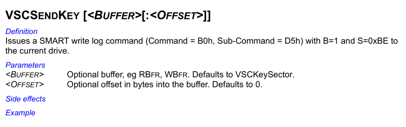

This *key* data generally follows the same format as a conventional SCT *key sector*, with an *action-code* designating the type of functionality, a *function-code* representing a specific sub-operation on that *action-code*, and additional parameter data specific to each *action* and *function* combination[^sct_spec]:

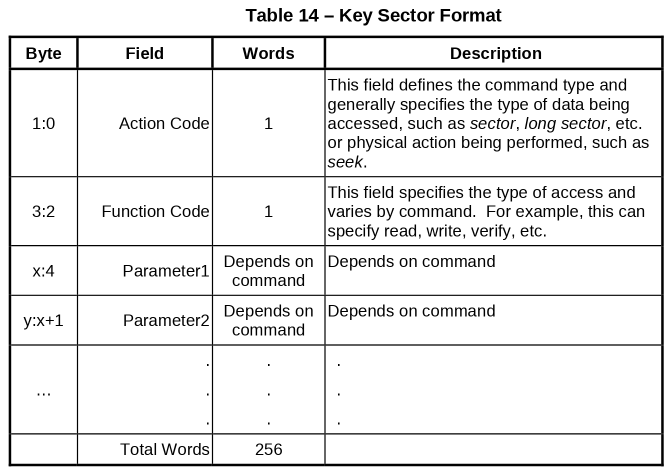

The exceptions to that generalisation are some *action-codes* that only have a single function. In these cases, the *function-code* field is missing, and the action-specific parameters begin at offset `+0x2` immediately after the *action-code* field.

With the *key* data sent, the command is then executed by transferring its data through SMART log `0xBF`, which may be either read from or written to depending on the action and function combination, using the following ATA command:

Feature | Count | LBA | Device | Command
---|---|---|---|---
`0xD5` (read log), `0xD6` (write log) | | `0xC24FBF` | `0xA0` | `0xB0` (SMART)

The TREX manual refers to this command as *VSC data in* or *VSC data out*:


## VUCs - Enabling

To enable VUC access, three different methods are used, each attempted in turn after the previous one fails with an ATA command error. If any method succeeds, VUC access is considered enabled. If all of them return an ATA error, it's considered a failure.

### VUCs - Enabling - VSC Enable

First, it tries executing the following ATA command with no data transfer:

Feature | Count | LBA | Device | Command
---|---|---|---|---
`0x45` (*E*) | `0xB` | `0x574400` (*WD*) | `0xA0` | `0x80` (vendor-specific)

The [TREX](#trex) manual refers to this command as *VSC enable*:

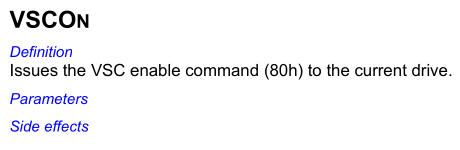

An interesting artefact in the *WICKEDVICAR* implementation here is the *count* register value of `0xB`. This value is not necessary for the command and is not used in TREX or any other WD-developed tools such as *wdidle3*, which leave that register unset. It does, however, appear in many [third-party public implementations](https://forum.hddguru.com/viewtopic.php?f=1&t=8374&p=69316) circulating since the 2000s, which may indicate this was developed at least partially through research into public information, rather than entirely from internal WD sources.

### VUCs - Enabling - SMART Log 0xE0

If the above fails, it then attempts to write a single 512-byte sector of null bytes to SMART log `0xE0`, a log defined as *SCT command/status*, with the following command:

Feature | Count | LBA | Device | Command
---|---|---|---|---
`0xD6` (write log) | `0x1` | `0xC24FE0` (log `0xE0`) | `0xA0` | `0xB0` (SMART)

This command is a complete mystery. It's not used anywhere in TREX, and no trace could be found online connecting it to WD. Testing with a range of WD Marvell drives found it to always cause an ATA error and never successfully enable VUCs. The best hypothesis is that it's intended to test for some controlled, expected ATA command error related to SMART logs, as writing invalid SCT data to the SCT log should always fail.

### VUCs - Enabling - SMART Log 0xBB

If the above fails too, it finally attempts a single-sector read command for vendor-specific SMART log `0xBB`. Although it is nominally a read command, no data is transferred:

Feature | Count | LBA | Device | Command
---|---|---|---|---
`0xD5` (read log) | `0x1` | `0xC24FBB` (log `0xBB`) | `0xA0` | `0xB0` (SMART)

This is the most interesting method of them all. This command is never used in TREX, and no trace connecting SMART log `0xBB` to WD could be found anywhere online: not a single source outside *WICKEDVICAR* itself mentions anything related to it. Yet testing with drives found that it enabled VUCs successfully. This appears to be some functional alternative to the standard *VSC enable* command that's undocumented even in WD's own internal tools.

## VUCs - SA Files

SA files can be read or written through VUC action-code 8 (*file*), with function-code 1 (*read*) to read a file or 2 (*write*) to write it, described in the [TREX](#trex) manual as reading or writing a *resident file*:


These read and write operations both have implementations in TREX script *eng.trx*:

<details markdown="1">
<summary>VUC read and write file implementations</summary>

```
//----------------------------------------------------------------------------------
// rdflo(Read Resident File with specified sector offset from beggining of file)
// Input:
// ulcFileID = reserved file id
//  ulcoffset = sector offset from beggining of file
// Output: Data in Rbfr
//----------------------------------------------------------------------------------
Command Rdflo ulcfileId   ulcSectoffset // Read Resident file from  a sector offset. rdfl <fileid> <sector offset>
    stack lba
    vscon
    if ( rstat bit 0 )
        return
    eif

    if(reportlvl == 2) fprintf "\nRead File 0x%02X from sector offset %d...", ulcFileID, ulcSectOffset; eif
    filldw keysector, 0
    *(keySector + keysect.ActionCode)= AC_RDWRResFile
    *(keySector + keysect.parm1) = eRDRESFILE
    *(keySector + keysect.parm2) = ulcFileID
    *(keySector + keysect.parm3) = ulcSectOffset

    b=1
    s=SMART_CTRLKEY
    //smartwrlog keysector
    .XfrRdData_ErrOff
    lba stack
Ecommand    // rdfl

//----------------------------------------------------------------------------------
// wrfl (Write Resident File)
// Input:
// ulcFileID = reserved file id
// Data to write must be in wbfr
// Output: None
//----------------------------------------------------------------------------------
Command WrFl ulcFileID    // Write Resident File. Usage wrfl <FileID>
   ulcl fileheadercheckbytes = 0x4c594f52
   ulcl filetype

    stack lba
    vscon
    if ( rstat bit 0 )
        return
    eif

    if(reportlvl == 2) fprintf "\nWrite Resident File = 0x%2.2X", ulcFileID; eif
    filldw keysector, 0
    *(keySector + keysect.ActionCode)= AC_RDWRResFile
    *(keySector + keysect.parm1) = eWRRESFILE
    *(keySector + keysect.parm2) = ulcFileID
    b=1
    s=SMART_CTRLKEY
    //smartwrlog keysector
    .XfrWrData_ErrOff

   // Now let's see if new or old fileheader format.
   filetype = *(wbfr + BmFileHeader24Byte.month)
   filetype |= (*(wbfr + BmFileHeader24Byte.month + 1) << 8)
   filetype |= (*(wbfr + BmFileHeader24Byte.month + 2) << 16)
   filetype |= (*(wbfr + BmFileHeader24Byte.month + 3) << 24)

   if ( filetype == fileheadercheckbytes )
      fprintf "\n\nWrote file 0x%X and it is a new header format file.\n", ulcFileID
   else
      fprintf "\n\nWrote file 0x%X and it is an old header format file.\n", ulcFileID
   eif

    lba stack
Ecommand    // wrfl
```

</details>

Despite the above script using a sector offset parameter for reading, this parameter does not actually seem to work. It always reads from the file start. Both read and write operations actually use the following parameter data:

Offset | Size | Type | Description
---|---|---|---
 `0x0` | 2 | `uint16_t` | File ID

As the above TREX script shows, the file ID parameter appears to always take up 16 bits, even for pre-ROYL drives, where file IDs are only 8-bit.

## VUCs - Reverse Translate

The drive can convert a given CHS address to the corresponding block address using VUC action-code 22 (*RevXlate* or *reverse translate*) with no function-code, described in the [TREX](#trex) manual as *return the logical LBA from the current physical CHS*:

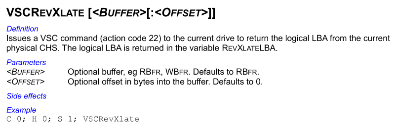

This *reverse translate* VUC has the following implementation in TREX script *eng.trx*:

<details markdown="1">
<summary>VUC reverse translate implementation</summary>

```
//----------------------------------------------------------------------------------
// RxltDM  Translate virtual to logical address with DM is TRUE     (Action Code 22)
// Translates a virtual CHS address of a Test Track to an ABA address.
//-------------------------------------------------------------------------------------
Command rxltDM  ulcCyl ulcHd ulcSect  // Usage: rxltDM <Vir cyl >, <Vir hd>, <vir sect>
    stack lba
    ulcl ulclba
    ulcl ulcRegion
    ulcl ulcSectors

    vscon
    // bail if there is an error
    if (rstat bitclr 0)
        filldw keysector, 0
        *(keySector + keysect.ActionCode)= AC_CHSTOLBA
        *(keySector + keysect.parm1) = ulcCyl & 0xffff     // (Bit 0-15)
        *(keySector + keysect.parm2) = ulcCyl >>16         // (Bit 16-31)
        *(keySector + keysect.parm3) = ulcHd
        *(keySector + keysect.parm4) = ulcSect
        *(keySector + keysect.parm5) = 0xFF55              // DMDisabled = TRUE

        b=1
        s=SMART_CTRLKEY
        //smartWrlog keysector

        .XfrRdData_ErrOff
        ptrmode short
        ulcSectors =  *(rbfr+20)
        if (rstat bitclr 0)
        if(*(rbfr+0) == 1)
            ulclba= *(rbfr+2) +  (*(rbfr+4)<<16) + (*(rbfr+6)<<32)
            fprintf "\n\nVirt. Cyl= %d, Virt. Hd= %d, Virt. Sec =%d",ulcCyl, ulcHd, ulcSect
            fprintf "\nLBA= %d (0x%X)", ulclba, ulclba
            fprintf "\nSectors on track= %d (0x%X)", ulcSectors, ulcSectors

        elseif(*(rbfr+0) == 2)
            ulclba= *(rbfr+2) +  (*(rbfr+4)<<16) + (*(rbfr+6)<<32)
            fprintf "\n\nVirt for RSVD. Cyl= %d, Virt. Hd= %d, Virt. Sec =%d",ulcCyl, ulcHd, ulcSect
            fprintf "\nRLBARel= %d (0x%X)", ulclba, ulclba
            ulcRegion = *(rbfr+10)
            ulclba= *(rbfr+12) +  (*(rbfr+14)<<16) + (*(rbfr+16)<<32)
            fprintf "\nRLBAabs= %d (0x%X)", ulclba, ulclba
            fprintf "\nRegion Number= %d ", ulcRegion
            fprintf "\nSectors on track= %d (0x%X)", ulcSectors, ulcSectors

        eif

        eif
    eif
    lba stack
ECommand  //

//----------------------------------------------------------------------------------
// Rxlt  Translate virtual to logical address     (Action Code 22)
// Translates a virtual CHS address to an LBA address.
//-------------------------------------------------------------------------------------
Command rxlt  ulcCyl ulcHd ulcSect  // Usage: rxlt <Vir cyl >, <Vir hd>, <vir sect>
    stack lba
    ulcl ulclba
    ulcl ulcRegion
    ulcl ulcSectors

    vscon
    // bail if there is an error 
    if (rstat bitclr 0)
        filldw keysector, 0
        *(keySector + keysect.ActionCode)= AC_CHSTOLBA
        *(keySector + keysect.parm1) = ulcCyl & 0xffff     // (Bit 0-15)
        *(keySector + keysect.parm2) = ulcCyl >>16         // (Bit 16-31)
        *(keySector + keysect.parm3) = ulcHd
        *(keySector + keysect.parm4) = ulcSect
        *(keySector + keysect.parm5) = 0     // DMDisabled = FALSE

        b=1
        s=SMART_CTRLKEY
        //smartWrlog keysector

        .XfrRdData_ErrOff
        ptrmode short
        ulcSectors =  *(rbfr+20)
        if (rstat bitclr 0)
          if(*(rbfr+0) == 1)
            ulclba= *(rbfr+2) +  (*(rbfr+4)<<16) + (*(rbfr+6)<<32)
            fprintf "\n\nVirt. Cyl= %d, Virt. Hd= %d, Virt. Sec =%d",ulcCyl, ulcHd, ulcSect
            fprintf "\nSectors on track= %d (0x%X)", ulcSectors, ulcSectors
            fprintf "\nLBA= %d (0x%X)", ulclba, ulclba

          elseif(*(rbfr+0) == 2)
            ulclba= *(rbfr+2) +  (*(rbfr+4)<<16) + (*(rbfr+6)<<32)
            fprintf "\n\nVirt for RSVD. Cyl= %d, Virt. Hd= %d, Virt. Sec =%d",ulcCyl, ulcHd, ulcSect
            fprintf "\nRLBARel= %d (0x%X)", ulclba, ulclba
            ulcRegion = *(rbfr+10) 
            ulclba= *(rbfr+12) +  (*(rbfr+14)<<16) + (*(rbfr+16)<<32)
            fprintf "\nRLBAabs= %d (0x%X)", ulclba, ulclba
            fprintf "\nRegion Number= %d ", ulcRegion
            fprintf "\nSectors on track= %d (0x%X)", ulcSectors, ulcSectors

          eif
        eif
    eif        
    lba stack
ECommand  //
```

</details>

From the above script the following parameter and response structures can be determined when translating an SA address:

**Parameter**

Offset | Size | Type | Value | Description
---|---|---|---|---
 `0x0` | 4 | `int32_t` | | Cylinder
 `0x4` | 2 | `uint16_t` | | Head
 `0x6` | 2 | `uint16_t` | | Sector
 `0x8` | 2 | `uint16_t` | 0 (*enable*), `0xFF55` (*disable*) | Defect management, whether relocations should be applied

**Response**

Offset | Size | Type | Value | Description
---|---|---|---|---
 `0x0` | 2 | `uint16_t` | 2 (system area) | Address space
 `0x2` | 6 | unsigned 48-bit integer | | Region-relative block address, ABA or RLBA depending on the *defect management* parameter
 `0xA` | 2 | `uint16_t` | | Region number, zero-indexed
 `0xC` | 6 | unsigned 48-bit integer | | Absolute block address, ABA or RLBA depending on the *defect management* parameter
 `0x14` | 2 | `uint16_t` | | Sectors per track, number of 512-byte sectors in a track

# Address Conversion

In ROYL-ABA architecture, the [SA directory](#system-area---royl---aba) structures files by *RLBA* within a *region*, rather than by CHS. This means that for *WICKEDVICAR* to use a CHS address in the context of the SA directory, or vice versa, it has to go through a layer of translation.

It implements this translation, both CHS-to-RLBA and RLBA-to-CHS, in a naive way by assuming each SA region maps to an entire physical head, which, although not technically correct, would work for nearly all real-world drives it targets. This means the *CHS* mentioned here is technically just *CS*, as the head is simply whatever SA redundant copy is being accessed.

## Address Conversion - Virtual CHS to RLBA

This conversion is implemented for all drive types. Despite pre-ROYL and ROYL-CHS not using RLBA as their main addressing method for the SA, it is still used for these drive types to create RLBA addresses for internal use by the firmware implant, as detailed in [WriteResources - Implant Data](#drive-class---writeresources---implant-data).

For pre-ROYL and ROYL-CHS it simply uses [VUC reverse translate](#vucs---reverse-translate), passing the CHS as input and receiving the RLBA as output.

For ROYL-ABA it implements a far more complex (and incorrect) method for unknown reasons. It starts with a technically correct virtual CHS to RLBA conversion, using the following calculation:

>(`cylinder count` + `cylinder`) &times; `sectors per track` + `sector`

The *cylinder count* in the above calculation comes from the *SA cylinder count* field of the data retrieved by drive class method [ReadInfo](#drive-class---readinfo). The operation of adding the cylinder to the total number of SA cylinders is done because logically the first ABA maps to the *minimum* cylinder, which in the context of the SA means the most negative.

The above calculation results in a correct RLBA value. Despite this, the result is then incorrectly transformed further with incongruous compensation for SA defects, even though the conversion works entirely with logical addresses, from which such defects have already been removed.

It reads and parses the entries in the [SA defect list](#sa-defects). For each defect at a lower address (combined *cylinder* and *sector*), it subtracts that defect's size in sectors from the RLBA, in an attempt to replicate the [sector slipping](https://en.wikipedia.org/wiki/Sector_slipping) mechanism used to remap defects in the SA.

The vast majority of drives of the period have an empty SA defect list. As a result, this conversion accidentally works fine for most real-world usage, although it can give incorrect results for the occasional drive that does have SA defects.

## Address Conversion - RLBA to Virtual CHS

This conversion type is implemented only for ROYL-ABA. It's required to translate the RLBA entries in the ROYL-ABA SA directory into the CHS coordinates used elsewhere by *WICKEDVICAR*.

It's implemented essentially as an inverse of [virtual CHS to RLBA](#address-conversion---virtual-chs-to-rlba) conversion, including the same incorrect SA defect compensation.

For each defect list entry it converts the address to RLBA using the following calculation:

>(`cylinder count` + `cylinder` + 1) &times; `sectors per track` + `sector`

In the above calculation *cylinder count* is obtained from the *SA cylinder count* field of the data retrieved by drive class method [ReadInfo](#drive-class---readinfo), while *sectors per track* is identified as detailed in [sectors per track](#sectors-per-track). Beyond the defect compensation being conceptually wrong in the first place, the calculation itself is also incorrect. The `+1` increment is incorrect and results in defect correction being applied to the wrong cylinder.

With a running value starting at the input RLBA, it then checks if each defect's RLBA is lower than or equal to the current value, if so incrementing it by the defect size.

The resulting incorrect value from the above incongruous defect compensation then has its cylinder extracted with the following calculation:

>`value` &divide; `sectors per track` &minus; `cylinder count`

And the sector extracted through the following:

>`value` % `sectors per track`

As with the virtual CHS to RLBA conversion, this would accidentally work for the vast majority of drives of the period that have no SA defects, but due to multiple errors could produce incorrect results on the occasional drive that does have SA defect list entries.

# Sectors per Track

For various calculations related to CHS addressing, *WICKEDVICAR* needs the number of sectors in each track within the SA. It obtains this value through two different methods depending on the architecture variant.

For [pre-ROYL](#system-area---pre-royl) and [ROYL-CHS](#system-area---royl---chs) architecture variants, it reads the SA directory and simply extracts the *sectors per track* field present in the directories for those two architecture types.

ROYL-ABA has no such field in the directory, so it uses an alternative method. It executes [VUC reverse translate](#vucs---reverse-translate) for C/H/S *-1/0/1*, the first sector of the highest cylinder in the SA, and extracts the *sectors per track* field within the result.

# SA Defects

*WICKEDVICAR* implements an impressive but completely needless and mistaken system for parsing the drive's SA defect list, for use when addressing the SA. This is implemented only for ROYL-ABA and is likely based on a misunderstanding of where physical and logical addressing are used in that architecture type. For pre-ROYL and ROYL-CHS the defect list is correctly never used.

It identifies these defects by first reading file ID `0x35` (*SA defect list*) using [VUC read file](#vucs---sa-files), parsing the file's contents starting with a header of the following structure:

Offset | Size | Type | Description
---|---|---|---
 `0x0` | 4 | `uint32_t` | Entry count

It then parses a concatenated list of *entries*, with the number of entries given by the *entry count* field in the above header. Each entry is 8 bytes in size with the following structure:

Offset | Size | Type | Description
---|---|---|---
 `0x0` | 3 | signed 24-bit integer | Cylinder, always negative
 `0x3` | 1 | `uint8_t` | Head, zero-indexed
 `0x4` | 2 | `uint16_t` | Start sector, zero-indexed
 `0x6` | 2 | `uint16_t` | End sector, zero-indexed

On newer drives, *start sector* and *end sector* values of `0xFFFF` are used as a sentinel marking the entire track as defective. However, this convention appears to postdate this version of *WICKEDVICAR*, which as such cannot correctly parse these whole-track entries.

# Resource Container

The implemented [drive class](../#drive-types---drive-class) methods [WriteResources](#drive-class---writeresources) and [ReadResources](#drive-class---readresources) both handle the same custom container format, used to package various firmware and implant-related data.

This container begins with a header of the following structure:

Offset | Size | Type | Value | Description
---|---|---|---|---
 `0x0` | 2 | `uint16_t` | `0x6922` | Magic
 `0x2` | 2 | `uint16_t` | 1 | Likely version
 `0x4` | 2 | `uint16_t` | | Checksum, value such that a 16-bit word sum of the entire container equals 0
 `0x6` | 4 | `uint32_t` | | Total container size in bytes
 `0xA` | 2 | `uint16_t` | | *Record* count

After the above *container header* follows a concatenated list of *records*, with the number of records given by the *record count* field in the header. Each record represents an item of data in the container. Records are of variable size and begin with a *record header* of the following structure:

Offset | Size | Type | Value | Description
---|---|---|---|---
 `0x0` | 2 | `uint16_t` | | Record type ID
 `0x2` | 2 | `uint16_t` | | Checksum, value such that a 16-bit word sum of the entire record equals 0
 `0x4` | 4 | `uint32_t` | | Total record size in bytes

The above *record header* is then followed by the content of the record, whose size is given by the header's *record size* field minus the 8 bytes of the header itself.

Not every record type is handled by both *WriteResources* and *ReadResources*. Some can only be read, and others only written. The following are all the record types handled within this module:

ID | Read | Write | Description
---|:-:|:-:|---
 1 | ✅ | ✅ | SA file
 2 | | ✅ | SA storage [implant data](#drive-class---writeresources---implant-data)
 3 | | ✅ | SA storage [SIERRAMIST](#drive-class---writeresources---sierramist)
 4 | ✅ | | Flash ROM image
 5 | | ✅ | [SA storage flag](#drive-class---writeresources---sa-storage-flag)
 6 | | ✅ | [Remove SA file](#drive-class---writeresources---remove-sa-file)

# Match Drive

The WD Marvell [drive type class](../#drive-types---drive-type-class) implements the *MatchDrive* method, validating that all of the following checks pass, in order:

* Identify device WWN OUI is `0014EE` (*Western Digital Technologies*) or model starts with *WDC WD*
* Identify device word 142 (*vendor specific*) is 4
* [Enabling VUCs](#vucs---enabling) succeeds

The identify device word 142 check is interesting. This field is unused and unmentioned in [TREX](#trex), and seemingly everywhere online. However, from testing, this value is always *4* for WD Marvell architecture drives and only those drives, including the latest drives from long after this version of *WICKEDVICAR*. Older WDC MCU architecture drives instead use values *1*, *2*, or *3* in this field. The value of identify device word 142 seems to be reliably usable as a marker for what firmware architecture type the drive has.

# Drive Class

The WD Marvell [drive class](../#drive-types---drive-class) has the following method implementations:

## Drive Class - ReadInfo

This retrieves various internal information about the drive as an opaque block of data and is implemented with VUC action-code 13 (*get table*) and no function-code, getting table ID 1 (*physical parameters*) with the following additional parameter data:

Offset | Size | Type | Value | Description
---|---|---|---|---
 `0x0` | 2 | `uint16_t` | 1 (*physical parameters*) | Table ID

The [TREX](#trex) manual describes this action-code as getting a *table*:

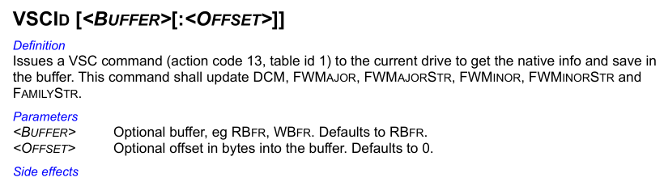

The specific table retrieved, ID 1, is named either *physical parameters* or simply *data table* throughout TREX. The TREX script *eng.trx* details the extensive structure of this table:

<details markdown="1">
<summary>Physical parameters table structure</summary>

```
//----------------------------------------------------------------------------
//  Drive Data Table  (For Action Code 13, Get Drive Data Table)
//----------------------------------------------------------------------------
ByteMap DrvDataTbl
   ver          2            // offset=0.  Format version
   CtrlFWRev    1            // offset=2. controller firmware rev. Total=8 bytes
   Pad          7            // These are the remaining 7 bytes of ctrlfwrev
   ServoFWRev   1            // offset=10. servo firmware rev. Total = 8 bytes
   pad          7            // These are the remaining 7 bytes of servo FW Rev.
   OvlFWRev     1            // offset=18. overlay firmware rev. Total=8 bytes
   pad          7            // These are the remaining 7 bytes of OVL FW Rev.
   ProdID       2            // offset=26. Product byte(LSB) and secondary product byte (MSB)
   PlatCnt      1            // offset=28. Drive platter count
   PhyHdCnt     1            // offset=29. Physical number of hds including depop hds.
   VirHdCnt     1            // offset=30. Virtual head count(actual no. of hds used)
   Depops       1            // offset=31. Bit map value. Bit 0= head 0. Bit set=head used
   DrvType      1            // offset=32. Drive type
   ZoneCnt      1            // ofsfet=33. Num. of zones including reserved zone
   ServoCnt     2            // offset=34. No. of servo wedges
   RsvdCylCnt   2            // offset=36. Virtual no. of negative cylinders
   SpindleRPM   2            // offset=38. Spindle RPM
   userCylCnt   4            // offset=40. No. of user cylinders
   CylWedgeSkew 1            // offset=44. Cylinder skew
   HdWedgeSkew  1            // offset=45. Head skew
   Clusterskew  1            // offset=46. Cluster Skew
   CodeRes      1            // offset=47. Code Residence
   PCBAType     1            // offset=48. PCBA Type
   InterfaceTyp 1            // offset=49. Interface type
   CtlrChipVend 2            // offset=50. Controller chip Vendor
   ctrlChipRev  2            // offset=52. Controller chip rev
   UpVend       2            // offset=54. MicroP Vendor
   UpRev        2            // offset=56. MicroP Rev
   ChnChipVend  2            // offset=58. Channel Chip Vendor
   ChnChipRev   2            // offset=60. Channel chip Rev
   PreampVend   2            // offset=62. Preamp Vendor
   PreampRev    2            // offset=64. Preamp Rev
   PwrICVend    2            // offset=66. Power IC vendor
   PwrICRev     2            // offset=68. Power IC Rev
   OTFIntlv     1            // offset=70. No. of interleaves in OTF ECC Corr
   NumOTF       1            // offset=71. Number of bytes corrected by OTF
   BurstCnt     2            // offset=72. Number of bytes corrected by FW burst corr.
   ECCBytes     1            // offset=74. No. of ecc bytes in read/write long sector
   pad          1            // Unused
   maxVSCTx     2            // offset=76. maximum VSC transfer data count
   formatRev    1            // offset=78. surface format version. Total=8 bytes
   Pad          7            // These are the remaining 7 bytes of formatRev
   RCFWRev      1            // offset=86. Read Channel firmware version. Total=8 bytes
   Pad          7            // These are the remaining 7 bytes of RCFWRev
   FeatureFlags   4         // offset=94.  Feature flags
   PAD          20           // offset=102 . Reserved
   jumperset    2            // offset=118. Current no. of relo sectors on drive. 
   ReloCnt      2            // offset=120. Number of Tare Count
   TareCnt      2            // offset=122. Number of Tares
   FtareCnt     2            // offset=124. Number of Ftares
   RemRelo      2            // offset=130. Max remaining possible relos
   ConsumedSpare    2        // offset=128. No. of consumed spares.
   LastSpareLBAHigh 2        // Offset=130. Max Spare LBA high 
   LastSpareLBALow  4        // offset=132. Max Spare LBA low
   TPI          2            // offset=136. Selected KTPI
   AreaDensity  2            // offset=138. Area density in units of 100MB per platter
   FormatType   1            // offset=140. Drive Format Type  
   Pad               1       // offset=141  unused
   ChipId            2       // offset=142  controller chip familyt id
   PCBARev           1       // offset=144  Revision of PCBA
   Pad               3       // offset=145  unused
   FeatureSupport1   4       // offset=148  Features SupportedBit 0 = Enhanced Security1 to 63 reserved
   FeatureSupport2   4
   NumOTFSym         2       // offset=156  Number of symbols that can be corrected by one interleave of OTF correction
   BurstSymCnt       2       // offset=158  Number of symbols that can be corrected by firmware burst correction
   SymBitOffset      1       // offset=160  Number of bits between the start of the first symbol and the first bit in a sector
   Pad               3       // offset=161  unused
   FlashSize         1       // offset=164   Size of flash, irrespective of type, in 16KB units
   FlashProtocolVer  1       // offset=165   Flash Programming Protocol Version 
   FlashSectorSize   1       // offset=166   Flash Sector Size (in 2k units). This is the erasable block size of the flash and minimum size to be programmed. 
   HeadFormatClass   1       // offset=167  what class is used for DDT and DRM
   HDAType           1       // offset=168  type of HDA (max number of platters)
   Pad               1
   SlumberTimer      2        // offset=170  SATA power management slumber timer
   PartialTimer      2        // offset=172  SATA power management partial timer
   ReadTLER          2        // offset=174	Current VAlue of read TLER in ms
   WriteTLER         2        // offset=176	Current VAlue of Write TLER in ms
   CacheSize         4        // offset=178	Actual num of 512 bytes buffers actually allocated to cache and not just DRAM overhead. This value may change as transient overlays and PST are loaded/unloaded
   DRAMSize          2        // offset=182	Physical size of DRAM in MB. This field always returns actual size whereas ID Dev returns amount of DRAM used and maybe less
   UCCMCacheFam      4  	 // offset=184	Current Dash Code configuration for the drive
   UCCMDashCode      4  	 // offset=188	Current Dash Code configuration for the drive
   UCCMConfgVerMajor	2	 // offset=192	Major Version for the current dash code list
   UCCMConfgVerMinor	2	 // offset=194	Minor Version for the current dash code list
   UCCMFWStructVerMajor 2    // offset=196 	F/W structure version 
   UCCMFWStructVerMinor 2    // offset=198 	F/W structure version 
   UCCM_State			1	 // offset=200  State of drive, whether user has tempered or not
   pad                  115   // offset=201-315
   PDListHashSzInBits   1     // offset=316  PDlist Hash Index size in number of bits. 

EbyteMap

ByteMap DrvDataTblOverlay       // This starts at byte offset 256 of drvtbl data.
    DCM             2           // DCM string=36 bytes
    pad             34          // This is part of DCM string
    FTSDate         2           // This is original drive built date=12 bytes
    pad             10          // This is part of original drive built date
    FTSreconfigDate 2           // This is drive reconfiguration date = 12 bytes
    pad             10          // This is part of drive reconfiguration date
EByteMap
```

</details>

Given the large size of this structure, only the specific fields accessed by *WICKEDVICAR* are documented here, with example values from a 2010-dated *Saturn*-family drive:

Offset | Size | Type | Value | Description
---|---|---|---|---
 `0x2` | 6 | `char[6]` | *08.BHC* | Controller firmware version
 `0x12` | 6 | `char[6]` | *08.BHC* | Overlay firmware version
 `0x24` | 2 | `uint16_t` | 256 | SA cylinder count

## Drive Class - ReadSA

The *ReadSA* method is implemented by parsing the *address* parameter as packed CHS coordinates, with the following structure:

Bits | Description
---|---
31:15 | Cylinder
14:12 | Head
11:0 | Sector

The method's *sector* parameter is simply added to the above *sector* field, then incremented by one to convert it from zero-indexed to one-indexed. The resulting sector is then validated against the number of [sectors per track](#sectors-per-track) of the drive.

These CHS values are then used with VUC action-code 12 (*CHS*) function-code 1 (*read with relocations*), described in the [TREX](#trex) manual as *read a virtual C/H/S & B location*:

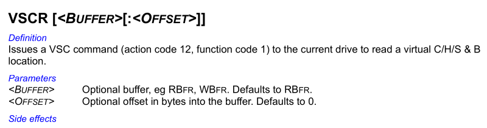

This VUC also has an implementation in TREX script *eng.trx*:

<details markdown="1">
<summary>VUC read CHS implementation</summary>

```
//----------------------------------------------------------------------------------
// RdCHS (Read CHS Segment with Relocations)
// Input:
//    ulcCyl  <virtual cylinder>
//    ulcHd   <Virtual head>
//    ulcSec  <virtual sector>
//    ulcBlk  <number of sectors to read>
// Output: Data in rbfr
//----------------------------------------------------------------------------------
Command RdCHS ulcCyl ulcHd ulcSec ulcBlk  // RdChs <vir Cyl> <vir Hd> <vir sec>
    vscon
    if ( rstat bit 0 )
        return
    eif
    sprintf CmdStr, "\nRead  CHS             C %-6d H %-3d S %-4d B %-5d", ulcCyl, ulcHd, ulcSec, ulcBlk
    printf  "%s", CmdStr

    filldw keysector, 0
    *(keySector + keysect.ActionCode)= AC_RDWRCHS
    *(keySector + keysect.parm1) = eRDCHS_WITHRELO
    *(keySector + keysect.parm2) = ulcCyl & 0xffff
    *(keySector + keysect.parm3) = ulcCyl >> 16
    *(keySector + keysect.parm4) = ulcHd
    *(keySector + keysect.parm5) = ulcSec
    *(keySector + keysect.parm6) = ulcBlk & 0xffff
    *(keySector + keysect.parm7) = ulcBlk >>16
    b=1
    s=SMART_CTRLKEY
    //SmartWrLog KeySector
    .XfrRdData_ErrOff
    sprintf CmdStr, ""
    c     = ulcCyl
    h     = ulcHd
    s     = ulcSec
    b     = ulcBlk

Ecommand    // RdCHS
```

</details>

From the above script the following parameter structure can be determined:

Offset | Size | Type | Description
---|---|---|---
 `0x0` | 4 | `int32_t` | Cylinder
 `0x4` | 2 | `uint16_t` | Head
 `0x6` | 2 | `uint16_t` | Sector
 `0x8` | 4 | `uint32_t` | Sector count

## Drive Class - WriteSA

This is implemented identically to [ReadSA](#drive-class---readsa), using VUC action-code 12 (*CHS*) but with function-code 2 (*write with relocations*). It takes the same structured parameter data detailed there.

## Drive Class - WriteResources

The *WriteResources* implementation, as for all drive types, parses a custom container of various firmware and implant data detailed in [resource container](#resource-container), writing each container record to the drive.

Before any record is processed, it first either locates existing [SA storage](../#sa-storage) or [creates it](#drive-class---writeresources---create-sa-storage). It then processes all records in the following controlled order:

ID | Description
---|---
 5 | [SA storage flag](#drive-class---writeresources---sa-storage-flag)
 2 | SA storage [implant data](#drive-class---writeresources---implant-data)
 6 | [Remove SA file](#drive-class---writeresources---remove-sa-file)
 1 | [SA file](#drive-class---writeresources---sa-file)
 3 | SA storage [SIERRAMIST](#drive-class---writeresources---sierramist)

### Drive Class - WriteResources - Create SA Storage

Before any record in the [resource container](#resource-container) is handled, it initialises [SA storage](../#sa-storage) for the drive. It first checks whether the SA storage already exists, using drive class method [SAStorageLocation](#drive-class---sastoragelocation). If this fails, it proceeds with creation.

It then constructs a map of every logical sector in an SA copy (or *region* in ROYL-ABA terminology): a `uint16_t` array sized as the number of SA cylinders multiplied by the number of sectors per SA track, identified through [ReadInfo](#drive-class---readinfo) field *SA cylinder count* and [sectors per track](#sectors-per-track), respectively. The index space of this sector map is in negative-cylinder order, meaning the first entry represents the first sector of cylinder -1. Each entry in the sector map has one of the following values:

Value | Description
---|---
0 | Free space
`0xFFFF` | Unusable
Anything else | ID number of the [SA](#system-area) *file* using the area

The whole of cylinder -1 is marked unusable in the above map, for an unknown reason, and for ROYL-ABA it performs incongruous SA defect compensation similar to that detailed in [Address Conversion](#address-conversion). It incorrectly sets as unusable every area in the [SA defect list](#sa-defects) for head 0, even though this sector map is used with *logical* addresses, where defects are already removed. For drives with SA defects, this would incorrectly mark usable areas as unusable.

It then parses the [SA directory](#system-area) and marks the areas used by each file with the relevant file ID, for pre-ROYL and ROYL-CHS simply using the cylinder and sector, and for ROYL-ABA using [RLBA to virtual CHS](#address-conversion---rlba-to-virtual-chs) conversion for the file's first-region RLBA.

From the above sector map it then constructs a list of areas to be used for SA storage *extents*. Every contiguous free-space area of at least 16 sectors becomes an extent for head 0, and no other heads are used.

It then constructs the initial storage [metadata](../#sa-storage---metadata), with all of the above-identified extents used as the metadata's *extents list*, and the *allocations list* being a single allocation of the metadata itself (ID `0xFFFD`), with the remainder marked as free space (ID `0xFFFE`). The metadata allocation is then written to the drive, creating the SA storage.

Because this SA storage cannot yet be located by the normal method [SAStorageLocation](#drive-class---sastoragelocation), as no firmware implant is installed at this point, the location where it was written is retained in memory for use later in the *WriteResources* pipeline.

### Drive Class - WriteResources - SA File

Structurally, this record represents an [SA](#system-area) *file*, a module of data stored within the drive SA. However, based on the implementation, this is more specifically intended for a section of firmware code, or *overlay* in drive terminology. This record type carries the firmware implant installed into a target drive.

It first parses the file header from this record's data, extracts the *version* field, and converts it to a firmware version string with the following transformations:

Type | Structure | Input | Output
---|---|---|---
pre-ROYL | `input[..2] + '.' + input[2..]` | *1234* | *12.34*
ROYL | `input[2..4] + '.' + input[6..]` | *12345678* | *34.78*

It then compares the constructed firmware version against the *controller firmware version* and *overlay firmware version* fields of the data retrieved through method [ReadInfo](#drive-class---readinfo). If the file version matches neither, the record is rejected and the file is not written to the drive.

It reads the SA directory file as detailed in [VUCs - SA Files](#vucs---sa-files) and parses the list of entries. If the file ID parsed from this record's file header is not in the directory, it creates a new directory entry using space from the [SA storage](../#sa-storage). It creates a new contiguous *reserved* (ID `0xFFFF`) allocation with the size of this new file, and inserts a new entry into the directory with the allocation address ([converted to RLBA](#address-conversion---virtual-chs-to-rlba) if ROYL-ABA) and size. It then writes the updated directory file to the drive as detailed in [VUCs - SA Files](#vucs---sa-files).

Interestingly, when recalculating the file header checksum of an updated directory, it always uses a byte sum for all architecture types. This is correct for pre-ROYL. However, the [ROYL file header](#system-area---royl) actually uses a 32-bit word sum, resulting in an invalid checksum being set for ROYL drives. In practice this bug is harmless, as the file write VUC it uses automatically recalculates the header checksum, but it's one indication this code was originally developed for pre-ROYL drives only, with ROYL support being added later.

If the SA directory was modified as detailed above, it then reloads it within the drive firmware using VUC action-code 8 (*file*) function-code 3 (*download static*) with no data transfer. This is described in [TREX](#trex) script *eng.trx* as *Download from media to static file*:

<details markdown="1">
<summary>VUC download static file description</summary>

```
// Function code for Read/Write Reserved File (Action code 8)
enum 1
    eRDRESFILE              // 1 Read Reserved File
    eWRRESFILE              // 2 Write Reserved File
    eDNSTATICFILE           // 3 Download from media to static file
    eUPSTATICFILE           // 4 Upload from static file to media
    eCreateFile             // 5 Create file
    eDeleteRemoveFile       // 6 Delete File
    eMarkFileBad            // 7 Mark file Bad, Set ID to "bad" id and don't free space
    eReturnAttribs          // 8 Return file attributes
    eSetAttribs             // 9 set file attributes
    eReadSingleCopy         // 10 Read single copy of file
    eWriteSingleCopy        // 11 Write single copy of file
    eReturnFileInfo         // 12 Return file info
    eReadPartialFile        // 13 Read Partial file
    eWritePartialFile       // 14 Write Partial file
    eReadPartialByte        // 15 Read Partial file
    eWritePartialByte       // 16 Write Partial file
   eReadSinglePartialFile  // 17 Read single partial file without checksum.
   eWriteSinglePartialFile // 18 Write single partial file without checksum.
eeNum
```

</details>

It then writes the file to the drive using the same [SA file write VUC](#vucs---sa-files) it used for the directory, but, unlike the directory, without the subsequent *download static* VUC.

As the *controller firmware* is the firmware portion stored in the flash ROM, not the SA, this record type is not capable of actually writing to it, so that version is likely checked only for redundancy. The *overlay firmware*, a collective name for the set of firmware modules stored in the SA, is likely the actual target.

The following are the candidates for target files. All use a file version field matching the reported overlay firmware version, all are read by [ReadResources](#drive-class---readresources), and all contain firmware code:

 ID | Pre-ROYL | ROYL-CHS | ROYL-ABA | Description
---|:-:|:-:|:-:|---
`0x11` | ✅ | ✅ | ✅ | Firmware overlay, permanent (*PERMOVL*)
`0x12` | ✅ | ✅ | ✅ | Firmware overlay, initialisation (*INIT2*)
`0x13` | ✅ | ✅ | ✅ | Firmware overlay, cache (*CACHEOVL*)
`0x14` | | ✅ | ✅ | Firmware overlay, user (*USER*)
`0x15` | ✅ | ✅ | ✅ | Firmware overlay, self-test (*SELFTEST*)
`0x17` | ✅ | ✅ | ✅ | Firmware overlay, defect management (*DM*)
`0x19` | ✅ | ✅ | ✅ | Firmware overlay, microcode (*UCODE*)
`0x1B` | ✅ | ✅ | ✅ | Firmware overlay, drive validation test (*DVT1*)
`0x1C` | ✅ | ✅ | ✅ | Firmware overlay, vendor-specific command (*VSC*)
`0x1E` | ✅ | ✅ | ✅ | Firmware overlay, head depopulation (*DEPOP*)
`0x1F` | | ✅ | ✅ | Firmware overlay, variable data track (*VDT*)
`0x4C` | ✅ | | | Firmware overlay, servo calibration (*SVCAL*)
`0x61` | ✅ | | ✅ | Firmware overlay, drive locking and encryption (*DRVPROT*)
`0x80` | | | ✅ | Firmware overlay, servo
`0x108` | | | ✅ | Firmware overlay, process test module (*PTM*)

### Drive Class - WriteResources - Implant Data

This record contains the raw contents of SA storage allocation [implant data](../#sa-storage---allocations---implant-data) (ID `0x2`). The record's contents are processed by creating a new SA storage allocation with ID `0x2` if it doesn't already exist, then writing those contents to that allocation.

After writing the above allocation, it performs a series of steps seemingly related to setting up the implant's access to areas of the SA storage.

It then creates an SA storage allocation with ID `0x3` if it doesn't exist and writes 32 sectors of null bytes. The purpose of this is unknown, and allocation ID `0x3` is never used or referenced anywhere else in *WICKEDVICAR*.

The virtual CHS addresses of created allocations `0x2` and `0x3` are then [converted to RLBA](#address-conversion---virtual-chs-to-rlba), interestingly even for pre-ROYL and ROYL-CHS, which don't normally use RLBA to address the SA. The reason for this is unknown, and such a conversion is never done anywhere else in *WICKEDVICAR* for those architecture variants.

It then creates and writes a new SA file with ID `0x55AA` (ROYL) or `0xAA` (pre-ROYL) using the same process detailed for [SA file records](#drive-class---writeresources---sa-file), with 512-byte contents of the following structure:

Offset | Size | Type | Value | Description
---|---|---|---|---
 `0x100` | 4 | `uint32_t` | `0x55AA` | Magic
 `0x104` | 4 | `uint32_t` | | Packed CHS address of allocation ID `0xFFFD` ([metadata](../#sa-storage---metadata)), format detailed in [SAStorageLocation](#drive-class---sastoragelocation)
 `0x108` | 4 | `uint32_t` | | RLBA of allocation ID `0x2` (implant data)
 `0x10C` | 4 | `uint32_t` | | RLBA of allocation ID `0x3` (unknown purpose)

This SA file appears to be intended for use by the firmware implant, to give it the SA storage locations it needs to access for its functionality. The discrepancy of the metadata allocation being packed CHS while the others are RLBA may be due to only the latter actually needing to be directly accessed by the firmware implant. The former address may be intended purely to pass through to [SAStorageLocation](#drive-class---sastoragelocation) for host-side use.

### Drive Class - WriteResources - SIERRAMIST

This record simply contains the contents of SA storage allocation [SIERRAMIST](../#sa-storage---allocations---sierramist) (ID `0x101`). It creates this allocation if it doesn't exist and writes this record's contents to it.

### Drive Class - WriteResources - SA Storage Flag

This record contains a single byte that is simply copied into the [metadata](../#sa-storage---metadata). It reads the metadata allocation (ID `0xFFFD`), overwrites the byte at offset `+0x5`, and writes the metadata back to the drive.

The purpose of this SA storage metadata field (`+0x5`) is unknown. The only other accesses anywhere in *WICKEDVICAR* are the equivalent *WriteResources* implementations for other drive types, which likewise write an arbitrary value taken from external input.

### Drive Class - WriteResources - Remove SA File

This record removes an arbitrary [SA](#system-area) *file* from the SA directory, with the 2-byte record having the following structure:

Offset | Size | Type | Description
---|---|---|---
 `0x0` | 2 | `uint16_t` | File ID

The record is always parsed as a 16-bit integer even if the drive is pre-ROYL. For a pre-ROYL drive with 8-bit file IDs, any ID that's too large simply can't match any SA directory entry and therefore has no effect.

It reads the SA directory file (ID 1) as detailed in [VUCs - SA Files](#vucs---sa-files), removes any entry matching the file ID, shifts all subsequent entries down, decrements the entry count, and writes the directory back to the drive.

It doesn't do anything to the file beyond removing its entry from the directory, so the file contents remain in the SA, just not referenced by the directory.

## Drive Class - ReadResources

The *ReadResources* method reads various internal firmware resources from a drive into a custom container format detailed in [resource container](#resource-container). It reads only the following two container record types in the listed order:

ID | Description
---|---
 4 | Flash ROM image
 1 | SA file

It first reads the contents of the drive's flash ROM using VUC action-code 36 (*flash*) function-code 1 (*read*), described in [TREX](#trex) script *eng.trx* as *Read Flash* with the following implementation:

<details markdown="1">
<summary>VUC read flash implementation</summary>

```
//----------------------------------------------------------------------------------
// flashr  (Read Flash) Action Code 36
// Input:
//   ulcStartOFT  <start offset to read from flash>
//   ulcNumbytes  <Number of bytes to read from flash>
// output: none
//----------------------------------------------------------------------------------
Command flashr ulcStartOFT  ulcNumBytes // Flash Read.  Usage: flashr <start offset> <num bytes>
    ulcl ulcBufsize
    if (ulcNumBytes==0)
        ulcBufsize=0x20000
    else
        ulcBufSize =ulcNumBytes
    eif

    vscon 
    if (rstat bit 0)
        return
    eif

    ResizeRbfr ulcBufsize
    fprintf "\nReading Flash to rbfr...."


    filldw keysector, 0
    *(keySector + keysect.ActionCode)= AC_RWERASEFLASH
    *(keySector + keysect.parm1) = eRdFlash
    *(keySector + keysect.parm2) = ulcStartOFT & 0xFFFF
    *(keySector + keysect.parm3) = ulcStartOFT >>16
    *(keySector + keysect.parm4) = ulcNumBytes & 0xFFFF
    *(keySector + keysect.parm5) = ulcNumBytes >>16
    b=1
    s=SMART_CTRLKEY
    //SmartWrLog KeySector

    // Send Flash Data to Host
    .XfrRdData_ErrOff
Ecommand    // end of flashr
```

</details>

It uses the following additional parameter data:

Offset | Size | Type | Value | Description
---|---|---|---|---
 `0x0` | 4 | `uint32_t` | | Offset, read start offset in bytes
 `0x4` | 4 | `uint32_t` | | Size, read size in bytes

It reads the flash iteratively in 65,536-byte chunks, incrementing the offset by the chunk size with each read, up to a maximum total size of 262,144 bytes (4 chunks). For all reads after the first, it checks if the read data matches the first chunk, exiting the loop early if so, as wraparound protection. The read data is then stored in the output container as a record with type ID 4.

It then reads a hardcoded list of [SA](#system-area) files from the drive. It [reads](#vucs---sa-files) and parses the SA file directory, checking each target ID against it and, if present, reading and storing the file's contents as a new record with type ID 1.

The following are all the file IDs it tries to read and their presence on each architecture variant:

 ID | Pre-ROYL | ROYL-CHS | ROYL-ABA | Description
---|:-:|:-:|:-:|---
`0x1` | ✅ | ✅ | ✅ | Directory
`0x2` | ✅ | ✅ | ✅ | Configuration
`0x11` | ✅ | ✅ | ✅ | Firmware overlay, permanent (*PERMOVL*)
`0x12` | ✅ | ✅ | ✅ | Firmware overlay, initialisation (*INIT2*)
`0x13` | ✅ | ✅ | ✅ | Firmware overlay, cache (*CACHEOVL*)
`0x14` | | ✅ | ✅ | Firmware overlay, user (*USER*)
`0x15` | ✅ | ✅ | ✅ | Firmware overlay, self-test (*SELFTEST*)
`0x17` | ✅ | ✅ | ✅ | Firmware overlay, defect management (*DM*)
`0x19` | ✅ | ✅ | ✅ | Firmware overlay, microcode (*UCODE*)
`0x1B` | ✅ | ✅ | ✅ | Firmware overlay, drive validation test (*DVT1*)
`0x1C` | ✅ | ✅ | ✅ | Firmware overlay, vendor-specific command (*VSC*)
`0x1E` | ✅ | ✅ | ✅ | Firmware overlay, head depopulation (*DEPOP*)
`0x1F` | | ✅ | ✅ | Firmware overlay, variable data track (*VDT*)
`0x4C` | ✅ | | | Firmware overlay, servo calibration (*SVCAL*)
`0x61` | ✅ | | ✅ | Firmware overlay, drive locking and encryption (*DRVPROT*)
`0x80` | | | ✅ | Firmware overlay, servo
`0x21` | ✅ | ✅ | ✅ | SMART log
`0x22` | ✅ | ✅ | ✅ | SMART log
`0x23` | ✅ | ✅ | ✅ | SMART log
`0x24` | ✅ | ✅ | ✅ | SMART log
`0x2A` | ✅ | ✅ | ✅ | Internal log
`0x2F` | ✅ | ✅ | ✅ | Internal log
`0x50` | ✅ | ✅ | ✅ | Acoustic profile
`0x51` | ✅ | ✅ | ✅ | Acoustic profile
`0x52` | ✅ | ✅ | ✅ | Acoustic profile
`0x53` | ✅ | ✅ | ✅ | Acoustic profile
`0x6E` | | ✅ | ✅ | Internal log
`0x108` | | | ✅ | Firmware overlay, process test module (*PTM*)
`0x109` | | | ✅ | ROM image, backup copy of the ROM stored in the SA

## Drive Class - SAStorageLocation

This method retrieves from the drive firmware implant the location of the [SA storage metadata](../#sa-storage---metadata). It returns values in the following structure:

Offset | Size | Type | Value | Description
---|---|---|---|---
 `0x0` | 4 | `unsigned long` | | Address, packed virtual CHS address
 `0x4` | 4 | `unsigned long` | 0 | Sector, sector offset from above address
 `0x8` | 4 | `unsigned long` | 1 | Sector count, metadata header size in sectors

The *sector offset* and *sector count* values are hardcoded to 0 and 1, respectively, as in all drive type implementations. The *address* field is the meaningful value, a packed CHS address with the following structure:

Bits | Description
---|---
31:15 | Cylinder
14:12 | Head
11:0 | Sector

It retrieves the above CHS address from the firmware implant by reading the ARM exception vector table from memory address 0 and extracting it from one of multiple potential locations nearby depending on a set of checks.

This memory read uses VUC action-code 19 (*memory*) function-code 1 (*read*). The [TREX](#trex) script *eng.trx* describes it as *Read Memory Address* and has the following implementation:

<details markdown="1">
<summary>VUC read memory implementation</summary>

```
//----------------------------------------------------------------------------------
// RdMem (Read Memory Address) Action code 19
// Input:
//    ulcOffset   <starting address in bytes)
//    ulcNumBytes <No. of bytes to read>
// output:Read memory data in rbfr
//----------------------------------------------------------------------------------
Command RdMem ulcoffset ulcNumBytes  //  rdmem <start offset> <Num bytes to read>
    stack lba

    fprintf "\nRead Memory at offset %d(0x%X)",ulcOffset, ulcOffset
    vscon 
    if (rstat bit 0)
        return
    eif

    filldw keysector, 0
    *(keySector + keysect.ActionCode)= AC_RDWRMEM
    *(keySector + keysect.parm1) = eRDMEM
    *(keySector + keysect.parm2) = ulcOffset & 0xffff
    *(keySector + keysect.parm3) = ulcOffset >> 16
    *(keySector + keysect.parm4) = ulcNumBytes & 0xffff
    *(keySector + keysect.parm5) = ulcNumBytes >> 16

    b=1
    s=SMART_CTRLKEY
    //SmartWrLog KeySector
    .XfrRdData_ErrOff

    lba stack
Ecommand    //RdMem
```

</details>

From the above script this VUC uses the following parameter structure:

Offset | Size | Type | Value | Description
---|---|---|---|---
 `0x0` | 4 | `uint32_t` | | Address, memory address
 `0x4` | 4 | `uint32_t` | | Size, read size in bytes

*WICKEDVICAR* reads 512 bytes from memory address 0, the standard location for an ARM exception vector table.

It then checks for specific CPU instructions in the *reserved* vector at offset `+0x14`, an unused vector normally containing a no-operation (NOP) instruction variant, and the *Fast Interrupt Request (FIQ)* vector at offset `+0x1C`, a vector for the highest-priority hardware interrupts normally used for critical low-latency tasks. All sets of checks use the *reserved* vector, but only one uses the *FIQ* vector.

Reserved vector (`+0x14`) | FIQ vector (`+0x1C`) | Offset
---|---|---
`00 00 A0 E1` (`mov r0,r0`) | `18 F0 9F E5` (`ldr pc,[pc,#0x18]`) | `0x34`
`01 10 A0 E1` (`mov r1,r1`) | | `0x3C`
`02 20 A0 E1` (`mov r2,r2`) | | `0xB4`
`03 30 A0 E1` (`mov r3,r3`) | | `0x5C`

If none of the above checks match, the method returns an error. Otherwise, the 32-bit packed CHS value is read from the offset given by the first check that succeeded.

The exact reason for multiple sets of checks being used is unknown. However, it's possible these correspond to different versions or variations of the firmware implant that modify the ARM exception vector table differently.

Interestingly, Kaspersky has identified this functionality in a threat intelligence report detailing *WICKEDVICAR*. However, they seem to have misinterpreted it as part of the firmware implant installation process, possibly reading it as a search for NOP instructions to patch with hooks for firmware modifications[^kaspersky_equationgroup]:

>The main function to reflash the HDD firmware receives an external payload, which can be compressed by LZMA. ...  For WD drives, there is a sub-routine searching for ARM NOP opcodes in read data, and then used further in following writes.

In fact, when this functionality is used, the drive is already infected. This method is used to retrieve the location of a storage area from the firmware implant itself and cannot succeed without this implant being present. The failure of these checks is even used by [WriteResources](#drive-class---writeresources---create-sa-storage) to identify an uninfected drive where this custom SA storage needs to be created. None of these checks should ever succeed on a standard drive with original firmware, and from testing with various drives they never do.

# SA Storage Size

The implementation of [creating SA storage](#drive-class---writeresources---create-sa-storage) for WD Marvell drives makes it possible to replicate exactly how [SA storage](../#sa-storage) extents are determined. This in turn allows testing with various drives to see how large the SA storage area would be on different models.

Some of these tests were done with actual physical drives, for which a photograph of the individual drive is included. Others were done on drive SA copies found in data recovery resource repositories, for which a photograph of a drive of the same model is included instead.

In the tables below, *usable size* excludes areas made unaddressable by sector slipping. *Utilisation* gives SA usage against the usable size of the heads in use, and *free space utilisation* gives the total size of the identified extents against the free space available to them. Extents are only ever taken from head 0, so both figures are per-head, matching the per-head values shown in each table. The two *conflict* rows give the amount of those extents overlapping either an in-use SA file or an area left unaddressable by sector slipping, which is none on drives with no SA defects.

## SA Storage Size - WD800BB-00JHC0 (Sabre)

*Sabre* is an early family using WD Marvell architecture, specifically the pre-ROYL variant. This drive family was produced from approximately 2004 to 2007, with the example here using an SA copy of a drive dated *19 February 2006*.

<table>
<tr>
<td>

<figure>
    <a href="sabre/image.jpg" class="image-popup">
        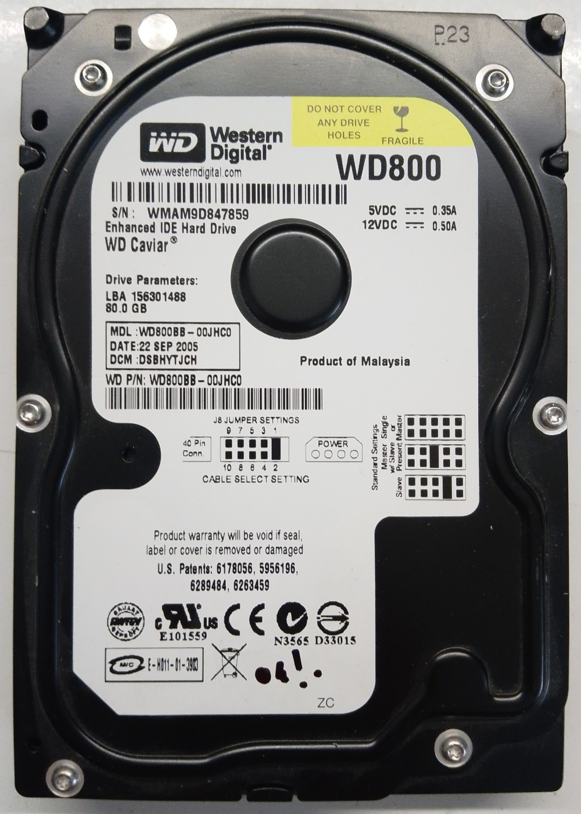
    </a>
</figure>

</td><td markdown="1">

**Information**

 Name | Value
---|---
 Model | *WDC WD800BB-00JHC0*
 Serial | *WD-WMAM9DPF8296*
 Firmware | *05.01C05*
 Capacity | 80 GB
 Date | 19 February 2006
 Family | *Sabre*
 Architecture | pre-ROYL

**SA Geometry**

 Name | Value
---|---
 Cylinders | 64
 Sectors per track | 533
 Heads | 2
 Total size | 34.93 MB (17.47 MB per head)
 Usable size | 34.93 MB (100%)

 **SA Usage**

Name | Value
---|---
 Heads | 2
 Size | 8.25 MB (4.12 MB per head)
 Utilisation | 23.6%

</td>
</tr>
</table>

<table>
<tr>
<td>

<figure>
    <a href="sabre/storage_extents.svg" class="image-popup">
        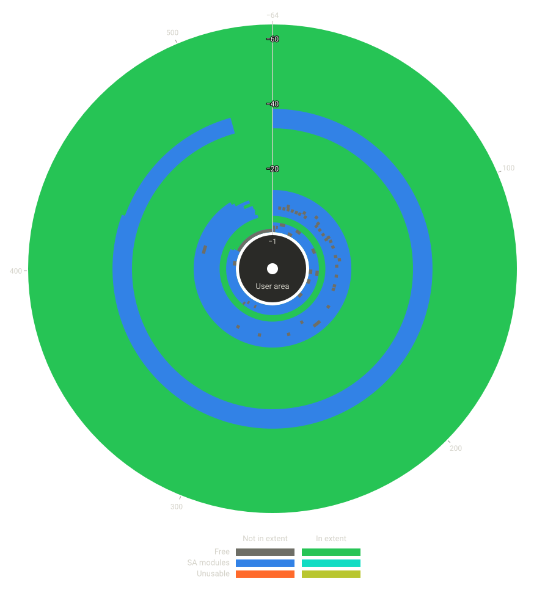
    </a>
</figure>

</td><td markdown="1">

**Storage Extents**

 Name | Value
---|---
Count | 63
Total size | 13.17 MB
Free space utilisation | 13.17 MB (98.68%)
Conflict (SA module) | *N/A*
Conflict (unusable) | *N/A*

</td>
</tr>
</table>

## SA Storage Size - WD2500AAKS-00VSA0 (Yosemite)

*Yosemite* is an early family using the ROYL-ABA architecture variant, produced from approximately 2007 to 2009. The example here uses a physical drive, shown in the included image.

<table>
<tr>
<td>

<figure>
    <a href="yosemite/image.jpg" class="image-popup">
        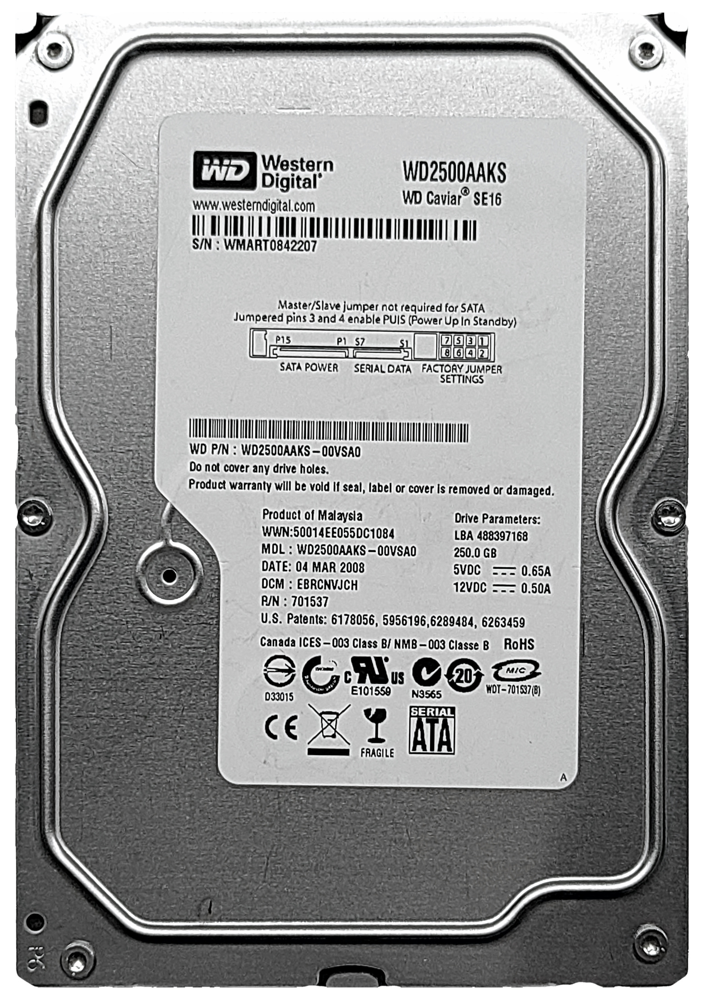
    </a>
</figure>

</td><td markdown="1">

**Information**

 Name | Value
---|---
 Model | *WDC WD2500AAKS-00VSA0*
 Serial | *WD-WMART0842207*
 Firmware | *01.01B01*
 Capacity | 250 GB
 Date | 4 March 2008
 Family | *Yosemite*
 Architecture | ROYL-ABA

**SA Geometry**

 Name | Value
---|---
 Cylinders | 170
 Sectors per track | 1301
 Heads | 2
 Total size | 226.48 MB (113.24 MB per head)
 Usable size | 226.48 MB (100%)

 **SA Usage**

Name | Value
---|---
 Heads | 2
 Size | 30.59 MB (15.29 MB per head)
 Utilisation | 13.5%

</td>
</tr>
</table>

<table>
<tr>
<td>

<figure>
    <a href="yosemite/storage_extents.svg" class="image-popup">
        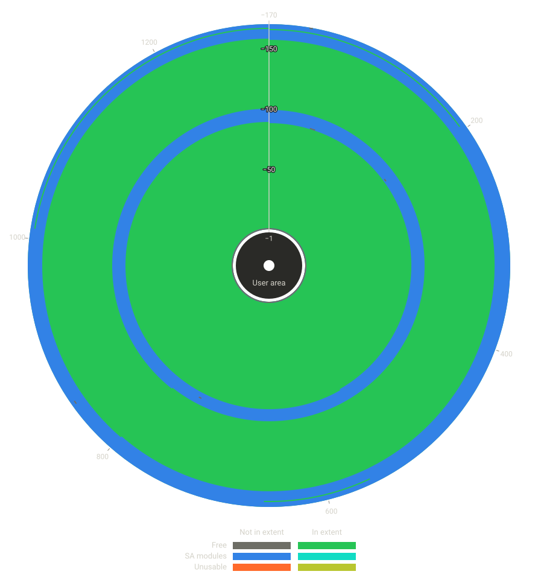
    </a>
</figure>

</td><td markdown="1">

**Storage Extents**

 Name | Value
---|---
Count | 150
Total size | 97.27 MB
Free space utilisation | 97.27 MB (99.31%)
Conflict (SA module) | *N/A*
Conflict (unusable) | *N/A*

</td>
</tr>
</table>

## SA Storage Size - WD3200BEKT-60V5T1 (Saturn)

*Saturn* is a family using the ROYL-ABA architecture variant, commonly found as *Scorpio*-branded 2.5" laptop drives and produced from approximately 2008 to 2012. The example here uses a physical drive dated *13 April 2010*, shown in the included image.

<table>
<tr>
<td>

<figure>
    <a href="saturn/image.jpg" class="image-popup">
        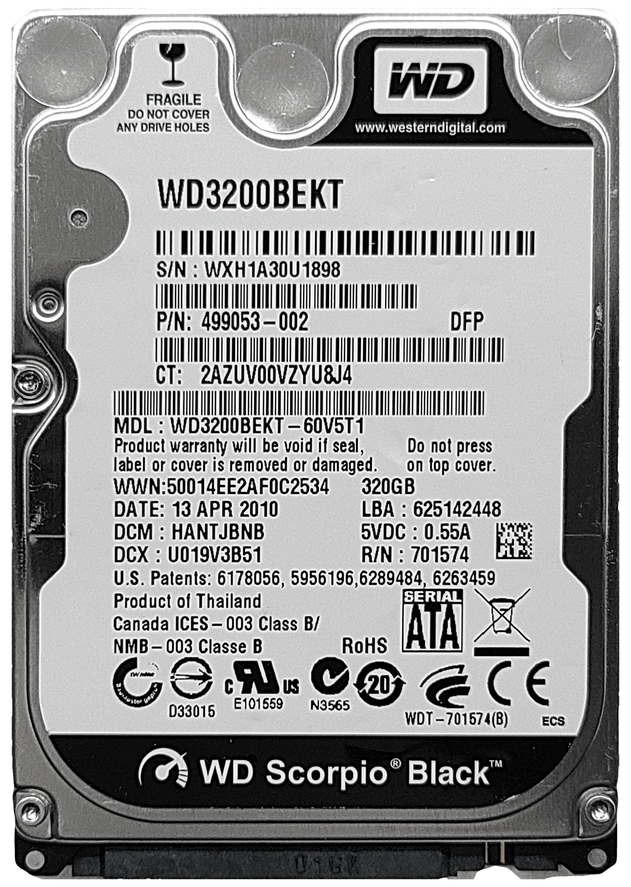
    </a>
</figure>

</td><td markdown="1">

**Information**

 Name | Value
---|---
 Model | *WDC WD3200BEKT-60V5T1*
 Serial | *WD-WXH1A30U1898*
 Firmware | *12.01A12*
 Capacity | 320 GB
 Date | 13 April 2010
 Family | *Saturn*
 Architecture | ROYL-ABA

**SA Geometry**

 Name | Value
---|---
 Cylinders | 256
 Sectors per track | 693
 Heads | 4
 Total size | 363.33 MB (90.83 MB per head)
 Usable size | 363.33 MB (100%)

 **SA Usage**

Name | Value
---|---
 Heads | 2
 Size | 65.44 MB (32.72 MB per head)
 Utilisation | 36.02%

</td>
</tr>
</table>

<table>
<tr>
<td>

<figure>
    <a href="saturn/storage_extents.svg" class="image-popup">
        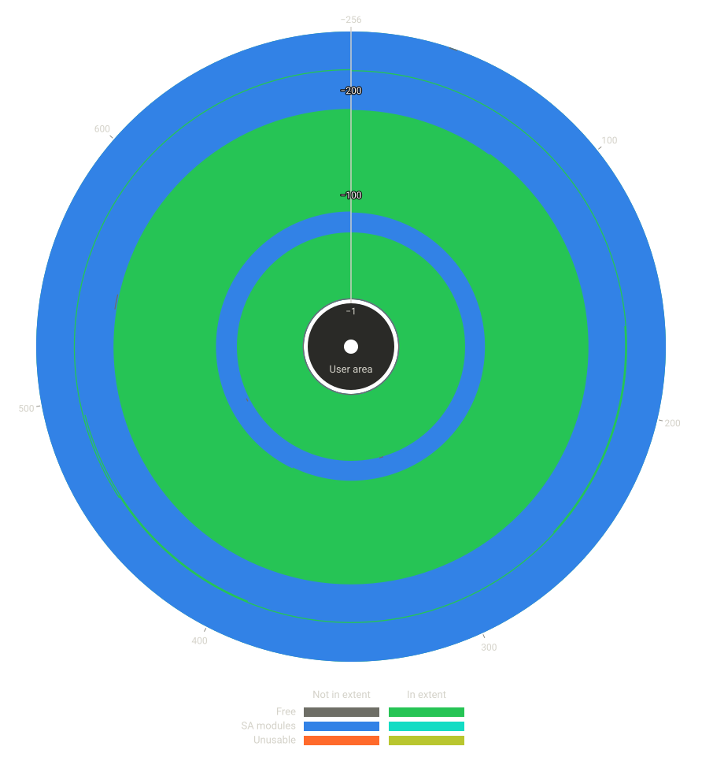
    </a>
</figure>

</td><td markdown="1">

**Storage Extents**

 Name | Value
---|---
Count | 166
Total size | 57.75 MB
Free space utilisation | 57.75 MB (99.37%)
Conflict (SA module) | *N/A*
Conflict (unusable) | *N/A*

</td>
</tr>
</table>

## SA Storage Size - WD84PURZ-85B2YY0 (Avalon C5)

*Avalon C5* is a drive family introduced in approximately 2021 and still in production as of 2026. As a modern drive, it uses the ROYL-ABA architecture variant. The example here uses an SA copy from a drive dated *20 July 2022*.

This drive is included purely as a hypothetical demonstration of what the results *could* be if this SA storage system were used on a modern high-capacity drive. Not only did this drive family first enter production over a decade after the date of this version of *WICKEDVICAR*, but the example drive's [SA directory](#system-area---royl---aba) uses a 20-byte entry structure that *WICKEDVICAR* cannot even parse. This section therefore shows what would happen *if* [creating SA storage](#drive-class---writeresources---create-sa-storage) supported this drive's SA directory format.

Because it has SA defect list entries, this drive also demonstrates the danger of the broken [SA defect compensation](#sa-defects) *WICKEDVICAR* implements: a substantial portion of the storage extents here overlap either in-use SA modules or unusable areas that are unaddressable due to [sector slipping](https://en.wikipedia.org/wiki/Sector_slipping). Writing an SA storage allocation to one of those conflicting areas could break the drive.

<table>
<tr>
<td>

<figure>
    <a href="avalon_c5/image.jpg" class="image-popup">
        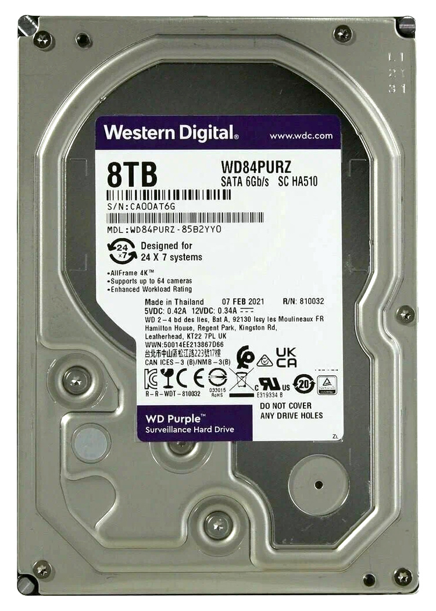
    </a>
</figure>

</td><td markdown="1">

**Information**

 Name | Value
---|---
 Model | *WDC WD84PURZ-85B2YY0*
 Serial | *WD-CA1LE4UK*
 Firmware | *80.00A80*
 Capacity | 8 TB
 Date | 20 July 2022
 Family | *Avalon C5*
 Architecture | ROYL-ABA

**SA Geometry**

 Name | Value
---|---
 Cylinders | 384
 Sectors per track | 2800
 Heads | 10
 Total size | 5.5 GB (550.5 MB per head)
 Usable size | 4.96 GB (90.1%)

 **SA Usage**

Name | Value
---|---
 Heads | 2
 Size | 320.89 MB (160.44 MB per head)
 Utilisation | 32.35%

</td>
</tr>
</table>

<table>
<tr>
<td>

<figure>
    <a href="avalon_c5/storage_extents.svg" class="image-popup">
        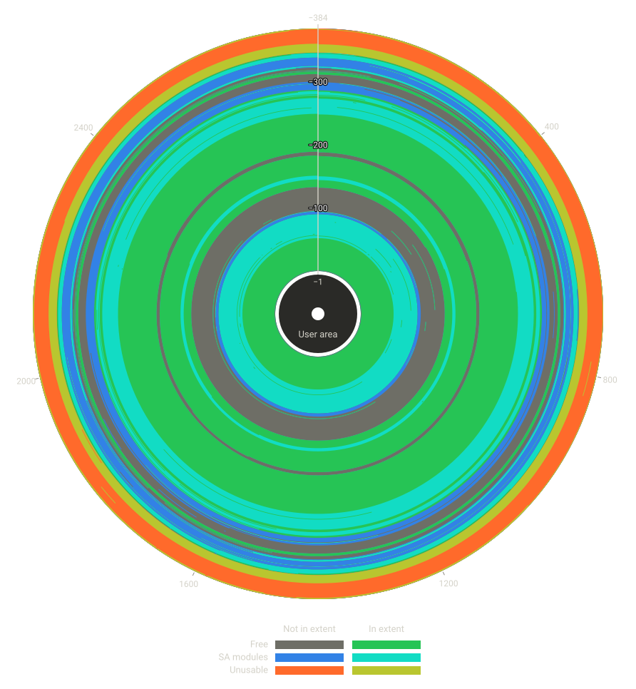
    </a>
</figure>

</td><td markdown="1">

**Storage Extents**

 Name | Value
---|---
Count | 308
Total size | 388.57 MB
Free space utilisation | 247.20 MB (73.66%)
Conflict (SA module) | 119.99 MB
Conflict (unusable) | 21.39 MB

</td>
</tr>
</table>

# Conclusion

The WD Marvell firmware architecture has the most complex implementation of any drive type *WICKEDVICAR* supports, and is overall the most technically impressive. The WD drive types, WDC MCU and WD Marvell collectively, are the only implementations that directly parse SA structures to identify available space for [SA storage](../#sa-storage), and of the two the Marvell variant is by far the more involved.

This complexity also provides visibility into details of the firmware implant itself. The SA storage allocation RLBA addresses used in the [implant data](#drive-class---writeresources---implant-data) indicate not only that the implant accesses the SA by RLBA even on pre-ROYL and ROYL-CHS drives, but also that the only allocations accessed are the implant data (ID `0x2`) and another mystery allocation (ID `0x3`) seemingly intended for internal use.

The design of the code gives some indications of the chronology of development, with the original version likely supporting only pre-ROYL drives and support for the ROYL variants added later. One specific example is the incorrect ROYL SA directory checksum issue detailed in [WriteResources - SA File](#drive-class---writeresources---sa-file). More generally, the structure of the code suggests that ROYL-CHS and ROYL-ABA support was introduced by refactoring an existing pre-ROYL implementation. An origin of exclusively pre-ROYL support would date this to approximately 2004 to 2007. Anything later would most likely have been developed with the ROYL architecture as the primary target.

The ROYL-ABA implementation is the most interesting and divergent of them all, and was almost certainly written by a different author from whoever produced the ROYL-CHS and pre-ROYL variants. One example indicating this is the unnecessary and potentially destructive [SA defect compensation](#sa-defects) applied only to ROYL-ABA drives, seemingly based on confusing the separate *virtual* and *physical* addressing.

The ROYL-ABA code appears to be the work of an author with access to detailed technical documentation on the drive internals, but with a shallow understanding of how the underlying system works. It's unclear, however, whether such documentation originated from another NSA researcher, from proprietary Western Digital specifications, or from some other source.

[^sct_spec]: https://web.archive.org/web/20071013061709if_/http://www.t10.org/t13/docs2005/DT1701r5-SCT.pdf
[^pc3000_manual]: https://trulycrisp.github.io/drivefirmware/iratemonk/wickedvicar/wd_marvell/pc3000_manual.pdf
[^kaspersky_equationgroup]: https://media.kasperskycontenthub.com/wp-content/uploads/sites/43/2018/03/08064459/Equation_group_questions_and_answers.pdf