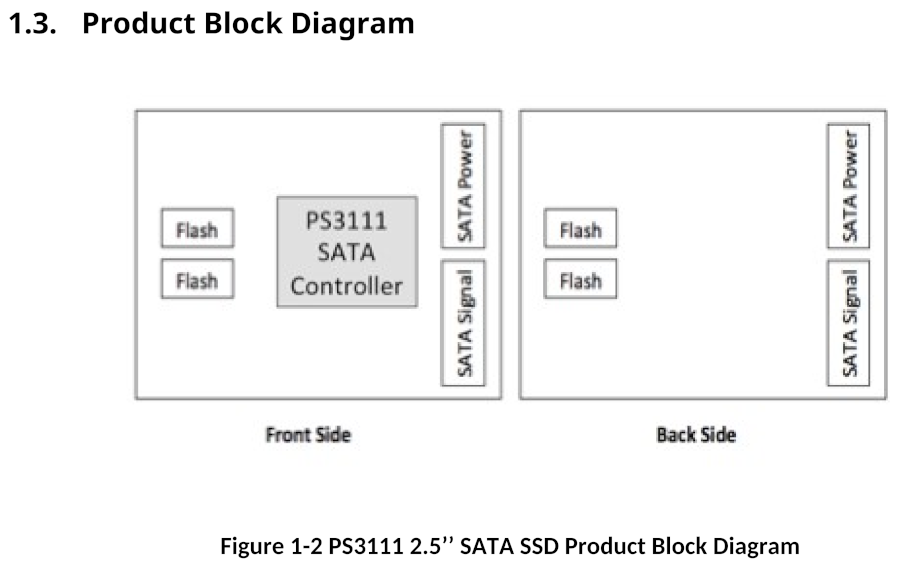
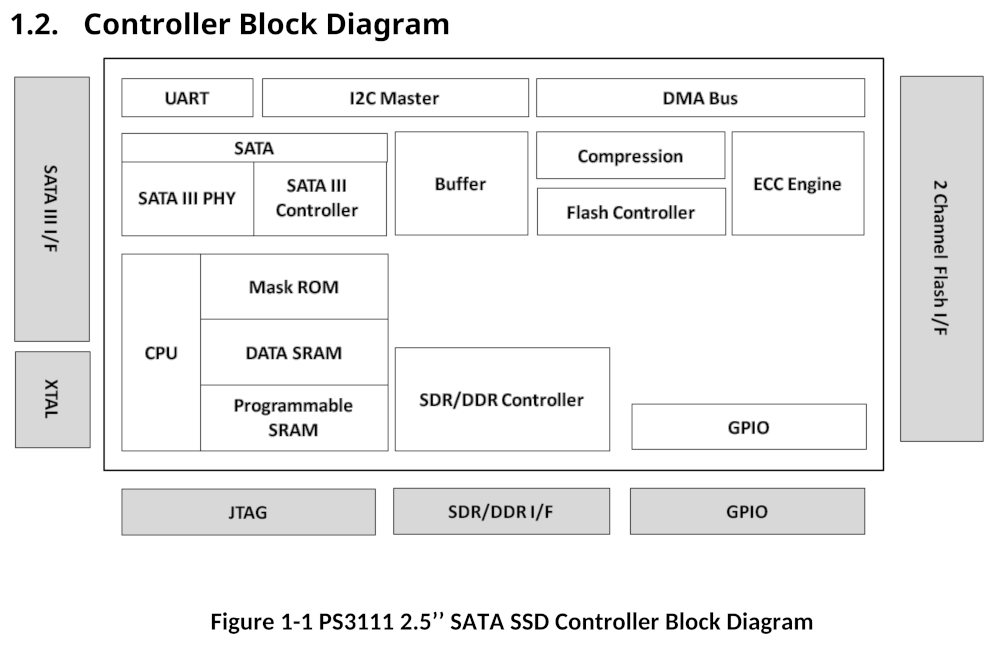
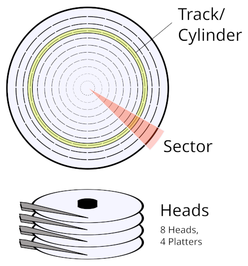

# Overview

## Hardware

Storage drives are one of the more complex components you can find in a standard personal computer, it is essentially a computer in its own right, a mini computer inside a computer. As a computer they contain the typical fundamental components you would expect, a processor, volatile memory, and non-volatile storage. They even run their own form of operating system, typically a minimal Real Time Operating System (RTOS) sometimes derived from common RTOS implementations such as ThreadX. All storage drives also have some type of storage medium they're built around, such as NAND flash for SSDs or magnetic disks for HDDs, and will have a bus to interface with an attached computer such as SATA or NVMe. This bus will use a standardised command set, such as ATA for SATA drives, for a computer to both read and write data to the drive and also access various other drive functionality.

Example diagrams showing these components on a Phison PS3111 SATA SSD are included below, the first shows components on the PCB, the second shows elements within the controller.

## Boot Process

The Phison PS3111 is a simple design that is instructive for demonstrating the concepts SSD design is built on. When the drive is powered on, the CPU boots and executes code from a mask ROM internal to the controller, this initial code is a bootloader with the main task of loading and executing the main firmware code from attached flash chips. The bootloader does a search reading the first page of each block of connected flash to find a specific signature, if found it will parse this page as a firmware header and load the firmware code in the pages that follow, executing it and handing over control. If the bootloader is unable to locate the main firmware on flash, it will instead begin its own minimal firmware implementation commonly known as safe mode.

This safe mode is a version of firmware that implements only a very basic set of standard functionality, such as returning drive identification data, but without for example features to read or write data to storage, most functionality available is vendor-specific undocumented features that allow software tools to load and execute firmware code in controller memory through the SATA interface, without the controller needing to load it from flash. This functionality for the bootloader to execute firmware in-memory has two main purposes. First for factory initialisation of the drive during the manufacturing process, when the drive PCB has been assembled but before the firmware code has been installed the drive executes in-memory a special firmware type known as a burner, this burner firmware implements the functionality needed to then initialise the drive and install the regular firmware to flash. The second use-case is for drive diagnostics or recovery, if firmware on flash becomes corrupted or otherwise unavailable, firmware code can then be loaded in memory to investigate the drive further, this is commonly used for example during data recovery or the RMA process.

Although safe mode can be entered automatically on drive failure as detailed above, drives will usually provide some hardware feature allowing it to be entered manually on-demand too, usually with a jumper on the PCB. A video below shows safe mode in use with the PC3000 data recovery product, using it to diagnose and recover data from a malfunctioning drive.

## Initialisation and Operation

At the lowest level, a drive accesses its storage medium through a system of physical addressing, reading and writing data by its physical location. For SSDs this physical addressing system is standardised to use values of the die, plane, block, and page within a flash chip. For HDDs, it uses values of Cylinder, Head, and Sector (CHS) for a position on the magnetic disks.

However when a computer reads and writes data to the drive, it doesn't use a physical location, but a Logical Block Address (LBA). Rather than an array of physical flash chips or platters, a drive presents its storage to a computer as a single continuous area of data, indexed by a sector offset within that data. Once the main firmware has been loaded by the bootloader and executes, the firmware must then setup the subsystem handling access based on that logical addressing, converting those LBAs to physical locations on the storage medium. This subsystem is called the Translator, or Flash Translation Layer (FTL) in SSD-specific terminology. The FTL maintains a Logical To Physical (L2P) mapping table for converting a given LBA to its physical address on flash, the FTL stores this table on flash and updates it as data is written or erased.

This raises a chicken-and-egg type problem though, if the SSD requires an L2P table to locate data on flash, and that table itself is stored in that same flash, when the drive initialises how does it locate that table? The answer is simple, critical internal data such as the FTL L2P table can simply be stored anywhere on flash (or within some broad block range), and the firmware will find it by searching for a specific identifying signature.

For the Phison 3111, critical firmware data such as code, configuration, and FTL tables are stored as separate blocks anywhere within a designated range (for FTL data the first 100 blocks), and marked with a specific 32-bit magic value in the spare Error Correction Code (ECC) area of each page, the firmware header for example uses `0x31113111` for this magic value. The firmware locates the data by reading the first page of every block in that range searching for the appropriate magic value.

One type of data loaded from flash this way is a bitmap of every block on flash and its designated purpose if any, this includes blocks of System Unit data (firmware, configuration), FTL data, and Product History data. All other blocks not marked in that bitmap are considered free for allocation by the FTL.

### System Area

This introduces a concept known as the System Area (SA). For any storage drive, the data it stores is divided into two distinct types, User Area data which is all regular external data written to it as storage, and SA data which is all other data used internally by the firmware. Although the SA is at least always partially designated by physical locations on the storage medium for critical data such as the L2P table as detailed earlier, many drives also maintain an additional logical SA managed by the Translator. In the Phison 3111 for example while critical system data is stored and located by physical address without logical translation, there's an additional logical SA accessed through the FTL for some non-critical data such as SMART logs.

## Command Sets

When a drive is attached to a computer, the computer communicates with it through a standard command set, examples of these are ATA for SATA drives and NVM for NVMe drives. These commands can have various functionality, not only reading and writing data but also configuring drive parameters or accessing diagnostics. Command sets do not uniquely map to a drive bus type one-to-one, as some command sets can be used for multiple, for example SCSI is used for both SAS and USB drives. This is further complicated by the fact that some command sets can be encapsulated within others, such as SCSI ATA Translation (SAT) which allows sending ATA commands through SCSI commands, this is commonly used for example with USB-SATA adaptors, where ATA commands can be sent to the drive through SAT over the USB Attached SCSI (UAS) protocol.

### ATA

ATA is the command set of the SATA protocol, as used by most hard drives and many solid state drives. ATA commands are based on a set of 7 register values, each of 8 or 16 bits depending on the mode (LBA28/LBA48).

| Number | Name         | Bits LBA28 | Bits LBA48 |
|--------|--------------|------------|------------|
| 1      | Features     | 8          | 16         |
| 2      | Sector Count | 8          | 16         |
| 3      | LBA Low      | 8          | 16         |
| 4      | LBA Mid      | 8          | 16         |
| 5      | LBA High     | 8          | 16         |
| 6      | Device       | 8          | 8          |
| 7      | Command      | 8          | 8          |

The command register is used for the actual command opcode ranging from 0 to 0xFF, while the other registers are parameter values with behaviors depending on the specific command.

| Opcode | Name |
|--------|------|
| `0x00` | NOP |
| `0x01` | |
| `0x02` | |
| `0x03` | CFA REQUEST EXTENDED ERROR CODE |
| `0x04` | |
| `0x05` | |
| `0x06` | DATA SET MANAGEMENT |
| `0x07` | DATA SET MANAGEMENT XL |
| `0x08` | DEVICE RESET |
| `0x09` | |
| `0x0A` | |
| `0x0B` | REQUEST SENSE DATA EXT |
| `0x0C` | |
| `0x0D` | |
| `0x0E` | |
| `0x0F` | |
| `0x10` | RECALIBRATE |
| `0x11` | RECALIBRATE |
| `0x12` | GET PHYSICAL ELEMENT STATUS / RECALIBRATE |
| `0x13` | RECALIBRATE |
| `0x14` | RECALIBRATE |
| `0x15` | RECALIBRATE |
| `0x16` | RECALIBRATE |
| `0x17` | RECALIBRATE |
| `0x18` | RECALIBRATE |
| `0x19` | RECALIBRATE |
| `0x1A` | RECALIBRATE |
| `0x1B` | RECALIBRATE |
| `0x1C` | RECALIBRATE |
| `0x1D` | RECALIBRATE |
| `0x1E` | RECALIBRATE |
| `0x1F` | RECALIBRATE |
| `0x20` | READ SECTOR(S) |
| `0x21` | READ SECTOR(S) (without retry) |
| `0x22` | READ LONG |
| `0x23` | READ LONG (without retry) |
| `0x24` | READ SECTOR(S) EXT |
| `0x25` | READ DMA EXT |
| `0x26` | READ DMA QUEUED EXT |
| `0x27` | READ NATIVE MAX ADDRESS EXT |
| `0x28` | |
| `0x29` | READ MULTIPLE EXT |
| `0x2A` | READ STREAM DMA EXT |
| `0x2B` | READ STREAM EXT |
| `0x2C` | |
| `0x2D` | |
| `0x2E` | |
| `0x2F` | READ LOG EXT |
| `0x30` | WRITE SECTOR(S) |
| `0x31` | WRITE SECTOR(S) (without retry) |
| `0x32` | WRITE LONG |
| `0x33` | WRITE LONG (without retry) |
| `0x34` | WRITE SECTOR(S) EXT |
| `0x35` | WRITE DMA EXT |
| `0x36` | WRITE DMA QUEUED EXT |
| `0x37` | SET MAX ADDRESS EXT |
| `0x38` | CFA WRITE SECTORS WITHOUT ERASE |
| `0x39` | WRITE MULTIPLE EXT |
| `0x3A` | WRITE STREAM DMA EXT |
| `0x3B` | WRITE STREAM EXT |
| `0x3C` | WRITE VERIFY |
| `0x3D` | WRITE DMA FUA EXT |
| `0x3E` | WRITE DMA QUEUED FUA EXT |
| `0x3F` | WRITE LOG EXT |
| `0x40` | READ VERIFY SECTOR(S) |
| `0x41` | READ VERIFY SECTOR(S) (without retry) |
| `0x42` | READ VERIFY SECTOR(S) EXT |
| `0x43` | |
| `0x44` | ZERO EXT |
| `0x45` | WRITE UNCORRECTABLE EXT |
| `0x46` | |
| `0x47` | READ LOG DMA EXT |
| `0x48` | |
| `0x49` | |
| `0x4A` | ZAC Management In |
| `0x4B` | |
| `0x4C` | |
| `0x4D` | |
| `0x4E` | |
| `0x4F` | |
| `0x50` | FORMAT TRACK |
| `0x51` | CONFIGURE STREAM |
| `0x52` | |
| `0x53` | |
| `0x54` | |
| `0x55` | |
| `0x56` | |
| `0x57` | WRITE LOG DMA EXT |
| `0x58` | |
| `0x59` | |
| `0x5A` | |
| `0x5B` | TRUSTED NON-DATA |
| `0x5C` | TRUSTED RECEIVE |
| `0x5D` | TRUSTED RECEIVE DMA |
| `0x5E` | TRUSTED SEND |
| `0x5F` | TRUSTED SEND DMA |
| `0x60` | READ FPDMA QUEUED |
| `0x61` | WRITE FPDMA QUEUED |
| `0x62` | |
| `0x63` | NCQ NON-DATA |
| `0x64` | SEND FPDMA QUEUED |
| `0x65` | RECEIVE FPDMA QUEUED |
| `0x66` | |
| `0x67` | |
| `0x68` | |
| `0x69` | |
| `0x6A` | |
| `0x6B` | |
| `0x6C` | |
| `0x6D` | |
| `0x6E` | |
| `0x6F` | |
| `0x70` | SEEK |
| `0x71` | SEEK |
| `0x72` | SEEK |
| `0x73` | SEEK |
| `0x74` | SEEK |
| `0x75` | SEEK |
| `0x76` | SEEK |
| `0x77` | SET DATE & TIME EXT / SEEK |
| `0x78` | ACCESSIBLE MAX ADDRESS CONFIGURATION / SEEK |
| `0x79` | SEEK |
| `0x7A` | SEEK |
| `0x7B` | SEEK |
| `0x7C` | REMOVE ELEMENT AND TRUNCATE / SEEK |
| `0x7D` | RESTORE ELEMENTS AND REBUILD / SEEK |
| `0x7E` | REMOVE ELEMENT AND MODIFY ZONES / SEEK |
| `0x7F` | SEEK |
| `0x80` | Vendor Specific |
| `0x81` | Vendor Specific |
| `0x82` | Vendor Specific |
| `0x83` | Vendor Specific |
| `0x84` | Vendor Specific |
| `0x85` | Vendor Specific |
| `0x86` | Vendor Specific |
| `0x87` | CFA TRANSLATE SECTOR |
| `0x88` | Vendor Specific |
| `0x89` | Vendor Specific |
| `0x8A` | Vendor Specific |
| `0x8B` | Vendor Specific |
| `0x8C` | Vendor Specific |
| `0x8D` | Vendor Specific |
| `0x8E` | Vendor Specific |
| `0x8F` | Vendor Specific |
| `0x90` | EXECUTE DEVICE DIAGNOSTIC |
| `0x91` | INITIALIZE DEVICE PARAMETERS |
| `0x92` | DOWNLOAD MICROCODE |
| `0x93` | DOWNLOAD MICROCODE DMA |
| `0x94` | STANDBY IMMEDIATE |
| `0x95` | IDLE IMMEDIATE |
| `0x96` | MUTATE EXT / STANDBY |
| `0x97` | IDLE |
| `0x98` | CHECK POWER MODE |
| `0x99` | SLEEP |
| `0x9A` | Vendor Specific |
| `0x9B` | |
| `0x9C` | |
| `0x9D` | |
| `0x9E` | |
| `0x9F` | ZAC Management Out |
| `0xA0` | PACKET |
| `0xA1` | IDENTIFY PACKET DEVICE |
| `0xA2` | SERVICE |
| `0xA3` | |
| `0xA4` | |
| `0xA5` | |
| `0xA6` | |
| `0xA7` | |
| `0xA8` | |
| `0xA9` | |
| `0xAA` | |
| `0xAB` | |
| `0xAC` | |
| `0xAD` | |
| `0xAE` | |
| `0xAF` | |
| `0xB0` | SMART |
| `0xB1` | Device Configuration Overlay |
| `0xB2` | SET SECTOR CONFIGURATION EXT |
| `0xB3` | |
| `0xB4` | Sanitize Device |
| `0xB5` | |
| `0xB6` | NV Cache |
| `0xB7` | Reserved for CFA |
| `0xB8` | Reserved for CFA |
| `0xB9` | Reserved for CFA |
| `0xBA` | Reserved for CFA |
| `0xBB` | Reserved for CFA |
| `0xBC` | |
| `0xBD` | |
| `0xBE` | |
| `0xBF` | |
| `0xC0` | CFA ERASE SECTORS |
| `0xC1` | Vendor Specific |
| `0xC2` | Vendor Specific |
| `0xC3` | Vendor Specific |
| `0xC4` | READ MULTIPLE |
| `0xC5` | WRITE MULTIPLE |
| `0xC6` | SET MULTIPLE MODE |
| `0xC7` | READ DMA QUEUED |
| `0xC8` | READ DMA |
| `0xC9` | READ DMA (without retry) |
| `0xCA` | WRITE DMA |
| `0xCB` | WRITE DMA (without retry) |
| `0xCC` | WRITE DMA QUEUED |
| `0xCD` | CFA WRITE MULTIPLE WITHOUT ERASE |
| `0xCE` | WRITE MULTIPLE FUA EXT |
| `0xCF` | |
| `0xD0` | |
| `0xD1` | CHECK MEDIA CARD TYPE |
| `0xD2` | |
| `0xD3` | |
| `0xD4` | |
| `0xD5` | |
| `0xD6` | |
| `0xD7` | |
| `0xD8` | |
| `0xD9` | |
| `0xDA` | GET MEDIA STATUS |
| `0xDB` | ACKNOWLEDGE MEDIA CHANGE |
| `0xDC` | BOOT - POST-BOOT |
| `0xDD` | BOOT - PRE-BOOT |
| `0xDE` | MEDIA LOCK |
| `0xDF` | MEDIA UNLOCK |
| `0xE0` | STANDBY IMMEDIATE |
| `0xE1` | IDLE IMMEDIATE |
| `0xE2` | STANDBY |
| `0xE3` | IDLE |
| `0xE4` | READ BUFFER |
| `0xE5` | CHECK POWER MODE |
| `0xE6` | SLEEP |
| `0xE7` | FLUSH CACHE |
| `0xE8` | WRITE BUFFER |
| `0xE9` | READ BUFFER DMA / WRITE SAME |
| `0xEA` | FLUSH CACHE EXT |
| `0xEB` | WRITE BUFFER DMA |
| `0xEC` | IDENTIFY DEVICE |
| `0xED` | MEDIA EJECT |
| `0xEE` | IDENTIFY DEVICE DMA |
| `0xEF` | SET FEATURES |
| `0xF0` | Vendor Specific |
| `0xF1` | SECURITY SET PASSWORD |
| `0xF2` | SECURITY UNLOCK |
| `0xF3` | SECURITY ERASE PREPARE |
| `0xF4` | SECURITY ERASE UNIT |
| `0xF5` | SECURITY FREEZE LOCK |
| `0xF6` | SECURITY DISABLE PASSWORD |
| `0xF7` | Vendor Specific |
| `0xF8` | READ NATIVE MAX ADDRESS |
| `0xF9` | SET MAX ADDRESS |
| `0xFA` | Vendor Specific |
| `0xFB` | Vendor Specific |
| `0xFC` | Vendor Specific |
| `0xFD` | Vendor Specific |
| `0xFE` | Vendor Specific |
| `0xFF` | Vendor Specific |

### NVM

NVM is the primary command set for the NVMe protocol, as used by most modern SSDs. Commands are 64 bytes in size, although the exact fields within those 64 bytes vary based on the command, there is a Common Command Format defining a general format applicable to all:

| Bytes | Field | Description |
|-------|-------|-------------|
| 00-03 | CDW0 | Command Dword 0 (Opcode, FUSE, PSDT, CID) |
| 04-07 | NSID | Namespace Identifier |
| 08-11 | CDW2 | Command-specific |
| 12-15 | CDW3 | Command-specific |
| 16-23 | MPTR | Metadata Pointer |
| 24-39 | DPTR | Data Pointer |
| 40-43 | CDW10 | Command-specific |
| 44-47 | CDW11 | Command-specific |
| 48-51 | CDW12 | Command-specific |
| 52-55 | CDW13 | Command-specific |
| 56-59 | CDW14 | Command-specific |
| 60-63 | CDW15 | Command-specific |

NVM commands are separated into two main types, I/O commands, and Admin commands. I/O commands are what you would expect from the name, handling regular data reading and writing. Admin commands are the more interesting type for this topic's security focus, as they handle management of the drive itself, including managing drive configuration, firmware, and various other internal functionality. NVM Admin command opcodes are organised in three distinct ranges, each serving a specific purpose:

| Range | Purpose |
|-------|---------|
| `0x00-0x7F` | Standard  |
| `0x80-0xBF` | I/O Command Set Specific |
| `0xC0-0xFF` | Vendor Specific |

NVM Admin commands

| Opcode | Command Name |
|--------|--------------|
| `0x00` | Delete I/O Submission Queue |
| `0x01` | Create I/O Submission Queue |
| `0x02` | Get Log Page |
| `0x04` | Delete I/O Completion Queue |
| `0x05` | Create I/O Completion Queue |
| `0x06` | Identify |
| `0x08` | Abort |
| `0x09` | Set Features |
| `0x0A` | Get Features |
| `0x0C` | Asynchronous Event Request |
| `0x0D` | Namespace Management |
| `0x10` | Firmware Commit |
| `0x11` | Firmware Image Download |
| `0x14` | Device Self-Test |
| `0x15` | Namespace Attachment |
| `0x18` | Keep Alive |
| `0x19` | Directive Send |
| `0x1A` | Directive Receive |
| `0x1C` | Virtualization Management |
| `0x1D` | NVMe-MI Send |
| `0x1E` | NVMe-MI Receive |
| `0x20` | Capacity Management |
| `0x24` | Lockdown |
| `0x7C` | Doorbell Buffer Config |
| `0x7F` | Fabrics Commands |
| `0x80` | Format NVM |
| `0x81` | Security Send |
| `0x82` | Security Receive |
| `0x84` | Sanitize |
| `0x86` | Get LBA Status |
| `0xC0–0xFF` | Vendor Specific |

### Vendor Unique Commands

So as mentioned in section [Boot Process](#boot-process) in safe mode software tools can use vendor-specific features to load firmware into memory, but how do those features work? They use something called Vendor Unique Commands (VUCs). In any command set used by drives some subset of commands are reserved as vendor specific, these commands are available for drive vendors to use for whatever functionality they like. Some forms of VUCs can be more complicated, and instead of using those reserved command codes implement special features within the standard command set, such as magic parameters to activate some alternate functionality, others can use sub-protocols transported within the standard command set such as ATA SMART Command Transport (SCT).

VUCs are not something unique to a drive's safe mode, but are something vendors also implement in standard firmware versions too, providing commands available during normal drive operation. These commands can allow access to low-level engineering features and firmware internals, including reading/writing controller memory, direct access to physical flash, and configuring internal drive parameters. VUCs are usually undocumented and intended for internal use by the vendor, however through leaked information or reverse engineering can sometimes be discovered and used. All modern storage drives have some form of VUCs implemented, across all drive types including SATA and NVMe, as vendors consider them an essential tool for drive manufacturing and diagnostics.

## Security

Over the years drive manufacturers have introduced many security features to protect their products, these security features generally focus on protecting two main areas, firmware confidentiality and integrity, and authorised Vendor Unique Command (VUC) access.

Modern storage drives generally secure their firmware with encryption, and often cryptographic signing too for validating authenticity. Firmware is usually secured with these protections not only through the standard update process (e.g. firmware sent through the ATA DOWNLOAD MICROCODE command), but also at rest when stored in the drive. When the bootloader loads firmware as detailed in section [Boot Process](#boot-process), the bootloader will first decrypt the firmware and verify some type of signature or checksum before executing it, providing protection intended to be analogous to UEFI Secure Boot found in personal computers.

Additionally VUCs for accessing sensitive drive functionality will generally be locked by default during normal drive operation, drive firmware will usually implement some type of authentication flow to gain access to these commands. This authentication is usually implemented as a challenge-response scheme using cryptography, some subset of unrestricted VUCs are first used to read challenge data from the drive, which is then encrypted or signed with a specific hardcoded key, and then sent back to the drive. If the drive validates the encryption or signature is valid, those restricted VUCs are then unlocked.

Both types of security protections detailed above are often built on asymmetric cryptography using an algorithm such as RSA, the drive will contain a public key to verify the signature of firmware images or VUC unlock challenge responses. However the private key necessary to create those signatures is not contained in the drive at all, and is kept private by the vendor for their internal use.
