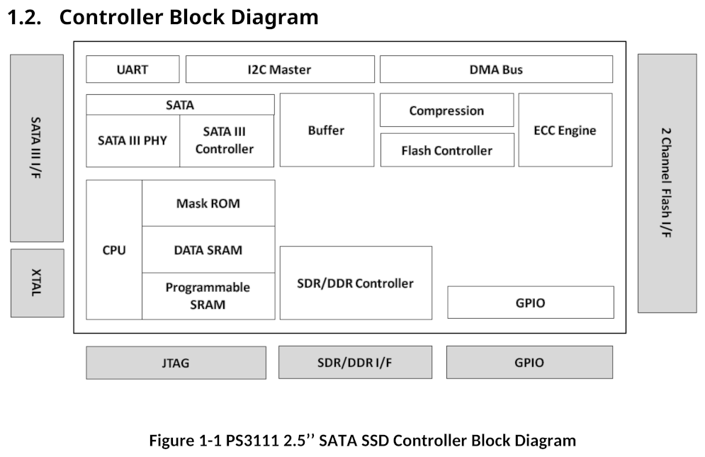
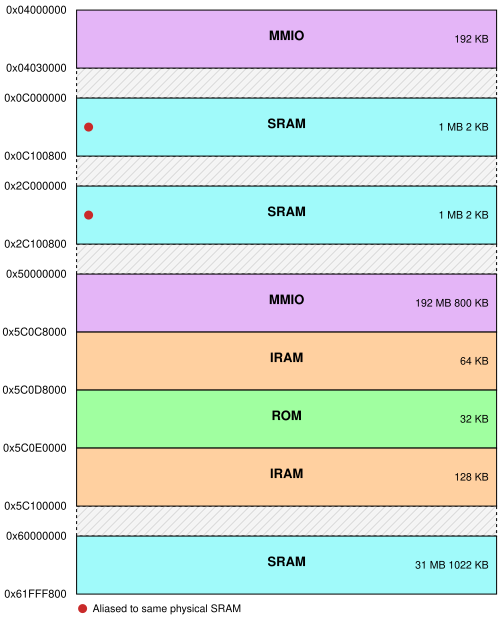
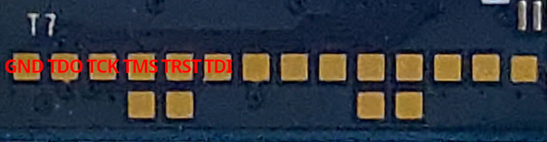
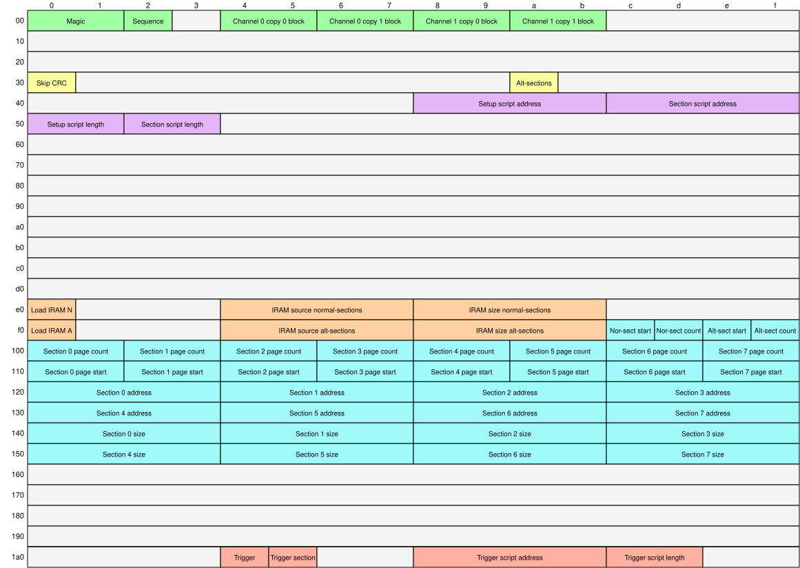
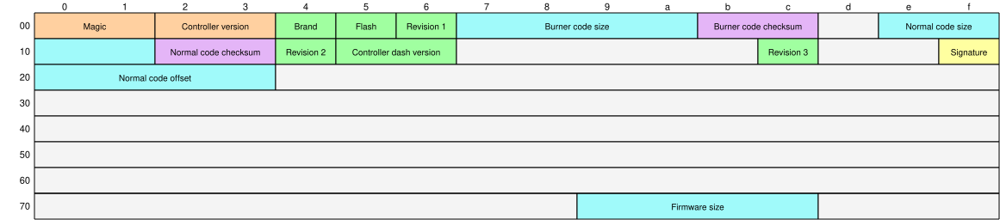
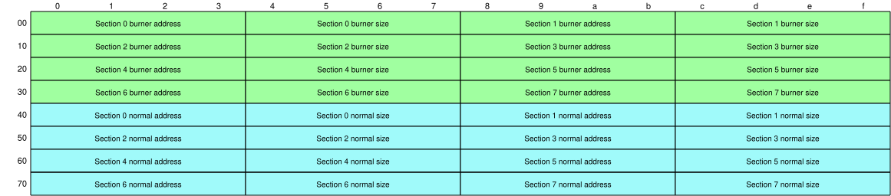
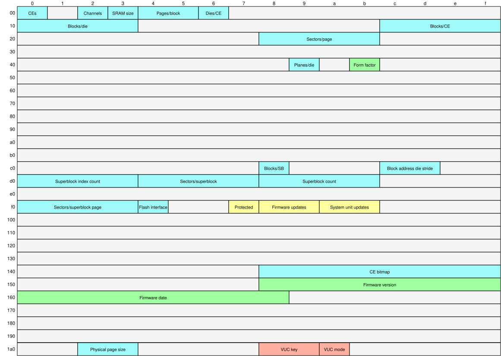

# Drive Firmware Security - Phison S11

*This page references many technical terms and concepts detailed in the [Overview](../overview) page, which should be read first.*

*Code demonstrating topics covered in this page can by found in the [Psychite](https://github.com/trulycrisp/psychite) repository*.

## Introduction

The Phison S11/3111 is one of the most common controllers used in SATA SSDs today, particularly for budget drives, with one drive model using this controller selling over 100 million units[^1]. Although not the only SATA SSD controller Phison currently produces[^2] it's by far the most popular due to its low cost, S11 controllers are more commonly found in drives today than all other Phison SATA controllers combined. Manufacturers like Phison let smaller companies create and sell a unique SSD product without having to develop an entire controller and firmware platform themselves, Phison will sell vendors a base hardware and firmware package they can customise for their specific needs. For Phison controllers such as the S11 a vendor can purchase anything from a complete off-the-shelf reference design with vendor branding to a co-developed custom design where the S11 controller is combined with a custom PCB, specific NAND flash chips, and customised firmware. Although each drive model with an S11 controller has variations in branding or customisation, the controller hardware and core firmware of these drives are always the same.

In the context of security this makes these drives a desirable target to attack, as a capability developed for this single controller can be used for many different drive models from many different vendors. The table below shows a sample of some drive models that use the S11 controller[^3]:

| Vendor | Model |
|---|---|
| Addlink | S22 |
| Gigabyte | SSD |
| Inland | Pro. (SATA) |
| KingMax | SMV |
| Kingston | A400 |
| Kingston | Q500 |
| Kioxia | Exceria SATA |
| Maxtor | Z1 |
| MSI | S270 |
| Patriot | Burst |
| Pioneer | APS-SL3 |
| PNY | CS2040 |
| PNY | CS900 |
| PNY | Elite |
| Seagate | BarraCuda Q1 |
| Silicon Power | A58 |
| Silicon Power | Bolt B75 Pro |
| Team | GX1 |
| Team | L3 EVO |
| Toshiba/Kioxia | TR200 |

## Hardware

The S11 controller is a simple SOC design with a single core Xtensa processor, 32 KB mask ROM, 192 KB of Instruction RAM (IRAM), and 33 MB of SRAM. A block diagram showing the controller's components is included below:



The Xtensa CPU has no Memory Management Unit (MMU) or Memory Protection Unit (MPU), all code executes with access to the entire physical address space, with full Read-Write-Execute (RWX) access to all memory. On power up the CPU executes code from the controller mask ROM, covered in section [Bootloader](#bootloader). The following shows a memory map of the address space within the controller:



The main hardware-level attack surface of this controller is the UART and JTAG debug interfaces, which can be permanently disabled during the manufacturing process using eFuses. Testing of various drives found both of these debug interfaces were usually enabled at the hardware eFuse-level, however were not usable likely due to the firmware implementation.

A physical JTAG interface was found on the reference PCB and most vendor PCBs, identified with a JTAG bypass scan. However this interface did not return an IDCODE and could not be used, even where the relevant eFuse left the hardware feature enabled. The pin-out of this JTAG interface is shown in the image below:



## Bootloader

When the controller powers on, the CPU executes code from the controller's mask ROM. The 32,768 byte contents of the mask ROM are loaded to address `0x5C0D8000`, the same reset vector address the CPU then jumps to and executes. This ROM code is a minimal bootloader written in C and assembly, with the purpose of loading and executing the main firmware. Depending on when the controller was manufactured this bootloader has different versions with slight variations, observed version numbers are `2.0`, `7.0`, `9.0`, and `9.2`, of which `2.0` is by far the most common. The bootloader can load the main firmware through two methods: from flash for the standard boot process, or directly into memory by an external tool.

### Bootloader - Firmware Load From Flash

Under normal conditions the bootloader enters the standard boot process, loading the main firmware from the drive's flash. For the first Chip Enable in each of the controller's two flash channels, it scans the first page of every block checking for the magic value `0x31113111` in the first 4 bytes of the page's Out-Of-Band (OOB) metadata area. When a matching page is found, the bootloader loads and parses it as a firmware header.

The firmware header is 4,096 bytes in size, and is always loaded into memory at address `0x5C0D4000` by the bootloader. The header is verified by calculating a checksum over all but the last 8 bytes, and comparing the result to a checksum value in the last 4 bytes, using the algorithm detailed in [CRC-32 Based Checksum](#algorithms---crc-32-based-checksum) with seed `0x31113111`. The firmware header is then parsed with the following structure:



The firmware header starts with magic bytes `49 44` 'ID', followed by a sequence number incremented each time a new firmware header is written. The drive stores firmware as four duplicate copies for redundancy, two copies in the first Chip-Enable (CE) of each of the controller's two flash channels, and the header contains the block location of each in fields *channel `x` copy `y` block*.

The bootloader begins the firmware loading process by first executing the *setup* init script if the relevant fields are configured, as described in section [Init Scripts](#bootloader---firmware-load-from-flash---init-scripts). It then sequentially loads a set of firmware sections into memory depending on whether either the *normal* or *alternate* set of sections is enabled, if boolean field *alt-sections* is false it uses the *Nor-sect count* number of sections starting at section number *Nor-sect start*, otherwise it similarly uses *alt-sect count* and *alt-sect start*.

To load each section the bootloader reads the *section `x` page count* number of flash pages starting at page *section `x` page start* in the same flash block as the header, it loads these pages into memory starting at the address in field *section `x` address* with *section `x` size* as the total section size in bytes, use of this size field means section sizes are not required to be flash page aligned. If field *skip CRC* is false it then verifies the section's checksum, it calculates the checksum of all but the last 8 bytes of the section using the algorithm detailed in [CRC-32 Based Checksum](#algorithms---crc-32-based-checksum) with seed `0x55AA55AA`, verifying the result against the checksum value in the last 4 bytes of the section. After a section is loaded into memory it will execute the *section* and *trigger* init scripts if applicable, as detailed in [Init Scripts](#bootloader---firmware-load-from-flash---init-scripts).

After all sections are loaded into memory the bootloader then optionally performs a memory copy to Xtensa Instruction RAM (IRAM), which starts at address `0x5C0C8000`. For the normal section set (field *alt-sections* false) if field *load IRAM N* is true, it does a memory copy using the source address in field *IRAM source normal-sections* and size in field *IRAM size normal-sections*. Similarly if the alternate section set is enabled (field *alt-sections* true) it uses fields *load IRAM A*, *IRAM source alt-sections*, and *IRAM size alt-sections*.

Finally with the firmware code now loaded from flash into memory, it jumps to the entry point at address `0x5C0E0400`, handing over control to the main firmware.

### Bootloader - Firmware Load From Flash - Init Scripts

The firmware header contains a method for custom initialisation of hardware such as the NAND Flash Controller (NFC) before the main firmware is loaded, referred to here as *init scripts*. These are a sequence of instructions interpreted by a simple form of virtual machine, performing various operations directly on specified memory addresses. Each init script has a *length* representing the number of entries, where each entry has the following structure:


If the operation field is either 0 or `0xFF` the script is ended, otherwise it contains the following sub-fields:

| Bit | Description |
|---|---|
| 5 | Operand 2 is indirect |
| 4 | Operand 1 is indirect |
| 3:0 | Opcode |

Sub-fields *operand 1/2 is indirect* mean that the value in the relevant operand field is treated as an address and dereferenced to the value it points to before use. The *opcode* field specifies which of the following operations is performed:

| Opcode | Description |
|---|---|
| 1 | Write operand 1 to target address |
| 2 | Write result of bitwise OR with operands 1 and 2 to target address |
| 3 | Write result of bitwise AND with operands 1 and 2 to target address |
| 4 | Wait while value at operand 1 address bitwise ORd with operand 2 value equals target value |
| 5 | Wait while value at operand 1 address bitwise ORd with operand 2 value doesn't equal target value |
| 6 | Wait while value at operand 1 address bitwise ANDd with operand 2 value equals target value |
| 7 | Wait while value at operand 1 address bitwise ANDd with operand 2 value doesn't equal target value |
| 8 | No operation |

The *size code* field represents the size or data width used for all steps in the operation, with the following possible sizes:

| Size code | Size in bytes |
|---|---|
| 0 | 4 |
| 1 | 2 |
| 2 | 1 |

An init script has associated *address* and *length* fields in the firmware header, where *address* is the raw memory address where the script is located, and *length* is the number of entries the script has. These init scripts are able to be located using a raw memory address field instead of an offset due to the firmware header always being loaded to the static address `0x5C0D4000` by the bootloader, the address always points to some area within the firmware header itself.

For the standard boot process the firmware header supports three separate init scripts, executed at different stages of the firmware load process. The *setup* script is executed immediately as the firmware header is parsed, before any sections are loaded into memory. The *section* script is executed after each firmware section is loaded, for every section, the only script that can execute multiple times. And the *trigger* script is executed by a handler triggered after a specific section is loaded, gated by boolean field *trigger* with the section number in field *trigger section*.

### Bootloader - Firmware Load In Memory

The bootloader has an alternate mode distinct from loading firmware from flash, commonly known in storage drive terminology as *safe mode*. This mode is entered either by the firmware load from flash process failing, by a hardware jumper on the PCB being bridged, or by the main firmware triggering it by setting the controller register at address `0x04000044` to `0x02` before initiating a reboot.

In this state the bootloader activates the SATA interface with its own implementation of a minimal set of ATA commands, with the main intended purpose of implementing a method for external vendor tools to load firmware directly into controller memory through the standard host interface. The S11 bootloader implements this functionality through Vendor Unique Commands (VUCs), using the command system detailed in [Vendor Unique Commands](#vendor-unique-commands).

### Bootloader - Firmware Load In Memory - Instruction RAM

To start the process of loading firmware into memory the sections resident in Xtensa Instruction RAM (IRAM) must be loaded first, using the VUC write operation *Program PRAM* `0x40`. This operation must be used by first executing VUC write operation *Set Parameter* `0x24` with relevant parameter data, this parameter data has the structure `4 byte address` `4 byte size`. With the destination address and size parameters set, the *Program PRAM* VUC is then executed with the relevant data, if bits 15:8 of the LBA register are non-zero (boolean true) this VUC also decrypts the data as described in [CRC-16 Based Cipher](#algorithms---crc-16-based-cipher) using a seed value derived from data received through VUC write operation *Send Seed* `0x80`. A maximum size of 65,536 bytes can be loaded in a single *Program PRAM* operation, so multiple may be required for a single section, this is repeated until all IRAM-resident sections are loaded into memory.

With the IRAM sections loaded, the VUC write operation *ISP Jump* `0xF` is executed to jump to the firmware entry point at address `0x5C0E0400`. This results in the bootloader executing and handing over control to the IRAM-loaded firmware, which must itself complete its own loading process.

### Bootloader - Firmware Load In Memory - SRAM

Firmware intended for in-memory execution, referred to as a *burner* in Phison terminology, is designed to implement a minimal set of functionality entirely in the Instruction RAM sections, without requiring any SRAM sections to be loaded. This minimal set of functionality implements everything necessary to load the remaining firmware, which uses the VUC system detailed in [Vendor Unique Commands](#vendor-unique-commands).

Loading a firmware section into SRAM uses VUC write operation *Program PRAM ICode* `0xBD`. Register *LBA* bits 23:16 are the offset in units of 65,536 bytes from SRAM base address `0x60000400`, while *LBA* bits 15:8 being non-zero (boolean true) signify the final operation that completes all SRAM firmware loading. In contrast with the bootloader's *Program PRAM* operation using optional standard firmware encryption, data for *Program PRAM ICode* has non-optional encryption of simply XORing each byte with `0xFF`. A maximum size of 65,536 bytes can be loaded in a single *Program PRAM ICode* operation, so multiple may be required for a single section, this is repeated until all SRAM-resident sections are loaded into memory.

With all SRAM sections loaded into memory, the firmware loading process is now complete and the firmware fully operational.

## Firmware

The firmware code used for the S11 controller is a Real Time Operating System (RTOS) based on a 2014-era version of ThreadX, with the version string `Copyright (c) 1996-2014 Express Logic Inc. * ThreadX Xtensa Version G5.6.5.8 SN: 3773-198-3201 *`. Although the controller only has a single processor core, the firmware makes use of task concurrency through ThreadX's multi-threading functionality. The firmware has three separate threads, `mainTask` for core high-level functionality such as ATA command handling, `ftlTask` for the Flash Translation Layer (FTL), and `flaTask` for NAND flash operations.

S11 firmware is distributed as files with extension `.BIN`. These firmware files are designed to be usable both to update the existing firmware on a drive through the standard ATA *DOWNLOAD MICROCODE* `0x92` command, and usable for manufacturing or repair where the drive currently has no functional firmware installed. This dual-purpose is achieved by having each firmware file actually contain two separate firmware images, the standard firmware intended for installation to a drive, and the *burner* firmware intended for loading into memory from the bootloader to install the aforementioned standard firmware. The *burner* component is unused when sent to the drive as a firmware update, its only purpose is for loading into memory by Phison vendor tools, as detailed in [Firmware Load in Memory](#bootloader---firmware-load-in-memory).

The firmware format begins with a 512 byte header with the following structure:



The main purpose of this header is providing necessary values to locate and parse the three possible segments the firmware can contain in the data that follows, *burner code*, *normal code signature*, and *normal code*, always in that order.

The burner code begins immediately after the header with the size in bytes given by field *burner code size*, with the *burner code checksum* being a 16-bit word sum of the segment's data. If the value in field *signature* is `0x33` the burner code is immediately followed by a normal code signature segment, as detailed in [Signature](#firmware---format---signature). If there is no normal code signature, the normal code segment begins immediately after the burner code, otherwise if a signature is present it begins at the offset given by field *normal code offset*. The normal code segment has equivalent size and checksum fields as detailed earlier for the burner code, using fields *normal code size* and *normal code checksum*. The structure of both the burner and normal code segments is equivalent, with the format detailed in [Code Segment](#firmware---format---code-segment).

### Firmware - Format - Code Segment

Each code segment begins with 16,384 bytes of data called a *seed*, this seed starts with a 1,024 byte header with the following structure:



Depending on the type of code, burner or normal, this seed header uses a different set of fields which contain the load address and size in bytes of each section in the code. Following the header, the remaining data of the seed is a key used to decrypt the code.

Following the seed, the remaining data of the code segment is the encrypted data of each section appended sequentially, the encryption used varies based on whether it is burner code or normal code. For burner code all instruction RAM (IRAM) sections are just encrypted with the cipher detailed in [CRC-16 Based Cipher](#algorithms---crc-16-based-cipher) with a seed value derived from the key data of the segment seed detailed above, while SRAM sections simply have each byte XORd with `0xFF`. Normal code is encrypted the same as the burner code IRAM sections with the same CRC-16 based cipher, however optionally with an additional layer of scrambling with the algorithm detailed in [XOR 0561](#algorithms---xor-0561), whether XOR 0561 is used varies by firmware version and is possibly related to the type of flash it's intended for.

### Firmware - Format - Signature

The firmware format has the optional capability to include a nominal cryptographic signature for the normal code segment, intended to verify it is legitimate and has not been tampered with. This signature is included as a separate segment in the firmware format, with a total size of 3,072 bytes.

This signature starts with a 512 byte header with an unknown structure. Although examining examples of these headers in Phison factory firmware shows they clearly have some defined structure with fields, no fields within it are actually extracted or parsed by the firmware during the firmware update process, and it's simply used as a single opaque block of arbitrary data. An example of one of these signature headers in a factory firmware file is included below:

```
00000000: 43 4f 44 45 20 42 4c 4f 43 4b 55 aa aa 55 00 ff 50 30 30 38 00 00 02 02 50 53 33 31 31 31 00 00  CODE BLOCKU..U..P008....PS3111..
00000020: 00 00 00 00 00 00 00 00 00 20 00 01 00 00 00 00 00 00 00 00 00 00 00 00 00 00 00 00 00 00 00 00  ......... ......................
00000040: 00 00 00 00 00 00 00 00 00 00 00 00 00 00 00 00 00 00 00 00 00 00 00 00 00 00 00 00 00 00 00 00  ................................
00000060: 50 30 30 38 00 00 00 00 00 00 00 00 00 00 00 00 32 30 32 30 2d 30 31 2d 30 38 31 36 31 39 32 34  P008............2020-01-08161924
00000080: 00 00 00 00 00 00 00 00 00 00 00 00 00 00 00 00 00 00 00 00 00 00 00 00 00 00 00 00 00 00 00 00  ................................
000000a0: 00 00 00 00 00 00 00 00 00 00 00 00 00 00 00 00 00 00 00 00 00 00 00 00 00 00 00 00 00 00 00 00  ................................
000000c0: 00 00 00 00 00 00 00 00 00 00 00 00 00 00 00 00 00 00 00 00 00 00 00 00 00 00 00 00 00 00 00 00  ................................
000000e0: 00 00 00 00 00 00 00 00 00 00 00 00 00 00 00 00 00 00 00 00 00 00 00 00 00 00 00 00 00 00 00 00  ................................
00000100: 00 00 00 00 00 00 00 00 00 00 00 00 00 00 00 00 00 00 00 00 00 00 00 00 00 00 00 00 00 00 00 00  ................................
00000120: 00 00 00 00 00 00 00 00 00 00 00 00 00 00 00 00 00 00 00 00 00 00 00 00 00 00 00 00 00 00 00 00  ................................
00000140: 00 00 00 00 00 00 00 00 00 00 00 00 00 00 00 00 00 00 00 00 00 00 00 00 00 00 00 00 00 00 00 00  ................................
00000160: 00 00 00 00 00 00 00 00 00 00 00 00 00 00 00 00 00 00 00 00 00 00 00 00 00 00 00 00 00 00 00 00  ................................
00000180: 00 00 00 00 00 00 00 00 00 00 00 00 00 00 00 00 00 00 00 00 00 00 00 00 00 00 00 00 00 00 00 00  ................................
000001a0: 00 00 00 00 00 00 00 00 00 00 00 00 00 00 00 00 00 00 00 00 00 00 00 00 00 00 00 00 00 00 00 00  ................................
000001c0: 00 00 00 00 00 00 00 00 00 00 00 00 00 00 00 00 00 00 00 00 00 00 00 00 00 00 00 00 00 00 00 00  ................................
000001e0: 00 00 00 00 00 00 00 00 00 00 00 00 00 00 00 00 00 00 00 00 00 00 00 00 00 00 00 00 00 00 00 00  ................................
```

The header detailed above is then followed by a 256 byte RSA signature. This signature is generated by prepending the previous header data to the normal code segment, hashing the result with SHA256, and encrypting the resulting hash with RSA.

The RSA signature data is then followed by the 256 byte RSA public modulus used to verify the signature, 1,024 padding bytes, and then [XOR 0561](#algorithms---xor-0561) obfuscated SHA-256 round constants and initial values used for the hash in the signature.

## Vendor Unique Commands

The S11 uses a Vendor Unique Command (VUC) system of avoiding the designated vendor-specific ATA opcodes, and instead implementing extra functionality when standard ATA commands are executed with specific magic parameters. VUC requires a sequence of two separate ATA commands, first a *STANDBY IMMEDIATE* `0xE0` command with magic register values, followed by either a *READ SECTOR(S) (without retry)* `0x21` command for a read or a *WRITE SECTOR(S) (without retry)* `0x31` command for a write.

The *STANDBY IMMEDIATE* `0xE0` command uses magic register values `0x6F` for *Count* and `0xFAEFFE` for *LBA*, Phison vendor tools refer to this command as *set AP key*. This command enables a temporary alternate VUC mode for the `0x21` and `0x31` commands, where the next of either of those commands is handled as a VUC. This temporary VUC mode can also be deactivated by the same `0xE0` command with magic register values `0x90` for *Count* and `0x51001` for *LBA*, which Phison vendor tools refer to as *unset AP key*.

The specific VUC operation is selected by the *Feature* register value of the *READ SECTOR(S) (without retry)* `0x21` or *WRITE SECTOR(S) (without retry)* `0x31` command, with the *LBA* register used for parameters.

A list of identified VUC operations is included below:

| Operation | Name | Description |
|---|---|---|
| 0x1 | Restart | Soft restart |
| 0x2 | Reset Smart | Reset SMART |
| 0x8 | Preformat | Format/initialise System Area |
| 0xF | ISP Jump | Jump to code in RAM |
| 0x10 | Read Flash | Read raw flash page |
| 0x12 | Read SRAM | Read SRAM memory |
| 0x13 | System Info | Read system information |
| 0x14 | Flash Id | Read flash ID for one CE |
| 0x15 | Flash Id All | Read flash ID for all CEs |
| 0x20 | Write Flash | Write raw flash page |
| 0x22 | Erase Flash | Erase raw flash block |
| 0x24 | Set Parameter | Set VUC parameter data for next command |
| 0x25 | Write Info Block | Write drive configuration data |
| 0x26 | Erase All Block | Erase all blocks |
| 0x28 | Read Info Block | Read drive configuration data |
| 0x30 | Check CRC | Verify CRC of code in RAM |
| 0x31 | Verify Flash | Read installed firmware from flash |
| 0x40 | Program PRAM | Write code to instruction RAM |
| 0x41 | Program Flash Header | Write firmware header to flash |
| 0x60 | Write Register | Write memory value |
| 0x61 | Read Register | Read memory value |
| 0x80 | Send Seed | Send firmware metadata/seed |
| 0x82 | Program Flash Code | Write firmware code to flash |
| 0xA7 | ONFI Parameter Page | Read ONFI parameter page |
| 0xBD | Program PRAM ICode | Write code to SRAM |
| 0xBE | Verify PRAM ICode | Read back code from SRAM |
| 0xC4 | VUC Unlock Start | Start VUC unlock sequence |
| 0xC5 | VUC Unlock Read | Read VUC unlock challenge |
| 0xC6 | VUC Unlock Write | Write VUC unlock response |
| 0xC7 | VUC Lock | Lock VUC access |
| 0xDA | Read Product History | Read product history data |
| 0xDB | Write Product History | Write product history data |
| 0xFB | Block Map | Read map of flash blocks for first CE of channel |

### Vendor Unique Commands - Unlocking

S11 firmware versions can optionally require an unlock procedure before sensitive VUCs are accessible, this uses a challenge-response scheme implemented in a subset of VUCs that are accessible before the drive is unlocked.

To start the unlock procedure [VUC System Info](#vendor-unique-commands---vuc-system-info) is executed to get the current lock state and configuration. The current state is in field *VUC mode*, and an identifier for the specific configured unlock key is in field *VUC key*, for firmware versions without any VUC lock support these fields will both be absent with null bytes in their place.

The *VUC mode* field can be one of the following values:

| Value | Description |
|---|---|
| 1 | Locked |
| 2 | Engineering |
| 3 | Unlocked |
| 4 | No lock (no key configured) |

The normal default mode of a drive is *Locked*, where the only accessible VUC operation is *System Info* `0x13`. Under some conditions the default mode can instead be *Engineering*, such as if the drive enters a state commonly known as *protected mode* or *SATAFIRM* due to an internal error, or if the firmware is a *burner* version intended for in-memory loading. When in *Engineering* mode access is granted to the VUC operations for the unlock procedure, *Unlock Start* `0xC4`, *Unlock Read* `0xC5`, *Unlock Write* `0xC6`, and *Lock* `0xC7`.

If the drive is in *Locked* mode, it must be changed to *Engineering* mode through ATA command *DOWNLOAD MICROCODE*. Although the command is normally used for updating firmware, additional functionality is implemented where a firmware header with the byte `0x33` at offset `+0x35` will change the drive to *Engineering* mode instead of performing a firmware update.

In *Engineering* mode, the challenge-response handshake is started by executing VUC write operation *Unlock Start* `0xC4` with a single sector of any data.

VUC read operation *Unlock Read* `0xC5` is then used to read a single sector of challenge data from the drive. The challenge data is then encrypted using the algorithm detailed in [CRC-16 Based Cipher](#algorithms---crc-16-based-cipher), with a seed value matching the drive's unlock key identified earlier in VUC *System Info* field *VUC key*.

The challenge response, the encrypted challenge data, is then sent back to the drive using VUC write operation *Unlock Write* `0xC6`. If the challenge response is correct, the drive will then enter VUC mode *Unlocked* where VUCs are accessible.

The drive can then optionally be returned to the default mode with VUC write operation *Lock* `0xC7` with a single sector of any data. 

### Vendor Unique Commands - VUC System Info

VUC read operation *System Info* `0x13` is the most basic and common VUC used, and the only one accessible when a drive is in a fully VUC locked state. It returns a 512 byte structure that includes a variety of information on flash geometry, controller hardware, and firmware state. The structure of key fields in this *System Info* data is shown below:



## Algorithms

### Algorithms - CRC-32 Based Checksum

The S11 implements a custom 32-bit checksum algorithm loosely based on CRC-32, used for various purposes such as firmware verification. This algorithm is implemented in the controller hardware itself, the firmware code has no software implementation. It uses a variable initial seed value to generate a checksum over data, different seed values result in different output, and different seed values are used in the firmware for different specific purposes. A Python implementation of this checksum is included below:

```python
def checksum_crc32(data: bytes, seed: int) -> int:
    state: int = seed

    for offset in range(0, len(data), 4):
        state ^= int.from_bytes(data[offset : offset + 4], "little")

        for _ in range(32):
            feedback: bool = bool(state & (1 << 31))
            state = (state << 1) & 0xFFFFFFFF

            if feedback:
                state ^= 0x4C11DB7

    return state
```

### Algorithms - CRC-16 Based Cipher

The S11 controller implements a custom and unusual symmetric stream cipher based on the CRC-16 checksum algorithm. The cipher generates a keystream from a 32-bit seed value used as a key, that keystream is then XORd with each byte of the plaintext for encryption, or inversely with ciphertext for decryption. This cipher is entirely implemented in controller hardware, and does not have any software implementation in the firmware.

This algorithm was likely chosen due to CRC-16 primitives already being hardware-accelerated in the controller, making it easier to implement hardware-accelerated than a more conventional symmetric cryptography standard algorithm. A Python implementation of this cipher is included below:

```python
def advance(state: int) -> int:
    for _ in range(16):
        state = ((state << 1) ^ (0x8005 if state & (1 << 15) else 0)) & 0xFFFF

    return state

def reflect(value: int) -> int:
    return int(f"{value:016b}"[::-1], 2)

def cipher_crc16(data: bytes, seed: int, offset: int = 0) -> bytes:
    start, skip = divmod(offset, 512)
    seed = (seed + start) & 0xFFFFFFFF
    keystream: bytearray = bytearray()
    
    while len(keystream) < skip + len(data):
        state: int = advance(advance(0x1234 ^ reflect(seed & 0xFFFF)) ^ reflect(seed >> 16))
        seed = (seed + 1) & 0xFFFFFFFF
        
        for _ in range(16):
            reflected: int = reflect(state)
            inverse: int = state ^ 0xFFFF
            inverse_reflected: int = reflected ^ 0xFFFF
            values: tuple[int, ...] = (
                ((state << 4) & 0xFF00) | ((state >> 2) & 0xFF),
                ((inverse_reflected << 10) & 0xF000) | ((state >> 3) & 0xFFF),
                ((reflected << 4) & 0xFFF0) | ((inverse >> 8) & 0xF),
                ((state << 3) & 0xFFF0) | ((reflected >> 2) & 0xF),
                reflected,
                ((inverse << 8) | (state >> 8)) & 0xFFFF,
                ((reflected << 4) & 0xF000) | (inverse & 0xFFF),
                state,
                ((reflected << 1) & 0xFFF0) | ((state >> 11) & 0xF),
                inverse_reflected,
                ((state << 8) | (state >> 8)) & 0xFFFF,
                ((reflected << 8) | (reflected >> 8)) & 0xFFFF,
                inverse,
                reflected,
                ((state << 2) & 0xFFF0) | ((reflected >> 1) & 0xF),
                state,
            )
            keystream += struct.pack("<16H", *values)
            
            for x in values:
                state = advance(state ^ reflect(x))
                
    return bytes(x ^ y for x, y in zip(data, keystream[skip:]))
```

### Algorithms - XOR 0561

Phison NAND Flash Controllers (NFC) implement a pseudo-RNG based data scrambling algorithm applied to data stored on flash, variants of this same algorithm are commonly referred to as *XOR 0561* in data recovery resources. This algorithm works by generating a keystream that then has each byte XORd with the relevant data, the specifics of how the keystream is generated are unknown, however it is constant and static always resulting in the same data, and has a repeating period of 16,384 bytes.

A sample of the first 512 bytes of the keystream is included below:

```
00000000: 05 61 7f 9c 2d c8 0f 0b 3a 29 67 c7 c9 d2 ad 0b f4 56 ea 1c 3b 53 15 f0 cf d0 0f 9b 56 fb 19 94  .a..-...:)g......V..;S......V...
00000020: 44 ba 8c f1 6d 2e 60 a6 a2 d9 d1 38 d1 23 6b e4 1c 48 81 27 49 5d 7a d3 c5 90 de 66 c3 19 58 81  D...m.`....8.#k..H.'I]z....f..X.
00000040: 3c 8b 08 2f 40 02 72 8d 51 17 a7 3d 0b cb 36 a4 64 ba ae 88 64 8e 1b 90 13 e1 9b 1a 2e 76 c3 0c  <../@.r.Q..=..6.d...d........v..
00000060: 52 b0 a0 16 7f b2 e7 1f 35 66 03 30 83 9c 03 70 b8 08 55 00 9f fb 77 bf d9 75 b8 ff a5 83 44 42  R.......5f.0...p..U...w..u....DB
00000080: 1a 96 1d 0c 71 c0 9a 31 ce 2a da a7 7f 00 f0 0e 1a 2a 6f 0e 46 d5 c9 0c 3c 07 57 a7 68 63 9a 15  ....q..1.*.......*o.F...<.W.hc..
000000a0: 5b 23 62 bf dd a7 ef f5 e9 b9 94 1c 82 0e 70 1f 52 68 3b a4 9b 39 11 4a af 74 2e 82 ce 8f 64 65  [#b...........p.Rh;..9.J.t....de
000000c0: 2d 2b 56 e4 2b ad 47 ba a1 62 9f b4 e0 6c f7 1b c9 b5 85 ba 96 f3 db b3 3d 4d 01 22 cf 8b 5e c8  -+V.+.G..b...l..........=M."..^.
000000e0: ed c9 c4 3a bf 85 d8 1a af cf 3a f3 f6 01 0b dd 2f e8 56 3c b6 4d bf da 10 a9 0b 15 6a d0 63 1b  ...:......:...../.V<.M......j.c.
00000100: 4b 7d f1 59 ad 74 c9 dd 24 a1 86 91 73 8b 64 14 33 bb 3e ba 46 b4 d1 d1 15 ba 5b 39 aa 5a 95 b1  K}.Y.t..$...s.d.3.>.F.....[9.Z..
00000120: ae e6 ec ba fd 4b e3 d4 94 ef 00 0d 7f 9a ef 00 a2 b2 e0 e0 6b 2a 33 1d 71 89 20 32 51 64 68 6a  .....K..............k*3.q. 2Qdhj
00000140: ae c0 41 01 74 d7 db 46 9c f6 51 e4 82 14 3d 41 aa a8 13 25 db c2 4d 8b e8 6b 75 41 ac e3 30 46  ..A.t..F..Q...=A...%..M..kuA..0F
00000160: 38 a6 1b 8c 3f 5d ab a2 5d c1 09 2e dd fc 5f aa 60 33 49 ba 7b ee 24 13 09 4a 5c 3d ed 4e 5d 4d  8...?]..]....._.`3I.{.$..J\=.N]M
00000180: a5 20 7b 24 6c 6d 70 41 70 56 84 c1 ef 27 b2 ec c4 5e e0 3b 6a 71 2f 5b e9 44 5a 27 f7 8c b6 c8  . {$lmpApV...'...^.;jq/[.DZ'....
000001a0: 95 9a 17 63 83 d3 42 a4 bb fe ae 0b 24 1d a9 87 96 2f c5 07 2f 55 10 e7 76 54 7b b6 49 26 06 55  ...c..B.....$..../../U..vT{.I&.U
000001c0: bd b1 f7 3f 88 0f ef e9 c0 18 b4 ca b6 b6 81 33 28 d0 2a 52 fd 6b 74 53 91 52 3c 3a c6 b5 f4 bb  ...?...........3(.*R.ktS.R<:....
000001e0: 8c 43 18 62 9d 9e 30 cf 71 ff 27 81 f6 23 ba f7 5a 69 18 92 77 bb e3 c2 50 cf c9 41 12 e1 34 e6  .C.b..0.q.'..#..Zi..w...P..A..4.
```

## Conclusion

Overall the security of the Phison S11 controller is poor, with no functional protections against malicious firmware modification or Vendor Unique Command (VUC) access.

As detailed in [Firmware - Format - Signature](#firmware---format---signature) the nominal cryptographic signature in the firmware format is not only completely optional, able to be absent with no consequences, but also provides no actual security protections. The RSA public modulus used to verify the signature is itself contained in the signature data, meaning a valid signature can simply be generated with an arbitrary RSA keypair and added to a tampered firmware file, which a drive will accept and install. This signature is also only used through the standard firmware update procedure, using the ATA *DOWNLOAD MICROCODE* command, no signature is present with the firmware installed to flash, the only firmware verification the bootloader is capable of during the boot process is validating the simple 32-bit checksum detailed in [CRC-32 Based Checksum](#algorithms---crc-32-based-checksum). Even if a cryptographic signature of the firmware code was verified during boot, the [Init Scripts](#bootloader---firmware-load-from-flash---init-scripts) feature of the firmware metadata header provides arbitrary memory write primitives usable for code execution before the firmware code can even be loaded for verification.

Outside of the above detailed firmware signature's non-functional use of RSA and SHA256, no legitimate cryptographic algorithms are used for any security feature. The main cipher used, such as for firmware encryption and VUC unlocking, is the dubious cipher detailed in [CRC-16 Based Cipher](#algorithms---crc-16-based-cipher) based on primitives of a non-cryptographic checksum, seemingly chosen for simplicity of hardware acceleration rather than security.

Code to demonstrate these vulnerabilities, including reading and writing firmware from a drive, packing and unpacking firmware files for modification, and various low-level access to drive internals through VUCs, can be found in the [Psychite](https://github.com/trulycrisp/psychite) repository.

[^1]: https://www.pcgamer.com/hardware/ssds/sata-drives-are-still-going-strong-as-kingston-announces-it-has-shipped-100-million-a400-ssds
[^2]: https://www.phison.com/en/solutions/ssd
[^3]: https://docs.google.com/spreadsheets/d/1B27_j9NDPU3cNlj2HKcrfpJKHkOf-Oi1DbuuQva2gT4